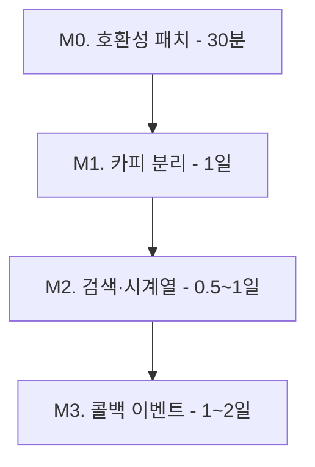

## Petory ↔ pet-data-api 연동 가이드

> 대상: Petory(Java/Spring) 백엔드/프론트 개발자
> 목표: pet-data-api v3 의 새 책임 분리 구조에 맞춰 **추천 카드/검색/이벤트 콜백** 을 안정적으로 붙이기.
> 짝 문서: [`V3-CHANGES.md`](V3-CHANGES.md) (서버 측 변경 요약).

---

### 0. 한 줄 요약

- **빠른 본 추천**(`POST /recommend`) + **선택적 카피**(`POST /recommend/copy`) + **검색**(`GET /facilities/search`) + **시계열 트렌드**(`GET /trends/{cat}/timeseries`) + **콜백 이벤트**(`POST /events/recommendation`) 로 구성.
- Petory 가 **반드시 해야 할 것**: `include_copy` 처리 + `X-Request-Id` 전달. (이것만 해도 호환은 유지)
- Petory 가 **할 수 있으면 좋은 것**: 이벤트 콜백 + 두 번째 콜로 LLM 카피 받기. (있어야 추천 품질이 시간이 갈수록 향상)

---

### 1. 호환성 노트 — 지금 당장 깨지는 부분

| 영역 | v2 (지금까지) | v3 (지금부터) | Petory 대응 |
|---|---|---|---|
| `POST /recommend` 의 `recommendation` 필드 | LLM 카피 (Ollama) | **규칙 기반 카피** (기본). LLM 필요 시 `include_copy=true` 명시. | 기존처럼 LLM 카피가 필요하면 페이로드에 `"include_copy": true` 추가 |
| 응답 타임아웃 | Ollama 30초+ 가정 | 기본 < 1초 (LLM 미호출) | 기본 호출 타임아웃을 **3초** 로 줄여도 됨. `include_copy=true` 일 때만 30초+ |
| `FacilityItem` | 9개 필드 | + `reasons: string[]` | 추가 필드 무시해도 OK. UI 표시는 선택. |
| `RecommendResponse` | 5개 필드 | + `request_id`, `recommend_version` (이미 v2 후반에 있었으면 그대로) | `request_id` 를 클라에 노출하면 이후 콜백/추적에 사용 가능 |

**즉시 깨지는 것 없음** — 페이로드에 `include_copy` 안 보내면 LLM 미호출되고 카피가 규칙 기반으로 바뀌는 게 유일한 행동 차이. UI 글자만 살짝 달라짐.

---

### 2. Petory 백엔드 (Spring) — 클라이언트 변경

#### 2.1 설정 분리

`application.properties` 또는 `application.yml`:

```properties
pet-data-api.base-url=http://pet-data-api:8000
pet-data-api.api-key=${PET_DATA_API_KEY}

# 본 추천 — LLM 없음, 짧은 타임아웃
pet-data-api.timeout-ms=3000

# 카피 보조 — Ollama 동기 대기, 길게
pet-data-api.copy-timeout-ms=35000
```

#### 2.2 추천 카드 호출 흐름

```
사용자 → Petory FE
  └── Petory BE.PetDataApiClient
        ├── ① POST /recommend         (timeout 3s, 항상 호출)
        │      → facilities + trends + request_id 즉시 반환
        │
        └── (필요 시) ② POST /recommend/copy  (timeout 35s, 비동기/지연 호출)
               → recommendation 문구
```

**왜 두 번 콜인가?** ① 은 LLM 안 부르므로 매우 빠르고 안정적. 카피는 페이지 전체 렌더에 필수가 아닐 가능성이 큼 → 카드 먼저 띄우고 카피는 들어오면 채워 넣기.

#### 2.3 X-Request-Id 전파

```java
// 추적용. 없어도 서버가 생성하지만, 페토리 트레이스와 연결하려면 보내는 게 좋음.
String requestId = MDC.get("traceId");  // 또는 UUID.randomUUID().toString().replace("-", "").substring(0,16)
HttpHeaders headers = new HttpHeaders();
headers.set("X-API-Key", apiKey);
headers.set("X-Request-Id", requestId);
```

응답 헤더에서도 `X-Request-Id` 가 그대로 돌아오고, 본문 `request_id` 도 동일하다.

#### 2.4 본 추천 페이로드 (옵션 추가)

```java
class RecommendRequest {
    double lat;
    double lng;
    String context;     // "grooming" | "hospital" | "supplies"
    double radiusKm = 3.0;
    int topN = 5;
    Pet pet;            // optional

    boolean includeCopy = false;  // v3 신규. 기본 false 권장.
}
```

#### 2.5 응답 처리

```java
class RecommendResponse {
    String context;
    String recommendVersion;
    String requestId;             // v3 신규 — 이후 콜백/카피에서 재사용
    List<FacilityItem> facilities;
    List<TrendKeyword> trends;
    String recommendation;        // 항상 채워질 수 있음 (규칙 기반 폴백)
    String generatedAt;
}

class FacilityItem {
    String name;
    int distanceM;
    String address;
    Double lat, lng;
    int mentionCount;
    double mentionScore;
    String source;                // "public" | "kakao" | "public+kakao"
    double score;                 // [0, 1] — 최종 랭킹 점수
    List<String> reasons;         // v3 신규 — ["distance", "trend_match:봄단발", "pet_breed_match"]
}
```

`reasons` 는 UI 에 "왜 이걸 추천했는지" 칩으로 보여주면 좋다. 라벨 매핑:

| 라벨 | 의미 | UI 한 줄 |
|---|---|---|
| `distance` | 사용자 위치에서 가까움 | "가까워요" |
| `mention` | 블로그 멘션 많음 | "블로그 후기" |
| `trend_match:<키워드>` | 시설명이 최근 트렌드 키워드 포함 | "<키워드> 인기" |
| `history` | 최근 14일 클릭 많음 | "많이 보는 곳" |
| `pet_species_match` | 펫 종 키워드 매칭 | "고양이/강아지 전문" |
| `pet_breed_match` | 펫 품종 키워드 매칭 | "<품종> 케어" |

#### 2.6 두 번째 콜 — `/recommend/copy`

```java
class RecommendCopyRequest {
    String context;
    String requestId;             // 첫 콜 응답의 request_id (있으면 로그 매핑됨)
    List<CopyFacility> facilities;  // 첫 콜 응답에서 name + distance_m 만 골라서
    List<TrendKeyword> trends;
    Pet pet;
}

class RecommendCopyResponse {
    String requestId;
    String recommendation;        // null 가능
    String source;                // "llm" | "rule"
    String generatedAt;
}
```

- `source == "rule"` 이면 LLM 실패한 폴백 카피라는 의미. 보여줘도 무관.
- `source == "llm"` 이고 `recommendation == null` 인 경우는 없음 (있으면 버그).
- 카피 타임아웃 발생 시 카드에서 카피 영역만 숨기면 됨.

---

### 3. Petory 프론트엔드 — 추천 카드 UX 권장

```
┌──────────────────────────────────────────┐
│  🐶 강아지 미용실 — 근처 5곳              │  ← 카드 헤더는 first response 로 즉시 표시
├──────────────────────────────────────────┤
│  해피독 미용실                            │
│  320m · 마포구                            │
│  [가까워요] [스포팅컷 인기]               │  ← reasons 기반 칩
│  ★ 0.78                                  │  ← score
├──────────────────────────────────────────┤
│  ⏳ 추천 코멘트 생성 중...                │  ← /recommend/copy 호출 중
└──────────────────────────────────────────┘
```

전환 후:

```
┌──────────────────────────────────────────┐
│  ... (위와 동일)                          │
├──────────────────────────────────────────┤
│  💬 "말티즈에게 인기인 스포팅컷이..."     │  ← copy 응답 도착
└──────────────────────────────────────────┘
```

- 두 콜 모두 실패해도 카드는 그릴 수 있어야 함 (시설·트렌드만으로도 의미 있음).
- `recommendation` 이 비어 있으면 코멘트 영역 자체를 숨김.

---

### 4. 검색 — `GET /facilities/search`

`/recommend` 가 추천(랭킹) 이라면 `/facilities/search` 는 **사용자 액션** (검색·필터). Petory 의 "주변 시설 찾기" 페이지에서 사용 권장.

```
GET /facilities/search
  ?q=강아지                  # pg_trgm 유사도 검색
  &context=grooming           # BUSINESS / HOSPITAL 자동 필터
  &region_city=서울특별시
  &region_district=마포구
  &lat=37.5665&lng=126.978
  &radius_km=3
  &tags=미용,위탁              # 콤마 구분, OR 매칭
  &sort=distance               # distance | trend | name (기본 name)
  &cursor=0&limit=20
```

응답:

```json
{
  "items": [
    {
      "id": 42, "source_id": "B-12345",
      "name": "해피독 미용실", "type": "BUSINESS", "status": "영업",
      "address": "...", "region_city": "서울특별시", "region_district": "마포구",
      "phone": "02-...", "lat": 37.5672, "lng": 126.9765,
      "distance_m": 320, "trend_score": 41
    }
  ],
  "next_cursor": 42,
  "has_next": true,
  "sort": "distance"
}
```

페이지네이션 주의:
- `sort=name` 만 안정적인 cursor 페이지네이션 지원.
- `sort=distance`, `sort=trend` 는 단일 페이지로 사용 (`has_next` 항상 false). 더 받고 싶으면 `limit` 늘리기 (max 50).

---

### 5. 트렌드 — Redis 단순 조회 vs 시계열

| 용도 | 엔드포인트 | 비고 |
|---|---|---|
| 카테고리 인기 키워드 top N (지금 이 순간) | `GET /trends/{category}` | 기존 그대로. Redis 직접 조회로 가장 빠름. |
| 일별 시계열 (증감률·차트) | `GET /trends/{category}/timeseries?days=14&top_keywords=10` | Postgres `trend_snapshots` 조회. 차트/대시보드용. |

시계열 응답:

```json
{
  "category": "grooming",
  "days": 14,
  "top_keywords": 10,
  "points": [
    {"date": "2026-05-01", "keyword": "스포팅컷", "score": 32},
    {"date": "2026-05-02", "keyword": "스포팅컷", "score": 35},
    ...
  ]
}
```

`points` 는 `(date ASC, score DESC)` 정렬. 같은 키워드를 모아 line chart 로 그리기 좋게 되어 있음.

---

### 6. 콜백 이벤트 — 추천 품질 환류

`/recommend` 의 결과가 사용자에게 어떤 반응을 얻었는지 서버에 알려주면, 다음 추천의 `history` 신호로 들어가 자동으로 부스트된다.

**언제 보내는가**

| 사용자 행동 | event | 권장 |
|---|---|---|
| 추천 카드 첫 노출 (시설 카드가 화면에 들어옴) | `view` | 선택 (보내면 노출률 계산 가능) |
| 카드/시설 클릭 | `click` | **권장** |
| 예약/전화 같은 전환 액션 | `book` | 권장 |

```http
POST /events/recommendation
X-API-Key: <키>
Content-Type: application/json

{
  "request_id": "<recommend 응답의 request_id>",
  "events": [
    {
      "facility_id": 42,
      "event": "click",
      "occurred_at": "2026-05-13T10:00:08Z",
      "user_ref": "petory-anon-789a"
    }
  ]
}
```

- `facility_id` 가 우선. 모르는 경우(예: kakao-only 후보) `source_id` 만 보내도 OK.
- `user_ref` 는 익명 식별자 (Petory 내부 사용자 ID 의 해시 등). 없어도 무방.
- 응답은 항상 **202 Accepted** + `{accepted, skipped}` 카운트. 4xx/5xx 가 아니면 신경 안 써도 됨 (fire-and-forget).

배치 권장: 사용자가 여러 카드를 봤다 → 한 페이지 단위로 모아서 1콜에 events 배열로 묶어 보내기 (최대 100개).

---

### 7. 단계별 도입 — Petory 측 체크리스트



#### M0. 호환성 패치 (꼭 해야 함)
- [ ] `PetDataApiClient` 가 응답에서 새 필드 (`request_id`, `reasons`, `recommend_version`) 무시해도 깨지지 않는지 확인 (대부분 Jackson 기본 동작으로 OK).
- [ ] 기존 LLM 카피가 필요한 화면이라면 페이로드에 `"include_copy": true` 추가 → 동작 동일.
- [ ] 본 추천 타임아웃을 3초 정도로 줄여 응답성 개선 (LLM 미호출 시).
- [ ] 검증: 추천 페이지 기존대로 동작하는지 회귀.

#### M1. 카피 분리 (응답성 개선)
- [ ] `include_copy` 제거 → 본 추천에서 LLM 호출 안 함.
- [ ] FE: `/recommend` 응답을 즉시 렌더. 코멘트 영역은 로딩 표시.
- [ ] FE: `/recommend/copy` 별도 호출. 응답 도착 시 코멘트 채움. 실패 시 코멘트 영역 숨김.
- [ ] BE: 두 콜의 `request_id` 가 같도록 첫 응답의 값을 그대로 두 번째 콜에 전달.
- [ ] 검증: LLM 다운 상태에서도 추천 카드가 정상적으로 그려지는지.

#### M2. 검색·시계열 활용
- [ ] "주변 시설 찾기" 페이지에서 기존 `/facilities` 대신 `/facilities/search` 사용. q, tags, sort 인자 노출.
- [ ] (선택) 관리자 대시보드에 `/trends/{cat}/timeseries` 로 트렌드 차트 추가.
- [ ] 검증: 검색 응답 시간 < 300ms 로컬, 시계열 14일치 정합성.

#### M3. 콜백 이벤트 (추천 품질 환류)
- [ ] FE: 추천 카드 클릭 시 `click` 이벤트 트래킹. `request_id`, `facility_id`, 시각 기록.
- [ ] BE: 트래킹 이벤트를 배치(예: 1초 디바운스)로 모아 `POST /events/recommendation` 호출.
- [ ] (옵션) `view` 이벤트도 추가하면 노출률 계산 가능.
- [ ] 검증: `recommendation_log` JOIN `facility_interactions` 쿼리로 같은 `request_id` 의 click 카운트가 보이는지.

---

### 8. 운영 — Petory 인프라 측

- **DNS / 네트워크**: Petory 서비스 컨테이너에서 pet-data-api 컨테이너로 8000 포트가 열려 있어야 함.
- **API Key 회전**: 1년에 한 번 정도. 절차: pet-data-api `.env` 의 `API_KEY_HASH` 갱신 → 재시작 → Petory `PET_DATA_API_KEY` 갱신.
- **헬스체크**: Petory 의 외부 헬스체크가 pet-data-api `/healthz`, `/readyz` 를 폴링하면 좋다.
- **메트릭 수집**: Prometheus 가 pet-data-api `/metrics` 를 스크레이프하도록 추가 (선택).

---

### 9. 자주 묻는 질문

**Q. `request_id` 가 응답마다 다른데, 같은 사용자를 어떻게 추적?**
A. `request_id` 는 1회 콜 추적용. 사용자 추적은 별도 `user_ref` 로. Petory 측 사용자 ID 의 해시 한 토막을 보내면 됨.

**Q. `/recommend` 가 `facilities: []`, `trends: []` 둘 다 빈 응답을 줄 수 있나?**
A. 있다. 반경 내 시설이 없고 Redis 도 실패한 경우. 이때 `recommendation: null` 이 함께 옴 → 카드 자체를 안 보여주는 게 안전.

**Q. `recommend_version` 이 `"grooming-mvp-v1"` 이면 다르게 처리해야 하나?**
A. 아니. 응답 구조는 동일. 서버 측 내부 파이프 식별자일 뿐. 로그/디버그용.

**Q. 이벤트 콜백을 안 보내면 추천 품질이 정말 나빠지나?**
A. 즉시는 아님. `history` 신호는 가중치 0.10~0.20 정도라 거리/멘션이 지배적. 다만 한 달, 두 달 누적되면 사용자가 선호하는 시설을 자동으로 상위에 띄우는 효과가 생긴다. 콜백을 안 보내면 이 학습 효과만 0 으로 고정.

**Q. LLM 카피가 한국어가 아닌 경우가 있나?**
A. Ollama 시스템 프롬프트로 한국어 강제. 영어/그 외 언어가 나오면 [`app/serving/recommender/llm.py`](../app/serving/recommender/llm.py) 의 시스템 프롬프트 조정 또는 LLM 자체 교체 필요.

---

### 10. 참고

- 서버 API 명세: Swagger UI (`http://pet-data-api:8000/docs`).
- 서버 변경 요약: [`V3-CHANGES.md`](V3-CHANGES.md).
- 그루밍 MVP 계약 (기존): [`GROOMING-RECOMMEND-MVP.md`](GROOMING-RECOMMEND-MVP.md).
- 데이터 흐름 다이어그램: [`DATA-AND-API-FLOW.md`](DATA-AND-API-FLOW.md).
