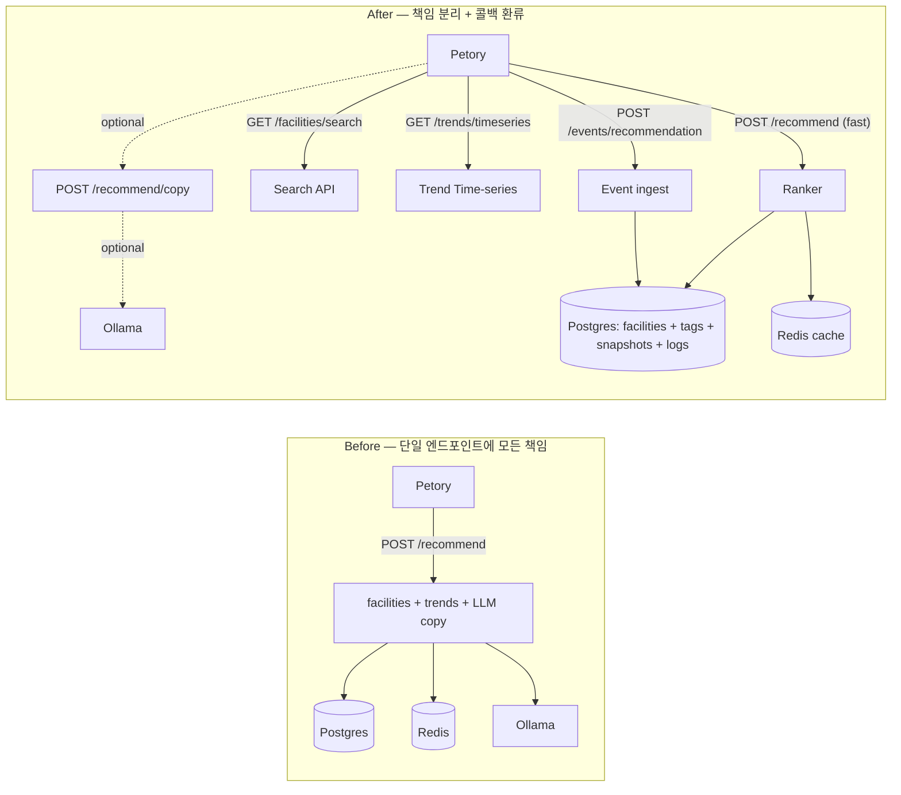

## pet-data-api v3 — 변경 사항 정리

> 기간: 2026-05-13 (4 phase 일괄 적용)
> 목표: 정체성을 **"외부 데이터 어댑터(A) + 가벼운 룰 기반 추천(B)"** 로 좁히고 책임을 엔드포인트 단위로 분리.

전체 설계 배경: [`docs/superpowers/specs/...`] 및 루트 [`README.md`](../README.md) 의 **Petory 연동 가이드** 단락 참고. Petory 측이 해야 할 작업은 [`PETORY-INTEGRATION.md`](PETORY-INTEGRATION.md) 에 별도 정리.

---

### 한눈에 보는 Before / After



---

### 1. 신규 엔드포인트

| 메서드 | 경로 | 목적 | 인증 |
|---|---|---|---|
| GET | `/healthz` | Liveness probe | 없음 |
| GET | `/readyz` | Readiness probe (DB + Redis ping) | 없음 |
| GET | `/metrics` | Prometheus 메트릭 | 없음 |
| GET | `/facilities/search` | 이름(pg_trgm) + 태그 + 지역 + (옵션) 반경 검색. 정렬 `distance` / `trend` / `name` | 일반 |
| GET | `/trends/{category}/timeseries` | 카테고리 일별 시계열 (기본 14일, Postgres) | 일반 |
| POST | `/recommend/copy` | LLM 카피만 별도 호출. 실패 시 `source=rule` 규칙 기반 폴백 | 일반 |
| POST | `/events/recommendation` | Petory 노출/클릭/예약 콜백 (202 fire-and-forget) | 일반 |

### 2. 기존 엔드포인트 변경

| 엔드포인트 | 변경 |
|---|---|
| `POST /recommend` | 기본 `include_copy=false` — Ollama 미호출, 규칙 기반 카피만. `include_copy=true` 면 기존처럼 LLM. 응답에 `request_id`, 항목별 `score`, `reasons`(랭킹 기여 신호 라벨) 추가. |
| `GET /trends/{category}` | 변경 없음. 단 동일 데이터를 시계열로 보고 싶으면 `/timeseries` 사용. |
| `GET /facilities`, `GET /facilities/{id}`, `GET /stats/summary`, `POST /collect/trigger` | 변경 없음. |

### 3. 새 응답 필드 — `POST /recommend`

```json
{
  "context": "grooming",
  "recommend_version": "legacy",
  "request_id": "9f1c8b2a4d70a01b",
  "facilities": [
    {
      "name": "해피독 미용실",
      "distance_m": 320,
      "address": "서울시 마포구 ...",
      "lat": 37.5672, "lng": 126.9765,
      "mention_count": 3,
      "mention_score": 0.6,
      "source": "public",
      "score": 0.78,
      "reasons": ["distance", "trend_match:스포팅컷"]
    }
  ],
  "trends": [{ "keyword": "스포팅컷", "score": 41 }],
  "recommendation": "근처 1개 미용실 후보를 찾았습니다. 가장 가까운 해피독 미용실까지 320m입니다.",
  "generated_at": "2026-05-13T10:00:00+00:00"
}
```

- `request_id`: 응답 헤더 `X-Request-Id` 와 동일. `POST /events/recommendation` 으로 같은 `request_id` 의 이벤트를 회신하면 노출→클릭 매핑이 됨.
- `reasons`: 랭킹에 기여한 신호 라벨. 라벨 종류: `distance`, `mention`, `trend_match:<키워드>`, `history`, `pet_species_match`, `pet_breed_match`.

---

### 4. 데이터 모델 추가 (가산형)

새 마이그레이션 4개. 기존 테이블/컬럼은 건드리지 않음.

| 파일 | 테이블 | 용도 |
|---|---|---|
| [`migrations/003_trend_snapshots.sql`](../migrations/003_trend_snapshots.sql) | `trend_snapshots` | 트렌드 키워드 일별 시계열. Redis 는 핫 캐시, Postgres 는 시계열·증감률·랭커 신호용. |
| [`migrations/004_facility_tags.sql`](../migrations/004_facility_tags.sql) | `facility_tags` | 시설 태그 (비정규화). `source` 컬럼으로 출처(`public` / `blog_mention` / `manual`) 추적. |
| [`migrations/005_recommendation_log.sql`](../migrations/005_recommendation_log.sql) | `recommendation_log` | 추천 호출 1건 = 1행. `request_id` UNIQUE. 어떤 시설을 어떤 점수로 노출했는지 기록. |
| [`migrations/006_facility_interactions.sql`](../migrations/006_facility_interactions.sql) | `facility_interactions` | Petory 콜백으로 받은 노출/클릭/예약 이벤트. 같은 `request_id` 로 `recommendation_log` 와 약결합. |

적용 순서 (기존 → 신규):

```bash
psql -d petdata -f migrations/init.sql
psql -d petdata -f migrations/v2_pet_facilities.sql
psql -d petdata -f migrations/add_facility_coords.sql
psql -d petdata -f migrations/003_trend_snapshots.sql
psql -d petdata -f migrations/004_facility_tags.sql
psql -d petdata -f migrations/005_recommendation_log.sql
psql -d petdata -f migrations/006_facility_interactions.sql
```

태그 시드 (1회):

```bash
python scripts/seed_tags.py
```

`business_details.business_type` / `hospital_details.specialty` 값을 잘게 쪼개 `facility_tags` 로 넣음. 멱등하므로 여러 번 돌려도 안전.

---

### 5. 랭커 일반화

[`app/serving/recommender/grooming_ranker.py`](../app/serving/recommender/grooming_ranker.py) 의 distance·mention·freshness 구조를 그대로 살려서 5신호 가중합으로 일반화.

- 본체: [`app/serving/recommender/ranker.py`](../app/serving/recommender/ranker.py) — `rank_facilities(candidates, ctx, top_n, signals?, weights?)`.
- 신호: [`app/serving/recommender/signals/`](../app/serving/recommender/signals/)
  - `DistanceSignal` — 거리 정규화.
  - `MentionSignal` — 블로그 멘션 카운트 정규화 (기존 grooming MVP 신호).
  - `TrendMatchSignal` — 시설명에 최근 트렌드 키워드가 포함되면 가산. reasons 에 `trend_match:<키워드>` 라벨.
  - `InteractionHistorySignal` — `facility_interactions` 14일치 클릭 수 정규화. **Petory 가 콜백 안 보내면 이 신호는 항상 0**.
  - `PetMatchSignal` — 펫 종(species), 품종 키워드가 시설명·태그에 포함되면 가산. 노령(`>=10살`) 펫 + `hospital` 컨텍스트면 추가 가산.

컨텍스트별 가중치 (각 합 = 1.0):

| context | distance | mention | trend_match | history | pet_match |
|---|---|---|---|---|---|
| grooming | 0.45 | 0.25 | 0.15 | 0.10 | 0.05 |
| hospital | 0.55 | 0.10 | 0.05 | 0.20 | 0.10 |
| supplies | 0.45 | 0.15 | 0.20 | 0.15 | 0.05 |

수정하려면 [`app/serving/recommender/ranker.py`](../app/serving/recommender/ranker.py) 의 `WEIGHT_PRESETS` 만 손대면 됨.

`grooming_ranker.rank_grooming_facilities()` 는 dedupe·merge 단계로만 남아 있고 (Kakao POI 병합·중복 제거), 최종 점수 계산은 새 `rank_facilities()` 가 담당.

---

### 6. 관측성

- 글로벌 `RequestIdMiddleware`: 모든 요청에 `X-Request-Id` 부여 (클라이언트가 보내면 재사용). [`app/platform/observability.py`](../app/platform/observability.py).
- `/metrics`: `prometheus_fastapi_instrumentator` 기본 메트릭 (`http_requests_total`, `http_request_duration_seconds_*`).
- `/readyz`: DB `SELECT 1` + Redis `PING`. 둘 다 OK 면 200, 하나라도 실패면 503 + `checks` 상세.

---

### 7. LLM 분리 (Phase 3)

기본 `POST /recommend` 가 Ollama 를 호출하지 않는다. 카피가 필요한 페이지에서만:

```http
POST /recommend/copy
{
  "context": "grooming",
  "request_id": "<위 응답의 request_id>",
  "facilities": [{"name": "해피독 미용실", "distance_m": 320}],
  "trends": [{"keyword": "스포팅컷", "score": 41}],
  "pet": {"type": "dog", "breed": "말티즈", "age": "2살"}
}
```

응답에는 `source` 필드가 있어 `llm` / `rule` 폴백 여부를 알 수 있음. LLM 실패해도 `recommendation` 은 채워질 수 있음(`source=rule`).

이전 동작이 필요하면 `POST /recommend` 본문에 `"include_copy": true` 추가.

---

### 8. 의도적으로 안 한 것 (다음 단계)

| 항목 | 이유 |
|---|---|
| 벡터DB / 임베딩 추천 | 데이터 규모·도메인 필드 빈약 대비 과한 인프라. |
| 시설 도메인 필드 전면 확장 (영업시간/메뉴/사진/평점) | 수급 소스 불안정 — 별도 phase. |
| 변경 이력 (`facility_history`) | 분석 대시보드 필요해질 때 별도 phase. |
| Kafka / 큐 | 스케일 초과. `/events/recommendation` 동기 INSERT 충분. |
| OAuth / JWT | 지금 SHA-256 API Key 충분. |

---

### 9. 코드 위치 인덱스

| 영역 | 파일 |
|---|---|
| 글로벌 미들웨어 / 헬스체크 / 메트릭 | [`app/platform/observability.py`](../app/platform/observability.py) |
| 트렌드 시계열 적재·조회 | [`app/ingestion/trend_history.py`](../app/ingestion/trend_history.py) |
| 트렌드 시계열 적재 트리거 | [`app/ingestion/runner.py`](../app/ingestion/runner.py) `run_trend_collection()` |
| 검색 API | [`app/serving/api/search.py`](../app/serving/api/search.py) |
| 트렌드 시계열 API | [`app/serving/api/trends.py`](../app/serving/api/trends.py) `get_trend_timeseries()` |
| 이벤트 API | [`app/serving/api/events.py`](../app/serving/api/events.py) |
| 추천 / 카피 API | [`app/serving/api/recommend.py`](../app/serving/api/recommend.py) |
| 일반화 랭커 | [`app/serving/recommender/ranker.py`](../app/serving/recommender/ranker.py) |
| 신호 모듈 | [`app/serving/recommender/signals/`](../app/serving/recommender/signals/) |
| 추천 로그 적재 | [`app/serving/recommender/persistence.py`](../app/serving/recommender/persistence.py) |
| 태그 시드 스크립트 | [`scripts/seed_tags.py`](../scripts/seed_tags.py) |

---

### 10. 검증

`pytest tests/ -q` → 124 testes pass.

배포 후 직접 확인할 것:

```bash
# 1. 헬스체크
curl -s http://localhost:8000/healthz
curl -s http://localhost:8000/readyz
curl -s http://localhost:8000/metrics | head

# 2. request_id 흐름
curl -s -i -H "X-API-Key: $API_KEY" -H "X-Request-Id: my-trace-1" \
  http://localhost:8000/trends/grooming | grep -i request-id

# 3. /recommend p95 (LLM 미호출 경로)
curl -s -X POST -H "X-API-Key: $API_KEY" -H "Content-Type: application/json" \
  -d '{"lat":37.5665,"lng":126.978,"context":"grooming","radius_km":3,"top_n":5}' \
  http://localhost:8000/recommend

# 4. 이벤트 콜백
curl -s -X POST -H "X-API-Key: $API_KEY" -H "Content-Type: application/json" \
  -d '{"request_id":"<위 응답의 request_id>",
       "events":[{"facility_id":42,"event":"click","occurred_at":"2026-05-13T10:00:08Z"}]}' \
  http://localhost:8000/events/recommendation
```
