# 데이터베이스 ERD

## 핵심 테이블 관계도

```mermaid
erDiagram
    users ||--o{ pet : "소유"
    users ||--o{ board : "작성"
    users ||--o{ comment : "작성"
    users ||--o{ board_reaction : "반응"
    users ||--o{ care_request : "요청"
    users ||--o{ care_application : "지원"
    users ||--o{ missing_pet_board : "신고"
    users ||--o{ meetup : "주최"
    users ||--o{ meetup_participants : "참여"
    users ||--o{ notification : "수신"
    users ||--o{ report : "신고"
    users ||--o{ user_sanction : "제재받음"
    
    board ||--o{ comment : "포함"
    board ||--o{ board_reaction : "반응받음"
    board ||--o{ board_view_log : "조회됨"
    board ||--o{ board_popularity_snapshot : "인기도"
    
    comment ||--o{ comment_reaction : "반응받음"
    
    care_request ||--o{ care_application : "지원받음"
    care_request ||--o{ care_request_comment : "댓글"
    care_request ||--|| care_review : "리뷰"
    care_request }o--|| pet : "대상"
    
    meetup ||--o{ meetup_participants : "참여자"
    
    location_service ||--o{ location_service_review : "리뷰"
    
    users {
        bigint idx PK
        varchar id UK "로그인ID"
        varchar username UK
        varchar email UK
        varchar password
        enum role "USER,ADMIN"
        varchar location
        text pet_info
        varchar refresh_token
        datetime last_login_at
        enum status "ACTIVE,SUSPENDED,BANNED"
        int warning_count
        datetime suspended_until
        boolean is_deleted
    }
    
    pet {
        bigint idx PK
        bigint user_idx FK
        varchar name
        varchar species "개,고양이"
        varchar breed
        int age
        varchar gender
        varchar image_url
    }
    
    board {
        bigint idx PK
        bigint user_idx FK
        varchar title
        text content
        varchar category
        enum status "ACTIVE,HIDDEN,DELETED"
        datetime created_at
        int view_count
        int like_count
        int comment_count
        datetime last_reaction_at
        boolean is_deleted
    }
    
    comment {
        bigint idx PK
        bigint board_idx FK
        bigint user_idx FK
        text content
        enum status
        datetime created_at
        boolean is_deleted
    }
    
    board_reaction {
        bigint idx PK
        bigint board_idx FK
        bigint user_idx FK
        enum type "LIKE,DISLIKE"
        datetime created_at
    }
    
    care_request {
        bigint idx PK
        bigint user_idx FK
        bigint pet_idx FK
        varchar title
        text description
        datetime date
        enum status "OPEN,IN_PROGRESS,COMPLETED,CANCELLED"
        datetime created_at
        boolean is_deleted
    }
    
    care_application {
        bigint idx PK
        bigint care_request_idx FK
        bigint applicant_idx FK
        text message
        enum status "PENDING,APPROVED,REJECTED"
        datetime created_at
    }
    
    care_review {
        bigint idx PK
        bigint care_request_idx FK
        bigint reviewer_idx FK
        bigint reviewee_idx FK
        int rating "1-5"
        text content
        datetime created_at
    }
    
    missing_pet_board {
        bigint idx PK
        bigint user_idx FK
        varchar title
        text content
        varchar pet_name
        varchar species
        varchar breed
        enum gender "MALE,FEMALE,UNKNOWN"
        varchar color
        date lost_date
        varchar lost_location
        decimal latitude
        decimal longitude
        enum status "MISSING,FOUND,CLOSED"
        boolean is_deleted
    }
    
    meetup {
        bigint idx PK
        bigint organizer_idx FK
        varchar title
        text description
        varchar location
        decimal latitude
        decimal longitude
        datetime date
        int max_participants
        int current_participants
        enum status "RECRUITING,CONFIRMED,COMPLETED,CANCELLED"
    }
    
    meetup_participants {
        bigint idx PK
        bigint meetup_idx FK
        bigint user_idx FK
        datetime joined_at
    }
    
    location_service {
        bigint idx PK
        varchar name
        varchar category
        varchar address
        decimal latitude
        decimal longitude
        double rating
        varchar phone
        time opening_time
        time closing_time
        boolean pet_friendly
    }
    
    location_service_review {
        bigint idx PK
        bigint service_idx FK
        bigint user_idx FK
        int rating
        text content
        datetime created_at
    }
    
    notification {
        bigint idx PK
        bigint user_idx FK
        enum type "COMMENT,REPLY,LIKE,CARE_APPLICATION..."
        varchar title
        varchar content
        bigint related_id
        varchar related_type
        boolean is_read
        datetime created_at
    }
    
    report {
        bigint idx PK
        enum target_type "BOARD,COMMENT,CARE_REQUEST,USER"
        bigint target_idx
        bigint reporter_idx FK
        text reason
        enum status "PENDING,REVIEWING,RESOLVED,REJECTED"
        bigint handled_by FK
        datetime handled_at
        enum action_taken "NONE,WARNING,CONTENT_HIDE,USER_SUSPEND"
    }
    
    user_sanction {
        bigint idx PK
        bigint user_idx FK
        enum type "WARNING,SUSPENSION,BAN"
        text reason
        datetime started_at
        datetime ended_at
        bigint sanctioned_by FK
    }
    
    board_view_log {
        bigint idx PK
        bigint board_idx FK
        bigint user_idx FK
        datetime viewed_at
    }
    
    board_popularity_snapshot {
        bigint idx PK
        bigint board_idx FK
        enum period_type "WEEKLY,MONTHLY"
        date snapshot_date
        int view_count
        int like_count
        int comment_count
        double popularity_score
    }
    
    attachment_file {
        bigint idx PK
        enum target_type "BOARD,CARE_REQUEST,MISSING_PET,USER_PROFILE"
        bigint target_idx
        varchar original_filename
        varchar stored_filename
        varchar file_path
        varchar file_extension
        bigint file_size
        varchar content_type
        datetime uploaded_at
    }
```



## 테이블 상세 정보

### 주요 제약 조건

#### Unique 제약

```sql
-- users 테이블
UNIQUE KEY uk_users_id (id)
UNIQUE KEY uk_users_email (email)
UNIQUE KEY uk_users_username (username)

-- board_reaction 테이블 (중복 반응 방지)
UNIQUE KEY uk_board_reaction (board_idx, user_idx)

-- comment_reaction 테이블
UNIQUE KEY uk_comment_reaction (comment_idx, user_idx)

-- report 테이블 (중복 신고 방지)
UNIQUE KEY uk_report (target_type, target_idx, reporter_idx)

-- board_view_log 테이블
UNIQUE KEY uk_view_log (board_idx, user_idx)

-- care_application 테이블 (부분 인덱스, MySQL 8.0.13+)
UNIQUE KEY uk_approved_application (care_request_idx) WHERE status = 'APPROVED'
```

#### Foreign Key 제약

```sql
-- board 테이블
FOREIGN KEY fk_board_user (user_idx) REFERENCES users(idx) ON DELETE CASCADE

-- comment 테이블
FOREIGN KEY fk_comment_board (board_idx) REFERENCES board(idx) ON DELETE CASCADE
FOREIGN KEY fk_comment_user (user_idx) REFERENCES users(idx) ON DELETE CASCADE

-- care_application 테이블
FOREIGN KEY fk_application_request (care_request_idx) REFERENCES care_request(idx)
FOREIGN KEY fk_application_user (applicant_idx) REFERENCES users(idx)
```

### 인덱스 전략

#### 단일 컬럼 인덱스
```sql
-- 정렬 최적화
CREATE INDEX idx_board_created_at ON board(created_at DESC);
CREATE INDEX idx_care_request_date ON care_request(date DESC);

-- 외래 키 (자동 생성 안 되는 경우)
CREATE INDEX idx_board_user ON board(user_idx);
CREATE INDEX idx_comment_board ON comment(board_idx);
```

#### 복합 인덱스
```sql
-- 게시글 카테고리별 조회 + 삭제 필터 + 정렬
CREATE INDEX idx_board_category_deleted_created 
ON board(category, is_deleted, created_at DESC);

-- 사용자별 게시글 조회
CREATE INDEX idx_board_user_deleted_created 
ON board(user_idx, is_deleted, created_at DESC);

-- 펫케어 요청 상태별 조회
CREATE INDEX idx_care_request_status_deleted_date 
ON care_request(status, is_deleted, date DESC);

-- 반응 집계 최적화
CREATE INDEX idx_board_reaction_board_type 
ON board_reaction(board_idx, type);

-- 모임 상태별 조회
CREATE INDEX idx_meetup_status_date 
ON meetup(status, date DESC);

-- 위치 기반 검색 (Spatial Index)
CREATE SPATIAL INDEX idx_missing_pet_location 
ON missing_pet_board(latitude, longitude);

CREATE SPATIAL INDEX idx_location_service_coords 
ON location_service(latitude, longitude);
```

#### Full-Text 인덱스
```sql
-- 게시글 검색
CREATE FULLTEXT INDEX idx_board_fulltext 
ON board(title, content);

-- 펫케어 요청 검색
CREATE FULLTEXT INDEX idx_care_request_fulltext 
ON care_request(title, description);
```

### 데이터 타입 선택 이유

#### BIGINT vs INT
- **PK**: BIGINT (최대 9,223,372,036,854,775,807)
- **카운트 필드**: INT (최대 2,147,483,647)

#### VARCHAR 길이
- **id, email**: VARCHAR(255) - 이메일 최대 길이
- **username**: VARCHAR(50) - 표시용 이름
- **title**: VARCHAR(200) - 제목
- **content**: TEXT - 길이 제한 없음

#### ENUM vs VARCHAR
- **ENUM 사용**: 고정된 값 목록 (status, type 등)
  - 장점: 타입 안전, 저장 공간 절약, 인덱스 효율
  - 단점: 값 추가 시 ALTER TABLE 필요
- **VARCHAR 사용**: 동적 값 (category 등)

#### DATE vs DATETIME vs TIMESTAMP
- **DATE**: 날짜만 필요 (lost_date)
- **DATETIME**: 날짜+시간, 타임존 무관
- **TIMESTAMP**: 자동 업데이트 (created_at, updated_at)

#### DECIMAL vs DOUBLE
- **DECIMAL(15,12)**: 정확한 좌표값 (latitude, longitude)
- **DOUBLE**: 근사값 허용 (rating, popularity_score)

### 테이블 크기 예상

| 테이블 | 예상 행 수 | 평균 행 크기 | 예상 크기 |
|--------|-----------|-------------|----------|
| users | 100,000 | ~500B | 50MB |
| board | 500,000 | ~2KB | 1GB |
| comment | 2,000,000 | ~500B | 1GB |
| board_reaction | 5,000,000 | ~50B | 250MB |
| board_view_log | 10,000,000 | ~30B | 300MB |
| care_request | 50,000 | ~1KB | 50MB |
| missing_pet_board | 10,000 | ~1KB | 10MB |
| notification | 1,000,000 | ~200B | 200MB |

**총 예상 크기:** ~3GB (데이터만, 인덱스 제외)

### 파티셔닝 전략 (대용량 데이터 대비)

#### 날짜 기반 파티셔닝

```sql
-- board_view_log 테이블 (월별 파티션)
CREATE TABLE board_view_log (
    idx BIGINT PRIMARY KEY,
    board_idx BIGINT,
    user_idx BIGINT,
    viewed_at DATETIME
)
PARTITION BY RANGE (YEAR(viewed_at) * 100 + MONTH(viewed_at)) (
    PARTITION p202401 VALUES LESS THAN (202402),
    PARTITION p202402 VALUES LESS THAN (202403),
    PARTITION p202403 VALUES LESS THAN (202404),
    -- ...
    PARTITION pmax VALUES LESS THAN MAXVALUE
);

-- 오래된 파티션 삭제
ALTER TABLE board_view_log DROP PARTITION p202401;
```

#### 해시 파티셔닝

```sql
-- notification 테이블 (user_idx 기준)
CREATE TABLE notification (
    idx BIGINT PRIMARY KEY,
    user_idx BIGINT,
    -- ...
)
PARTITION BY HASH(user_idx)
PARTITIONS 10;
```

### 백업 전략

1. **전체 백업** (주 1회)
   ```bash
   mysqldump -u root -p petory > petory_full_backup.sql
   ```

2. **증분 백업** (매일)
   - Binary Log 활성화
   - Point-in-Time Recovery 가능

3. **테이블별 백업** (중요 데이터)
   ```bash
   mysqldump -u root -p petory users board care_request > critical_data.sql
   ```

### 데이터 정리 정책

1. **소프트 삭제된 데이터**
   - 90일 후 하드 삭제
   ```sql
   DELETE FROM board WHERE is_deleted = true AND deleted_at < DATE_SUB(NOW(), INTERVAL 90 DAY);
   ```

2. **조회 로그**
   - 30일 후 삭제 또는 아카이빙
   ```sql
   DELETE FROM board_view_log WHERE viewed_at < DATE_SUB(NOW(), INTERVAL 30 DAY);
   ```

3. **알림**
   - 읽은 알림 30일 후 삭제
   ```sql
   DELETE FROM notification WHERE is_read = true AND created_at < DATE_SUB(NOW(), INTERVAL 30 DAY);
   ```

### 마이그레이션 스크립트 예시

#### 1단계: 테이블 생성
```sql
CREATE DATABASE petory CHARACTER SET utf8mb4 COLLATE utf8mb4_unicode_ci;

USE petory;

-- users 테이블
CREATE TABLE users (
    idx BIGINT AUTO_INCREMENT PRIMARY KEY,
    id VARCHAR(50) NOT NULL UNIQUE,
    username VARCHAR(50) NOT NULL UNIQUE,
    email VARCHAR(255) NOT NULL UNIQUE,
    password VARCHAR(255) NOT NULL,
    role ENUM('USER', 'ADMIN') NOT NULL DEFAULT 'USER',
    status ENUM('ACTIVE', 'SUSPENDED', 'BANNED') NOT NULL DEFAULT 'ACTIVE',
    warning_count INT NOT NULL DEFAULT 0,
    is_deleted BOOLEAN NOT NULL DEFAULT FALSE,
    created_at DATETIME NOT NULL DEFAULT CURRENT_TIMESTAMP,
    updated_at DATETIME NOT NULL DEFAULT CURRENT_TIMESTAMP ON UPDATE CURRENT_TIMESTAMP,
    INDEX idx_users_status (status, is_deleted),
    INDEX idx_users_created (created_at DESC)
) ENGINE=InnoDB DEFAULT CHARSET=utf8mb4 COLLATE=utf8mb4_unicode_ci;

-- board 테이블
CREATE TABLE board (
    idx BIGINT AUTO_INCREMENT PRIMARY KEY,
    user_idx BIGINT NOT NULL,
    title VARCHAR(200) NOT NULL,
    content TEXT,
    category VARCHAR(50),
    status ENUM('ACTIVE', 'HIDDEN', 'DELETED') NOT NULL DEFAULT 'ACTIVE',
    view_count INT NOT NULL DEFAULT 0,
    like_count INT NOT NULL DEFAULT 0,
    comment_count INT NOT NULL DEFAULT 0,
    is_deleted BOOLEAN NOT NULL DEFAULT FALSE,
    created_at DATETIME NOT NULL DEFAULT CURRENT_TIMESTAMP,
    FOREIGN KEY fk_board_user (user_idx) REFERENCES users(idx) ON DELETE CASCADE,
    INDEX idx_board_user (user_idx, is_deleted, created_at DESC),
    INDEX idx_board_category (category, is_deleted, created_at DESC),
    FULLTEXT INDEX idx_board_fulltext (title, content)
) ENGINE=InnoDB DEFAULT CHARSET=utf8mb4 COLLATE=utf8mb4_unicode_ci;
```

#### 2단계: 초기 데이터
```sql
-- 관리자 계정 생성
INSERT INTO users (id, username, email, password, role) 
VALUES ('admin', 'Administrator', 'admin@petory.com', '$2a$10$hashed_password', 'ADMIN');
```

### 성능 모니터링 쿼리

```sql
-- 느린 쿼리 확인
SELECT * FROM mysql.slow_log ORDER BY query_time DESC LIMIT 10;

-- 테이블 크기 확인
SELECT 
    table_name,
    ROUND(((data_length + index_length) / 1024 / 1024), 2) AS "Size (MB)"
FROM information_schema.tables
WHERE table_schema = 'petory'
ORDER BY (data_length + index_length) DESC;

-- 인덱스 사용률 확인
SELECT 
    table_name,
    index_name,
    cardinality,
    seq_in_index
FROM information_schema.statistics
WHERE table_schema = 'petory'
ORDER BY table_name, index_name;
```

