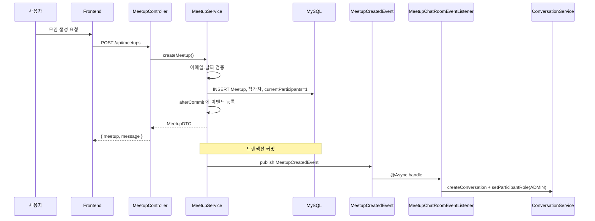
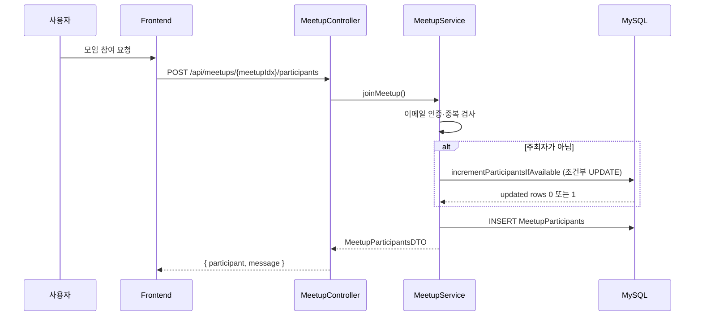
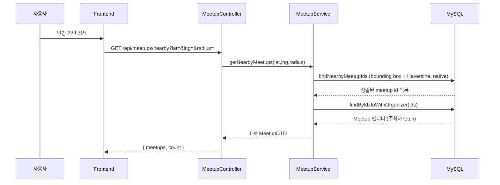

# 산책 & 오프라인 모임 (Meetup) 아키텍처

## 📋 개요

산책 & 오프라인 모임 도메인은 반려동물 산책 모임을 생성하고 참여할 수 있는 기능을 제공하는 핵심 도메인입니다. 위치 기반 검색, 최대 인원 제한, 채팅방 자동 연동 등을 통해 사용자들이 오프라인에서 만날 수 있는 모임을 쉽게 만들고 참여할 수 있도록 합니다.

## 🏗️ 시스템 아키텍처

### 전체 구조도

```mermaid
graph TB
    subgraph "Frontend"
        FE[React Frontend<br/>MeetupPage 등]
    end
    
    subgraph "Backend API Layer"
        MC[MeetupController<br/>/api/meetups<br/>@PreAuthorize 인증]
    end
    
    subgraph "Service Layer"
        MS[MeetupService<br/>모임 CRUD, 참여, 검색]
        SCH[MeetupScheduler<br/>매시 상태 전이]
        EP[ApplicationEventPublisher]
        CS[ConversationService<br/>그룹 채팅 생성·역할·나가기]
        L[MeetupChatRoomEventListener<br/>@Async + REQUIRES_NEW]
    end
    
    subgraph "Data Layer"
        MR[MeetupRepository]
        MPR[MeetupParticipantsRepository]
        MySQL[(MySQL<br/>Meetup<br/>MeetupParticipants)]
    end
    
    subgraph "External Integration"
        CHAT[Chat Domain<br/>Conversation / Participant]
        USER[User Domain<br/>이메일 인증 등]
    end
    
    FE -->|REST| MC
    MC --> MS
    SCH --> MR
    MS --> MR
    MS --> MPR
    MS --> EP
    EP -->|MeetupCreatedEvent| L
    L --> CS
    MS --> USER
    CS --> CHAT
    MR --> MySQL
    MPR --> MySQL
    
    style MS fill:#e1f5ff
    style L fill:#fff4e1
    style CS fill:#ffe1f5
```

## 🔧 핵심 컴포넌트

### 1. MeetupService (모임 관리)

**역할**: 모임 CRUD, 참여 관리, 위치 기반 검색

**주요 메서드**:
- `createMeetup()`: 모임 생성 (이메일 인증 필수, 커밋 후 `MeetupCreatedEvent` → 비동기 채팅방 생성)
- `joinMeetup()`: 모임 참여 (최대 인원 제한, 동시성 제어)
- `cancelMeetupParticipation()`: 모임 참여 취소 (채팅방 자동 나가기)
- `getNearbyMeetups()`: 반경 기반 모임 검색 (`ST_Distance_Sphere`)

**핵심 로직**:

#### 모임 생성 프로세스 (요약)
- 이메일 미인증 시 `EmailVerificationRequiredException` (목적 코드: `MEETUP`).
- `meetupDTO.getDate()`가 현재보다 이전이면 `MeetupValidationException.dateMustBeFuture()`.
- 모임 저장 → 주최자 `MeetupParticipants` 저장 → `currentParticipants = 1`.
- **`TransactionSynchronization.afterCommit()`**에서만 `MeetupCreatedEvent` 발행 (채팅 실패가 모임 트랜잭션을 롤백하지 않도록).
- `MeetupChatRoomEventListener`가 `@Async`(비동기) + `@Transactional(REQUIRES_NEW)`로 `ConversationService.createConversation` 및 `setParticipantRole(ADMIN)` 수행.

```java
TransactionSynchronizationManager.registerSynchronization(new TransactionSynchronization() {
    @Override
    public void afterCommit() {
        eventPublisher.publishEvent(new MeetupCreatedEvent(
                MeetupService.this,
                savedMeetup.getIdx(),
                organizer.getIdx(),
                savedMeetup.getTitle()));
    }
});
```

#### 모임 참여 프로세스 (요약)
- `meetupRepository.findByIdWithOrganizer`, `usersRepository.findByIdString`.
- 중복 시 `MeetupConflictException.alreadyJoined()`.
- **주최자가 아닌 경우만** `meetupRepository.incrementParticipantsIfAvailable(meetupIdx)` 호출  
  (`UPDATE ... WHERE currentParticipants < maxParticipants`). 반환 0이면 `MeetupConflictException.fullCapacity()`.
- 성공 시 `entityManager.refresh(meetup)`로 영속성 컨텍스트 동기화.
- `MeetupParticipants` 저장 (`joinedAt` 기록).

```java
if (!meetup.getOrganizer().getIdx().equals(userIdx)) {
    int updated = meetupRepository.incrementParticipantsIfAvailable(meetupIdx);
    if (updated == 0) {
        throw MeetupConflictException.fullCapacity();
    }
    entityManager.refresh(meetup);
}
```

#### 반경 기반 검색 (DB Native Query + Haversine)
- **1단계**: `SpringDataJpaMeetupRepository.findNearbyMeetupIds` — Bounding box + Haversine(km) ≤ `radius`, `ORDER BY` 거리·날짜, `LIMIT` (서비스에서 `maxResults`를 1~1000으로 클램프, 컨트롤러 기본 500).
- **2단계**: `findByIdxInWithOrganizer(ids)`로 주최자 페치 후, **ID 순서대로** DTO 조립 (`MeetupService.getNearbyMeetups`).
- `date > :currentDate`, `status != COMPLETED`, 소프트 삭제 제외는 네이티브 쿼리 조건에 포함.

### 2. 상태 관리

**상태 전이**:
```
RECRUITING → CLOSED → COMPLETED
```

**상태 설명**:
- `RECRUITING`: 모집 중 (기본 상태)
- `CLOSED`: 마감 (정원 충족 등 — 아래 스케줄러가 `RECRUITING`을 닫을 때 설정)
- `COMPLETED`: 종료 (모임 일시 경과)

**상태 전이 규칙**:
- 모임 생성 시: `RECRUITING`으로 시작, `currentParticipants = 1`(주최자 포함).
- **자동**: `MeetupScheduler.transitionMeetupStatuses()` — **매시 정각** 실행 (`@Scheduled(cron = "0 0 * * * ?")`).
  - `closeFullRecruitingMeetups`: `RECRUITING` ∧ `currentParticipants >= maxParticipants` ∧ `date >= now` → **`CLOSED`**
  - `completePastMeetups`: `date < now` → **`COMPLETED`**
- 수동으로 상태를 바꾸는 전용 API는 없고, 필요 시 `updateMeetup` 등 확장 여지는 엔티티 필드 수준에 있음.

### 3. 인원 관리

**인원 관리 로직**:
- 주최자는 `MeetupParticipants`에 포함되며, 생성 직후 **`currentParticipants = 1`** (주최자 **포함** 카운트).
- 일반 참가 시에만 `incrementParticipantsIfAvailable`로 +1 (주최자 본인 재참여 시도는 애초에 중복으로 차단).
- 참여 취소 시: 일반 참가자만 삭제 가능, `decrementParticipantsIfPositive(meetupIdx)`로 DB 원자적 감소.

**동시성 제어**:
- `@Transactional` + 참가 시 **원자적 UPDATE** `incrementParticipantsIfAvailable` (경쟁 조건 시 한 명만 성공).
- 중복 참여: `existsByMeetupIdxAndUserIdx()` 선행 검사.

## 🔄 비즈니스 로직 흐름

### 1. 모임 생성 흐름

**단계별 처리 과정** (`MeetupService.createMeetup()`):

1. **이메일 인증 확인**
   - **이메일 인증 필수**: `organizer.getEmailVerified()` 확인
   - 미인증 시 `EmailVerificationRequiredException` 발생
   - 모임 생성은 책임 있는 행동이므로 2단계 권한 필요

2. **날짜 검증**
   - 모임 일시가 현재 시간 이후인지 확인
   - 과거 날짜면 예외 발생

3. **모임 저장**
   - 모임 정보 저장 (제목, 설명, 위치, 좌표, 날짜, 최대 인원 등)
   - 상태: 기본값 `RECRUITING` (모집 중)
   - `currentParticipants = 0`으로 초기화

4. **주최자 자동 참여**
   - `MeetupParticipants` 엔티티 생성하여 주최자를 참가자로 추가
   - `currentParticipants = 1`로 설정 (주최자 포함)

5. **이벤트 발행** (트랜잭션 커밋 후)
   - `TransactionSynchronization.afterCommit()`을 사용하여 트랜잭션 커밋 후 이벤트 발행
   - `MeetupCreatedEvent` 발행
   - 채팅방 생성 실패가 모임 생성까지 롤백하지 않도록 분리

6. **채팅방 자동 생성** (커밋 이후, 비동기, 별도 트랜잭션)
   - `afterCommit`으로 발행된 `MeetupCreatedEvent`를 `MeetupChatRoomEventListener`가 수신
   - `@Async` + `@Transactional(REQUIRES_NEW)`
   - 그룹 채팅방 생성 및 주최자 `ADMIN` 역할
   - 채팅방 생성 실패해도 모임 생성은 유지 (리스너에서 예외 로깅)

**특징:**
- 이메일 인증 필수
- 주최자 자동 참여
- 채팅방 생성은 이벤트 기반으로 분리 (핵심 도메인과 파생 도메인 분리)

### 2. 모임 참여 흐름

**단계별 처리 과정** (`MeetupService.joinMeetup()`):

1. **이메일 인증 확인**
   - **이메일 인증 필수**: `user.getEmailVerified()` 확인
   - 미인증 시 `EmailVerificationRequiredException` 발생

2. **중복 참여 확인**
   - `existsByMeetupIdxAndUserIdx()`로 DB 레벨 중복 체크
   - 이미 참여한 경우 `MeetupConflictException.alreadyJoined()`

3. **최대 인원 체크 및 증가** (원자적 UPDATE 쿼리)
   - 주최자가 아닌 경우에만 인원 증가
   - **원자적 UPDATE 쿼리**: `incrementParticipantsIfAvailable()`
     - `WHERE currentParticipants < maxParticipants` 조건으로 DB 레벨 체크
     - 조건 만족 시 `currentParticipants + 1` 증가 (원자적 연산)
   - 업데이트된 행 수가 0이면 `MeetupConflictException.fullCapacity()`
   - 성공 시 `entityManager.refresh(meetup)`로 엔티티 동기화

4. **참가자 추가**
   - `MeetupParticipants` 엔티티 생성 및 저장
   - `joinedAt = LocalDateTime.now()` 기록

**동시성 제어:**
- 원자적 UPDATE 쿼리로 Race Condition 방지
- 여러 사용자가 동시에 참여해도 인원 수 정확성 보장

**특징:**
- 원자적 UPDATE 쿼리로 동시성 문제 해결
- 주최자는 최대 인원 체크에서 제외 (이미 참여한 상태)

### 3. 모임 참여 취소 흐름

**단계별 처리 과정** (`MeetupService.cancelMeetupParticipation()`):

1. **주최자 보호**
   - 주최자는 참여 취소 불가
   - `MeetupForbiddenException.organizerCannotCancel()`

2. **참가자 확인**
   - `findByMeetupIdxAndUserIdx` — 없으면 `MeetupParticipantNotFoundException`

3. **참가자 삭제**
   - `meetupParticipantsRepository.delete()`로 참가자 삭제

4. **인원 감소**
   - `meetupRepository.decrementParticipantsIfPositive(meetupIdx)` — 원자적 UPDATE (`currentParticipants > 0`)

5. **채팅방 자동 나가기**
   - `conversationService.leaveMeetupChat()` 호출
   - 채팅방에서 자동으로 나가기
   - 채팅방 나가기 실패해도 모임 참여 취소는 성공으로 처리 (예외 캐치)

**특징:**
- 주최자 보호 (참여 취소 불가)
- 채팅방 자동 나가기 연동
- 채팅방 나가기 실패해도 모임 참여 취소는 성공

### 4. 반경 기반 모임 검색 흐름

**단계별 처리 과정** (`MeetupService.getNearbyMeetups()`):

1. **`findNearbyMeetupIds(lat, lng, radius, now, limit)`** — 네이티브 SQL로 **ID 목록**만 거리·일시 순 정렬 + `LIMIT`
2. **`findByIdxInWithOrganizer(ids)`** — 주최자 JOIN FETCH로 N+1 방지
3. **순서 유지** — 1번에서 나온 ID 순서대로 엔티티를 매핑해 `MeetupDTO` 리스트 생성

**특징:**
- 반경 필터·정렬은 DB에서 처리하고, 엔티티 로드는 별도 쿼리로 분리(대량 시 주최자 로딩 최적화).

### 5. 모임 수정/삭제 흐름

**수정 흐름** (`MeetupService.updateMeetup()`):

1. **모임 조회** — `findByIdWithDetails`, 없으면 `MeetupNotFoundException`
2. **권한** — 요청 사용자가 **주최자도 아니고** **`Role.ADMIN` / `MASTER`도 아닌 경우** `MeetupForbiddenException.notOrganizer()`
3. **데이터 업데이트** — 제목, 설명, 위치, 좌표, 날짜, 최대 인원 등, null이 아닌 값만 반영

**삭제 흐름** (`MeetupService.deleteMeetup()`):

1. **모임 조회** — `findByIdWithOrganizer`
2. **동일 권한 검증** 후 Soft Delete (`isDeleted`, `deletedAt`)

**특징:**
- Soft Delete 방식으로 데이터 보존
- 운영자(ADMIN/MASTER)는 주최자가 아니어도 수정·삭제 가능

## 📊 데이터 흐름

### 1. 모임 생성 및 채팅방 연동 흐름



### 2. 모임 참여 흐름



### 3. 반경 기반 검색 흐름



## 🎯 핵심 설계 전략

### 1. 위치 기반 검색 전략

**문제**: 사용자 위치 기준으로 가까운 모임을 찾아야 함

**해결**: DB Native 쿼리에서 Haversine + Bounding Box
- 위도/경도 범위로 1차 축소 후 `6371 * acos(...)` 로 반경(km) 필터
- `date > :currentDate`, `status != COMPLETED`, 삭제 제외는 SQL 조건

**정렬 전략**:
- 거리 오름차순, 동일 시 모임 일시 오름차순 (쿼리 `ORDER BY`에 반영)

**효과**:
- 사용자 위치 기준으로 가까운 모임 우선 표시
- 정확한 거리 계산으로 신뢰도 향상

### 2. 인원 관리 전략

**문제**: 최대 인원 제한을 정확하게 관리해야 함

**해결**: `currentParticipants`는 **주최자 포함** 총원(생성 시 1로 시작)
- 일반 참가만 `incrementParticipantsIfAvailable`로 원자적 증가
- `WHERE currentParticipants < maxParticipants`로 한 번에 한도 검증

**동시성 제어**:
- `@Transactional` + `incrementParticipantsIfAvailable` (경쟁 시 DB가 직렬화)
- 중복 참여: `existsByMeetupIdxAndUserIdx`

**효과**:
- 정확한 인원 수 관리
- 동시 참여 시에도 인원 수 정확성 보장

### 3. 채팅 연동 전략

**문제**: 모임 생성 시 자동으로 채팅방을 만들어야 함

**해결**: 모임 **커밋 후** `MeetupCreatedEvent` → `MeetupChatRoomEventListener`가 비동기로 `ConversationService.createConversation`
- 주최자만 초기 참여 + `ADMIN` 역할
- 채팅방 추가 **입장**은 `MeetupService.joinMeetup`에 없음. 필요 시 Chat API `POST /api/chat/conversations/meetup/{meetupIdx}/join` 등으로 별도 연동
- 참여 **취소** 시 `conversationService.leaveMeetupChat` (실패해도 모임 취소는 유지)

**에러 처리**:
- 채팅방 생성 실패해도 모임 생성은 성공으로 처리
- 채팅방 나가기 실패해도 모임 참여 취소는 성공으로 처리

**효과**:
- 사용자 개입 없이 자동으로 채팅방 생성
- 모임 참여자 간 소통 편의성 향상

### 4. 이메일 인증 필수 전략

**문제**: 신뢰할 수 있는 사용자만 모임을 생성/참여해야 함

**해결**: 이메일 인증 필수
- 모임 생성 시 이메일 인증 확인
- 모임 참여 시 이메일 인증 확인
- 미인증 사용자는 모임 생성/참여 불가

**효과**:
- 신뢰할 수 있는 사용자만 서비스 이용
- 스팸 및 악의적 사용 방지

### 5. 상태 관리 전략

**문제**: 모임의 생애주기를 명확하게 관리해야 함

**해결**: 열거형 상태 + **`MeetupScheduler`** 자동 전이(매시 정각)
- `RECRUITING` → (정원 마감 & 일시 미도래) → `CLOSED`
- 임의 상태 → (일시 경과) → `COMPLETED`

**효과**:
- 별도 배치 없이도 정원·일시에 맞춰 상태 정리
- 사용자가 모임 상태를 쉽게 파악 가능

## 🔄 도메인 간 연동

### 1. Chat 도메인 연동
- **용도**: 모임 생성 후 그룹 채팅방 생성(이벤트 리스너), 참여 취소 시 `leaveMeetupChat`
- **방법**: `MeetupChatRoomEventListener` → `ConversationService`; `joinMeetupChat`은 별도 API
- **효과**: 모임과 채팅 생명주기 분리(모임 롤백과 분리)

### 2. User 도메인 연동
- **용도**: 이메일 인증 확인
- **방법**: `Users.emailVerified` 필드 확인
- **효과**: 신뢰할 수 있는 사용자만 서비스 이용

## 📈 성능 최적화

### 1. DB 최적화

#### 인덱스 전략
```sql
-- 주최자별 모임 조회
CREATE INDEX idx_meetup_organizer ON meetup(organizer_idx, created_at DESC);

-- 날짜별 모임 조회
CREATE INDEX idx_meetup_date ON meetup(date);

-- 상태별 모임 조회
CREATE INDEX idx_meetup_status ON meetup(status);

-- 위치 기반 검색 (POINT 공간 인덱스)
ALTER TABLE meetup ADD SPATIAL INDEX idx_meetup_geo_point_spatial (geo_point);

-- 참가자 조회
CREATE INDEX idx_meetup_participants ON meetupparticipants(meetup_idx, user_idx);
```

**선정 이유**:
- 주최자별 조회가 빈번함
- 날짜별 필터링이 자주 사용됨
- 위치 기반 검색 최적화
- 참가자 조회 성능 향상

### 2. 애플리케이션 레벨 최적화

#### 반경 기반 검색 최적화
- **DB Native 쿼리**: ID·정렬·LIMIT은 `findNearbyMeetupIds`, 엔티티는 `findByIdxInWithOrganizer`
- 서비스 레이어는 ID 순서 보존하며 DTO 변환

#### 트랜잭션 관리
- `@Transactional`로 데이터 일관성 보장
- 읽기 전용 트랜잭션 (`@Transactional(readOnly = true)`) 사용

## 🔐 보안 고려사항

### 1. 권한 제어
- `MeetupController` 클래스에 `@PreAuthorize("isAuthenticated()")` — 로그인 필요
- 모임 생성·참여: 이메일 인증 필수(서비스 레벨)
- 모임 수정·삭제: 서비스에서 **주최자 또는 `ADMIN`/`MASTER`** (`MeetupForbiddenException.notOrganizer()`)

### 2. 데이터 검증
- 날짜 검증: 생성 시 미래 일시 (`MeetupValidationException`)
- 중복 참여·정원: `existsBy...` + `incrementParticipantsIfAvailable`

### 3. 입력 검증
- SQL Injection 완화: JPA/파라미터 바인딩(Native 쿼리 포함)

## 📝 주요 API 엔드포인트

백엔드는 대부분 **JSON 래퍼**(`meetup` / `meetups` / `participant` / `count` / `message`)를 반환합니다. 아래는 페이로드 요약입니다.

### 모임 관리
```
GET    /api/meetups?page=&size=
       → { meetups, count, totalElements, totalPages, page, size }

GET    /api/meetups/{meetupIdx}
       → { meetup }

POST   /api/meetups
       → { meetup, message }

PUT    /api/meetups/{meetupIdx}
       → { meetup, message }

DELETE /api/meetups/{meetupIdx}
       → { message }
```

### 모임 검색·목록
```
GET /api/meetups/nearby?lat=&lng=&radius=   (기본 radius=5.0 km, maxResults 기본 500)
    → { meetups, count }

GET /api/meetups/search?keyword=
    → { meetups, count }

GET /api/meetups/location?minLat=&maxLat=&minLng=&maxLng=
    → { meetups, count }

GET /api/meetups/available?page=&size=
    → { meetups, count, hasNext, page, size }

GET /api/meetups/organizer/{organizerIdx}
    → { meetups, count }
```

### 모임 참여
```
POST   /api/meetups/{meetupIdx}/participants
       → { participant, message }

DELETE /api/meetups/{meetupIdx}/participants
       → { message }

GET    /api/meetups/{meetupIdx}/participants
       → { participants, count }

GET    /api/meetups/{meetupIdx}/participants/check
       → { isParticipating }
```

### 채팅(별도)
```
POST /api/chat/conversations/meetup/{meetupIdx}/join?userId={users.idx}
     — 모임 채팅방 입장(모임 참가 API와 별도, numeric user idx)
```

## 🎯 핵심 포인트 요약

### 1. 모임 생성 및 참여
- **생성**: 이메일 인증 필수, 주최자 자동 참여, 채팅방 자동 생성
- **참여**: 이메일 인증 필수, 최대 인원 제한, 동시성 제어
- **취소**: 주최자 보호, 채팅방 자동 나가기

### 2. 위치 기반 검색
- **Haversine**: DB Native 쿼리에서 km 거리 계산 + Bounding Box
- **필터링**: SQL에서 미래 일시·비 COMPLETED·미삭제 처리
- **정렬**: 거리순, 같으면 일시순

### 3. 인원 관리
- **총원 카운트**: `currentParticipants`에 주최자 포함(생성 시 1)
- **동시성**: `incrementParticipantsIfAvailable` 원자적 UPDATE
- **정확성**: 중복 참여 차단 + DB 조건부 증가

### 4. 채팅 연동
- **자동 생성**: 커밋 후 이벤트 → 비동기 채팅방 생성
- **채팅 입장**: 모임 `POST .../participants`와 별도 Chat API로 연동 가능
- **자동 나가기**: 모임 참여 취소 시 `leaveMeetupChat` 시도

### 5. 상태 관리
- **상태 전이**: `MeetupScheduler`가 매시 정각 정원 마감 → `CLOSED`, 일시 경과 → `COMPLETED`
- **명확한 규칙**: `SpringDataJpaMeetupRepository.closeFullRecruitingMeetups` / `completePastMeetups` 쿼리 참고

### 6. 이메일 인증
- **필수 조건**: 모임 생성/참여 시 이메일 인증 필수
- **신뢰성**: 신뢰할 수 있는 사용자만 서비스 이용
- **보안**: 스팸 및 악의적 사용 방지
