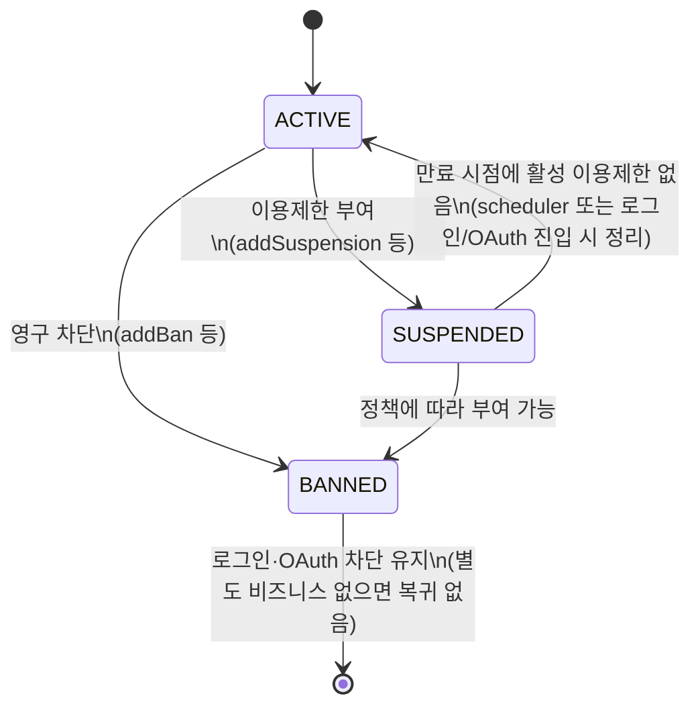

# User 도메인 아키텍처

본 문서는 **`domain/user`가 담당하는 책임 경계**, **식별자·상태 모델**, **인증·세션 관점의 흐름**, **타 도메인과의 조합 지점**, **성능·동시성 고려**, **현재 보안 관점의 갭(사실 기록)**을 정리합니다.  
기능 시나리오·화면 단위 설명은 **`docs/domains/user.md`** 에 두고, 이메일 인증 토큰·purpose·Redis 흐름의 상세는 **`docs/architecture/이메일 인증 시스템 아키텍처.md`** 를 참고합니다.

---

## 1. 도메인 경계 (책임)

| 영역 | User 도메인이 소유하는 것 | User 바깥에 두는 것 |
|------|--------------------------|---------------------|
| **신원·자격증명** | 로그인 ID(`Users.id`), 비밀번호 해시, Refresh Token 저장·폐기, JWT **subject로 쓰이는 문자열**(로그인 ID) | HTTP 보안 헤더·CORS 운영 값·전역 예외 포맷 → `global` |
| **OAuth 연계** | `SocialUser`(provider + providerId) ↔ `Users` 연결, OAuth 성공 후 토큰 발급·리다이렉트 | Provider 앱 등록 정보 → 설정·인프라 |
| **프로필·펫 마스터** | 사용자 공개 정보, 펫 중심 CRUD 및 관련 메타데이터 등 **마스터 데이터** | 게시판/케어/모임 등 **비즈니스 컨텍스트** 안에서의 사용자 참조 FK |
| **제재 상태** | `Users.status`, `suspendedUntil`, `warning_count`, `UserSanction` 이력, 로그인·OAuth 진입 시 제재 검사 일부 | 신고 접수·관리자 UI·`ReportActionType` 선택 → **`report` / `admin`** (적용 시 `UserSanctionService.applySanctionFromReport` 호출) |

신뢰·고위험 액션(펫케어·모임 등)에서의 **`emailVerified` 게이트**는 기능별 서비스에 흩어져 있으며, “이메일 인증이라는 하나의 상태를 여러 도메인이 참조한다”는 점만 User 아키텍처 관점에서 기억하면 됩니다(상세는 이메일 인증 문서).

---

## 2. 식별자 체계

실제 코드·스키마에서 혼동이 생기기 쉬운 축입니다.

| 구분 | 필드·값 | 용도 |
|------|---------|------|
| **Surrogate PK** | `Users.idx` (Long) | JPA FK, 다른 도메인 엔티티가 사용자를 참조할 때 주로 사용 |
| **로그인 ID** | `Users.id` (String, unique) | 로컬 로그인·**Access/Refresh JWT subject**·`UserDetailsService.loadUserByUsername` 인자명은 `username`이지만 실질값은 로그인 ID |
| **username 컬럼** | `Users.username` (String, unique) | 회원 레코드의 별칭 성격 필드로 존재(로그인 subject와 혼동 주의) |
| **OAuth 식별** | `(Provider, SocialUser.providerId)` | 신규/기존 판별; 기존 `Users`는 **동일 이메일이면 소셜 연결** (`OAuth2Service.createOrLinkUser`) |
| **Refresh 세션** | `Users.refreshToken` + `refreshExpiration` | 현재 설계에서는 **사용자당 최근 1개의 Refresh 문자열**(새 로그인·OAuth마다 행 업데이트로 덮임) |

**문서화 시 주의:** API 응답 DTO에서는 로그인 ID와 idx를 명확히 구분하는 것이 크로스 도메인 추적 비용을 줄입니다.

---

## 3. 인증 관련 컴포넌트 레이아웃

```mermaid
flowchart LR
    subgraph Client
        FE[React 등]
    end
    subgraph global
        JF[JwtAuthenticationFilter]
        SC[SecurityConfig]
    end
    subgraph user
        AC[AuthController]
        AU[AuthenticationManager]
        AS[AuthService]
        UD[UsersDetailsServiceImpl]
        O2S[OAuth2Service]
        O2Ok[OAuth2SuccessHandler]
    end
    subgraph data[(MySQL)]
        U[(users)]
        SU[(socialuser)]
    end
    FE -->|Bearer JWT| JF
    JF --> UD
    SC --> JF
    FE --> AC
    AC --> AU
    AC --> AS
    AS --> U
    O2Ok --> O2S
    O2S --> U
    O2S --> SU
```

- **Stateful 한 지점**: Refresh는 **DB 컬럼**에 저장(주석 상 Redis 이전 가능성 언급). Access는 **무상태 JWT**(짧은 TTL).
- **OAuth**: Naver 등은 **커스텀 `accessTokenResponseClient`**, 사용자 정보 로딩은 **`OAuth2UserProviderRouter`** 경유(`SecurityConfig`).

---

## 4. 인증 흐름 (요지)

### 4.1 로컬 로그인

1. `AuthController.login` → `AuthenticationManager.authenticate`(principal = **로그인 ID 문자열**, credential = 비밀번호).
2. `AuthService.login` → `UsersRepository.findActiveByIdString` 로 조회 후 **제재 상태** 검사 및 만료된 SUSPENDED 정리 → Access·Refresh 생성·저장.

### 4.2 API 요청 시(JWT)

1. `JwtAuthenticationFilter`: `Authorization: Bearer` 또는 **쿼리 파라미터 `token`**(SSE 등).
2. `JwtUtil.validateToken` + `UserDetailsService.loadUserByUsername(id)` → `SecurityContext`에 `ROLE_*` 부여.

### 4.3 Refresh

- `AuthService.refreshAccessToken`: JWT 서명 검증 → DB의 문자열 일치 및 `refreshExpiration` 확인 → **Access만 재발급**, Refresh 문자열은 **회전하지 않음**.

### 4.4 OAuth2 성공

- `OAuth2SuccessHandler` → `OAuth2Service.processOAuth2Login` → 로컬 로그인과 동일하게 **Refresh 덮어쓰기** 후 프론트로 **쿼리 스트링에 토큰 실어 리다이렉트**(닉네임 미설정 시 `needsNickname` 플래그).

---

## 5. 상태 전이 (계정·제재)

### 5.1 `UserStatus` (코드 레벨)



### 5.2 런타임에서의 정리 책임(중복)

- **배치**: `UserSanctionScheduler`(매일 0시) → `UserSanctionService.releaseExpiredSuspensions` — `UserSanction` 이력을 기준으로 `Users.status` 동기화.
- **요청 시**: `AuthService.login`, `OAuth2Service.processOAuth2Login` 에서 만료된 SUSPENDED 를 ACTIVE 로 정리하는 경로 존재(스케줄러 실패 지연 완충 역할 가능).

### 5.3 신고 액션과의 매핑 (사실 기록)

`UserSanctionService.applySanctionFromReport` 에서 **`ReportActionType.SUSPEND_USER` → 실제 코드상 `addBan`(영구 차단)** 로 연결됩니다. 이름과 동작 불일치는 운영·문서 간 혼선 요인이므로 “도메인 사전” 차원에서 유지해야 합니다.

---

## 6. 타 도메인 조합

- **신고/관리**: 관리자 조치 결과가 `applySanctionFromReport` 로 들어옴 → `UserSanction` 누적 + `Users` 상태 변경. 상위 플로우는 **`docs/architecture/신고 및 제재 시스템 아키텍처.md`** 쪽과 맞춰 읽습니다.
- **파일 업로드**: 펫 등 이미지 URL은 저장되나, 저장소 접근 규칙은 **file 업로드 / 정적 제공** 전역 설정과 결합됩니다(`SecurityConfig` 의 `/api/uploads/**` 등).
- **펫코인 등 금전**: `SpringDataJpaUsersRepository.findByIdForUpdate` 로 **유저 행 단위 비관적 락**(동시 차감·경고 카운터는 별 처리 — 아래 절 참고).

---

## 7. 성능·동시성 포인트

| 지점 | 구현 패턴 | 비고 |
|------|-----------|------|
| 경고 카운터 | `incrementWarningCount` 단일 JPQL 업데이트 | 동시 경고 레이스에 유리 |
| 이용제한 + 경고 재조회 | `addWarning` 내 save 후 재조회 | 경계 부근에서 발생할 수 있는 이중 처리는 상위 플로우 설계로 완화 |
| 펫코인 등 | `findByIdForUpdate` | 동시 차감 시 필수 패턴 유지 전제 |
| 소셜 가입 레이스 | `createNewUserWithRetry`(Unique 위반 재시도) | 동일 이메일 동시 소셜 가입 시 장애 완충 경로 존재 |
| Many 쪽 로딩 | `Users.socialUsers` 등 `@BatchSize` | 다른 도메인에서 참조 시 N+1 완충 패턴 명시 참고 가능 |
| Refresh 저장 | 사용자당 단일 컬럼 | 다중 디바이스 동시 세션은 “후발 로그인이 이전 세션 Refresh 무효화” 형태 |

---

## 8. 현재 보안·정책 갭 (코드 팩트 중심, 우선순위만 정리)

1. **`UserStatus` ↔ Access JWT**  
   `UsersDetailsServiceImpl` 과 `JwtAuthenticationFilter` 경로에서는 **JWT가 유효한 한 BANNED/SUSPENDED 여부가 재평가되지 않음**(로그인·OAuth 순간 검사에는 걸림). 제재 즉시 효력을 위해선 Access TTL에 의존도↑ 또는 매 요청·주기 검증 같은 정책 보강 검토 필요.

2. **펫 리소스 소유자 검증 부재**  
   `PetController` 와 `PetService` 의 `getPet` / `updatePet` / `deletePet` / `restorePet` 경로는 인증은 필요하지만, **현재 로그인 사용자가 해당 펫의 소유자인지 검증하지 않음**. 현재 구조상 `petIdx` 를 아는 인증 사용자는 타 사용자 펫에도 접근·수정·삭제를 시도할 수 있다.

3. **`@PreAuthorize("permitAll()")` vs HTTP 보안 레이어**  
   컨트롤러 메서드에 `@PreAuthorize("permitAll()")` 가 있어도, **`SecurityConfig.authorizeHttpRequests`에서 해당 경로가 `authenticated()` 로 막히면 요청 자체가 먼저 거절**됩니다(CLAUDE.md에 게시판 목록 사례로 기록된 불일치). 메서드 보안 허용과 HTTP 보안 허용을 같은 의미로 읽으면 안 됩니다.

4. **토큰이 URL을 타는 플로우**  
   OAuth 성공 후 `accessToken`, `refreshToken` 을 **쿼리**로 넘김 → 브라우저 기록·Referer 등으로 유출 표면 증가. 운영 수준에서는 **Authorization Code 흐름 + 백엔드 교환 또는 POST body/fragment 전략** 등으로 축소하는 편이 일반적.

5. **`JwtAuthenticationFilter` 의 `token` 쿼리 파라미터**  
   SSE 등을 위한 타협일 수 있으나, URL에 토큰을 두는 패턴 특유의 **유출·프록시 로그 노출 리스크**가 있다.

6. **CORS 설정**  
   `allowedOriginPatterns("*")` + `allowCredentials(true)` 조합은 운영에서 제한해야 할 수 있으며, 파일 내 TODO 주석이 그 전제를 담음.

7. **공개·모니터링 엔드포인트**  
   `/actuator/**`, `/admin-ui/**` 가 `permitAll` 로 노출되어 있음. 로컬 전용이라는 전제가 깨지면 위험.

8. **OAuth 처리 로그**  
   `OAuth2Service` 초기 처리에서 속성 로그 출력이 과할 수 있어, 운영 환경 PII 노출 검토 필요.

9. **`jwt.expiration` vs Access 15분**  
   `JwtUtil` 에 레거시 `generateToken`/설정값 `expiration` 과 **고정 15분 Access** 코드 경로가 공존—신규 개발 시 혼선 방지 차원 문서 필요.

---

## 9. 이 문서와 `docs/domains/user.md`의 역할 분담

| 문서 | 읽는 이유 |
|------|-----------|
| **`user-domain-architecture.md`(본 문서)** | 구조·경계·식별자·보안 현실 면 각도를 빠르게 잡음 |
| **`domains/user.md`** | 기능·시나리오·구체 API·예외 메시지 흐름을 참조 |

변경 발생 시 우선 순서: 코드 진실 변경 → 본 문서의 **식별자·전이·갭** 업데이트 → 도메인 상세 예시 블록(`domains/user.md`) 순을 권장합니다.
