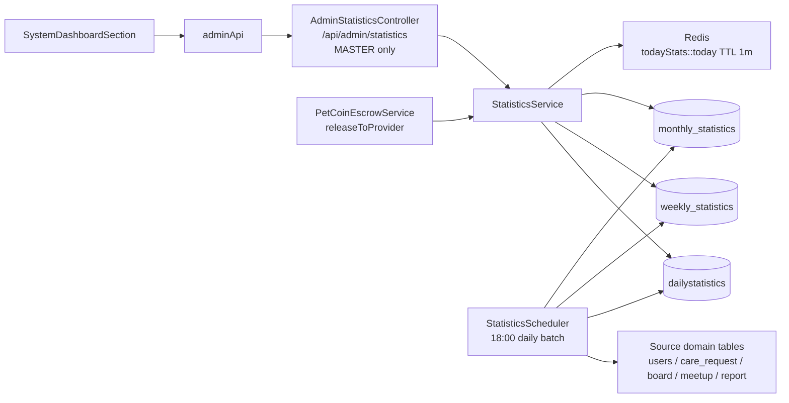
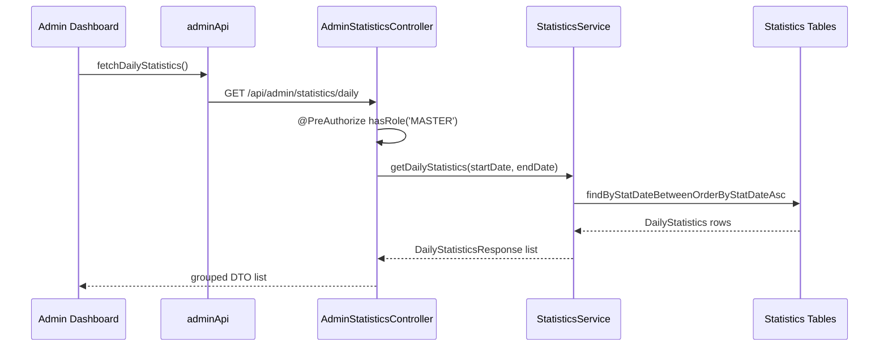
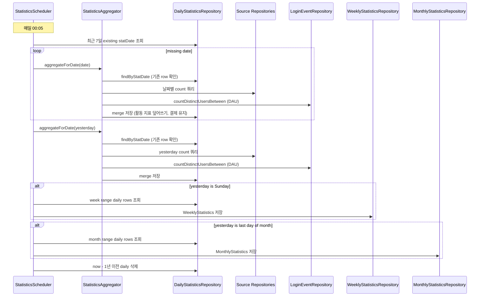
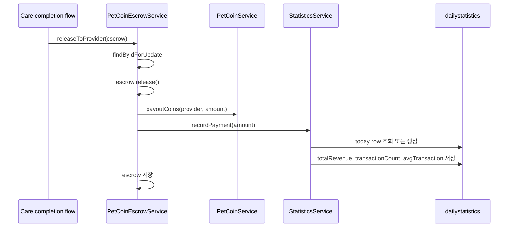
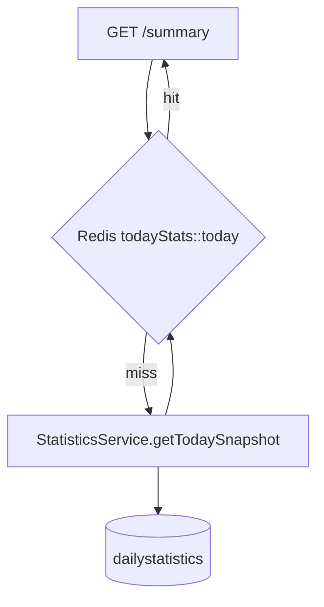
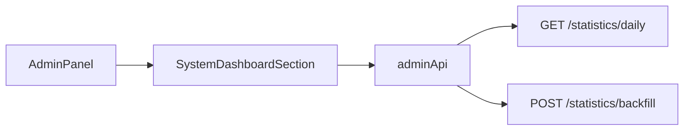
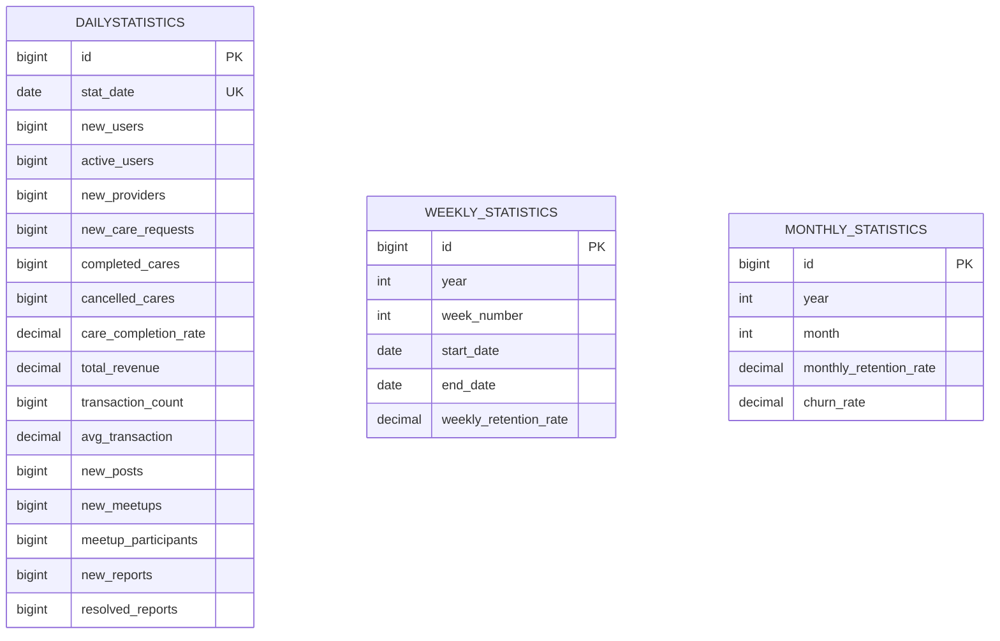

# 관리자 대시보드 & 통계 시스템 아키텍처

> 기준 코드: `domain/statistics`, `AdminStatisticsController`, `SystemDashboardSection`, `adminApi`, `PetCoinEscrowService`, `RedisConfig`.

이 문서는 Admin 전체 운영 구조가 아니라 **통계 집계 시스템과 관리자 대시보드 연결**을 설명한다. Admin facade, 감사 로그, 사용자/신고/파일 관리 구조는 `docs/architecture/admin/관리자 운영 아키텍처.md`에서 다룬다.

---

## 1. 전체 구조

핵심 구조:

- 조회 API는 저장된 statistics 테이블을 읽는다.
- 배치 집계는 source 도메인 repository의 count 쿼리를 사용해 daily row를 만든다.
- weekly/monthly는 source table을 다시 세지 않고 daily row를 합산한다.
- 에스크로 지급 완료는 배치를 기다리지 않고 `recordPayment()`로 당일 revenue를 즉시 갱신한다.
- 오늘 스냅샷 API는 Redis 1분 캐시를 쓴다.

---

## 2. API와 권한

`AdminStatisticsController`는 클래스 전체가 `@PreAuthorize("hasRole('MASTER')")`이다. `/api/admin/**` 보안 경로는 ADMIN도 진입 가능한 구조지만, 통계 컨트롤러 메서드 권한은 MASTER로 다시 좁혀진다.

| Method | Path | Service | 현재 프론트 사용 |
| --- | --- | --- | --- |
| GET | `/daily` | `getDailyStatistics` | 사용 |
| GET | `/weekly` | `getWeeklyStatistics` | 미사용 |
| GET | `/monthly` | `getMonthlyStatistics` | 미사용 |
| GET | `/summary` | `getTodaySnapshot` | 미사용 |
| POST | `/backfill` | `backfill` | 사용 |

---

## 3. 자동 집계 플로우

집계 시각:

- Cron: `0 5 0 * * ?` (매일 00:05, 구: `0 0 18 * * ?`)
- 기준 날짜: `LocalDate.now().minusDays(1)`
- 일별 보관: 1년 초과 row 삭제

집계 정책:

- daily row가 이미 있으면 **활동 지표를 merge/update한다** (구: skip). 결제 데이터가 있으면 매출 필드는 유지.
- weekly/monthly row가 이미 있으면 다시 만들지 않는다.
- backfill은 날짜별 예외를 잡아서 한 날짜 실패가 전체 범위를 중단하지 않게 한다.
- `StatisticsAggregator` 별도 빈: self-invocation 없이 `@Transactional`이 정상 적용된다.

---

## 4. 지표 소스

| 그룹 | 지표 | 원천 |
| --- | --- | --- |
| User | 신규 가입 | `Users.createdAt` |
| User | 활성 사용자 | `login_events.login_at` DISTINCT user_id (구: `Users.lastLoginAt`) |
| User | 신규 제공자 | `Users.role = SERVICE_PROVIDER`, `createdAt` |
| Care | 신규 케어 요청 | `CareRequest.createdAt` |
| Care | 완료 케어 | `CareRequest.completedAt` |
| Care | 취소 케어 | `CareRequest.status = CANCELLED`, `updatedAt` |
| Care | 완료율 | `completed / (completed + cancelled)` |
| Payment | 매출 | `PetCoinEscrowService.releaseToProvider()`에서 즉시 반영 |
| Payment | 거래 수/평균 거래액 | `recordPayment()`에서 갱신 |
| Board | 신규 게시글 | `Board.createdAt` |
| Meetup | 신규 모임 | `Meetup.createdAt` |
| Meetup | 모임 참여 | `MeetupParticipants.joinedAt` |
| Report | 신규 신고 | `Report.createdAt` |
| Report | 처리 신고 | `Report.status = RESOLVED`, `updatedAt` |

현재 통계에 없는 지표:

- MissingPet 제보/해결 수
- 댓글/반응 수
- 위치 리뷰/검색 수
- 파일 업로드 수
- 케어 지원 수

---

## 5. 매출 즉시 반영 플로우

이 흐름은 매출을 빠르게 보여주는 장점이 있다.

**동시성 보호 (2026-06-28 수정)**:
- `recordPayment()`는 `findByStatDateForUpdate` (`PESSIMISTIC_WRITE` 락)로 오늘 row를 잠근 뒤 수정한다.
- 동시 INSERT 경합 시 `DataIntegrityViolationException`을 잡아 1회 재시도한다.

**배치 충돌 해결 (2026-06-28 수정)**:
- 배치는 기존 row가 있어도 skip하지 않고 활동 지표를 항상 merge/update한다.
- 결제 데이터(`transactionCount > 0`)가 있으면 매출 필드는 그대로 두고 활동 지표만 덮어쓴다.

---

## 6. Redis 캐시

| 항목 | 내용 |
| --- | --- |
| 캐시명 | `todayStats` |
| 키 | `'today'` |
| 실제 Redis key 형태 | `todayStats::today` |
| TTL | 1분 |
| 설정 위치 | `RedisConfig.cacheManager()` |
| 사용 API | `GET /api/admin/statistics/summary` |

현재 프론트 대시보드는 `/summary`를 호출하지 않고 `/daily` 응답의 마지막 row를 요약 카드에 사용한다. 따라서 Redis 캐시는 백엔드 API로는 준비되어 있지만, 현 UI의 기본 경로에는 직접 쓰이지 않는다.

---

## 7. 프론트 대시보드 연결

현재 화면 기능:

- 최근 30일 daily 통계 조회
- 요약 카드 표시
- 성장 추이 LineChart
- 서비스 활성화 BarChart
- MASTER 전용 수동 집계 버튼

현재 연동 갭:

| 위치 | 현재 코드 | 백엔드 응답 |
| --- | --- | --- |
| 요약 카드 | `latest.newUsers` | `latest.users.newUsers` |
| 매출 카드 | `latest.totalRevenue` | `latest.revenue.totalRevenue` |
| 라인 차트 | `dataKey="newUsers"` | `users.newUsers` 또는 데이터 평탄화 필요 |
| 바 차트 | `dataKey="newPosts"` | `community.newPosts` |

즉, 현재 구조에서는 프론트에서 중첩 DTO를 평탄화하거나, Recharts `dataKey`를 중첩 경로에 맞춰 바꿔야 한다.

---

## 8. 저장 모델

주/월 테이블은 daily와 같은 집계 컬럼을 대부분 반복해서 가진다. 주/월 조회 성능은 좋지만, 컬럼 추가 시 세 엔티티와 세 DTO를 함께 수정해야 한다.

---

## 9. 운영 리스크와 개선 포인트

| 항목 | 현재 상태 | 개선 방향 |
| --- | --- | --- |
| 매출 즉시 반영과 daily skip 충돌 | ✅ 수정됨 (2026-06-28) merge 방식으로 전환 | — |
| Self-invocation @Transactional | ✅ 수정됨 (2026-06-28) StatisticsAggregator 빈 분리 | — |
| recordPayment 레이스 컨디션 | ✅ 수정됨 (2026-06-28) 비관적 락 + 재시도 | — |
| DAU 원천 오류 (lastLoginAt) | ✅ 수정됨 (2026-06-28) login_events DISTINCT | — |
| ISO 53주차 하드코딩 | ✅ 수정됨 (2026-06-28) 동적 계산 | — |
| WAU/MAU = DAU 합산 | 주/월 DISTINCT 집계 아님, 합산 기준 | `statistics-wau-mau-distinct` 태스크로 분리 예정 |
| 프론트 DTO 불일치 | 화면은 평면 필드, API는 중첩 DTO | `adminApi` 변환 계층 또는 화면 dataKey 수정 |
| `/summary` 미사용 | Redis 캐시 API는 있지만 기본 화면 경로는 `/daily` | 요약 카드는 `/summary` 사용 검토 |
| 캐시 무효화 | `recordPayment()` 후 `todayStats` evict 없음 | 결제 반영 시 `@CacheEvict(todayStats)` 검토 |
| 통계 범위 | MissingPet/Comment/Location/File 미포함 | 필요한 운영 지표만 선별 추가 |
| 감사 로그 | 통계 backfill 요청 감사 로그 없음 | Admin facade/audit 정책 편입 검토 |

---

## 10. 관련 문서

- `docs/domains/statistics.md`
- `docs/domains/admin.md`
- `docs/architecture/admin/관리자 운영 아키텍처.md`
- `docs/architecture/Redis_캐싱_전략.md`
- `docs/domains/payment.md`
- `docs/refactoring/statistics/statistics-domain-review-2026-06-28.md` — 전체 리뷰 결과
- `docs/refactoring/statistics/statistics-refactoring-2026-06-28.md` — Before/After 리팩토링 기록
