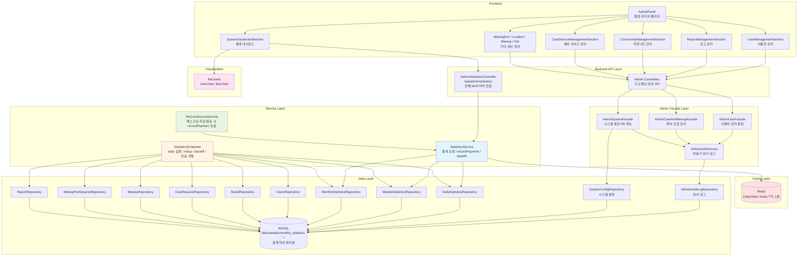
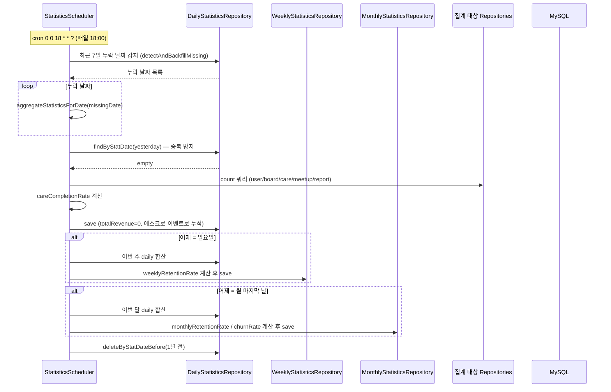
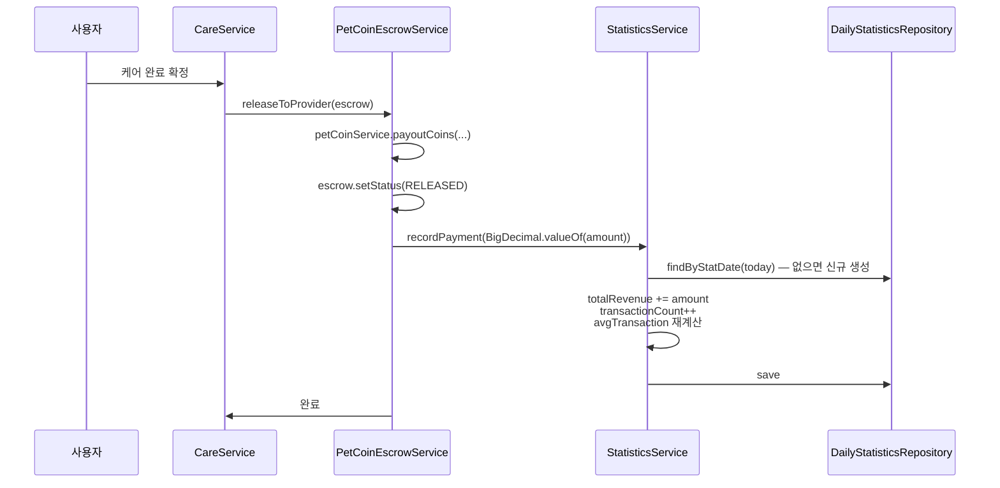
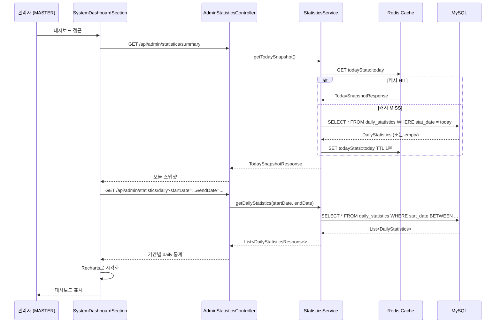
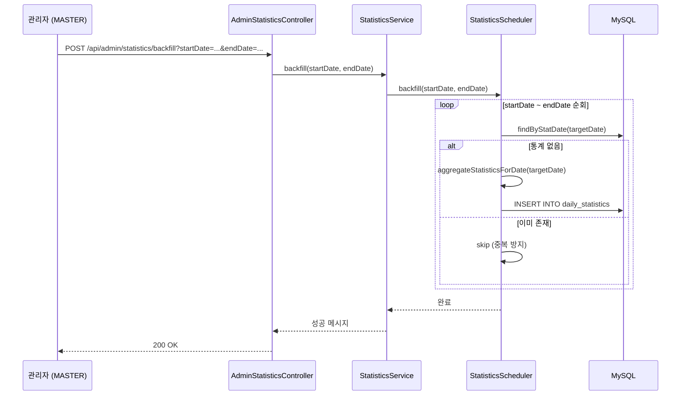

# 관리자 대시보드 & 통계 시스템 아키텍처

## 📋 개요

관리자 대시보드 & 통계 시스템은 Petory 서비스의 운영 현황을 한눈에 파악하기 위한 중앙 집중형 관리 도구입니다. 실시간 쿼리 부하를 줄이기 위해 **일별/주별/월별 3단계 집계 구조**를 채택하여 핵심 지표를 요약 저장하고, Recharts를 활용하여 시각화합니다. 통계에는 사용자·게시판·케어 외에 **모임(Meetup)·모임 참여·신고(Report)·매출** 지표가 포함됩니다. 또한 신고 처리, 유저, 콘텐츠, 케어 서비스, 실종/목격, 위치 서비스, 모임, 파일 등을 한곳에서 제어하는 통합 관리자 페이지(`AdminPanel`)를 제공합니다.

**통계 도메인 핵심 특징**:
- 매일 18:00 배치로 daily 집계 (backfill 포함)
- 일요일 → 주간 rollup, 월말 → 월간 rollup 자동 실행
- 에스크로 완료 이벤트로 매출 즉시 반영 (`PetCoinEscrowService` → `recordPayment()`)
- Redis 1분 캐시 기반 오늘 스냅샷 조회
- 1년 경과 daily 데이터 자동 삭제

## 🏗️ 시스템 아키텍처

### 전체 구조도



## 🔧 핵심 컴포넌트

### 1. StatisticsService (통계 조회 서비스)

**역할**: 통계 조회, 오늘 스냅샷(Redis 캐시), 매출 이벤트 반영, backfill 위임

**주요 메서드**:

| 메서드 | 설명 |
|--------|------|
| `getDailyStatistics(startDate, endDate)` | 기간별 daily 통계 조회. startDate > endDate 시 IllegalArgumentException |
| `getWeeklyStatistics(year)` | 연도별 주간 통계 전체 조회 |
| `getMonthlyStatistics(year)` | 연도별 월간 통계 전체 조회 |
| `getTodaySnapshot()` | 오늘 daily 행 조회 (없으면 빈 엔티티). **Redis 1분 캐시** (`todayStats::today`) |
| `recordPayment(amount)` | 당일 totalRevenue/transactionCount/avgTransaction 업데이트. `@Transactional` |
| `backfill(startDate, endDate)` | StatisticsScheduler.backfill() 위임 |

**트랜잭션 전략**: 클래스 `@Transactional(readOnly = true)`, `recordPayment`·`backfill`만 `@Transactional`

**핵심 로직 (recordPayment)**:
```java
@Transactional
public void recordPayment(BigDecimal amount) {
    LocalDate today = LocalDate.now();
    DailyStatistics stats = dailyStatisticsRepository.findByStatDate(today)
            .orElseGet(() -> DailyStatistics.builder().statDate(today).build());
    stats.setTotalRevenue(stats.getTotalRevenue().add(amount));
    stats.setTransactionCount(stats.getTransactionCount() + 1);
    long count = stats.getTransactionCount();
    stats.setAvgTransaction(stats.getTotalRevenue().divide(BigDecimal.valueOf(count), 2, RoundingMode.HALF_UP));
    dailyStatisticsRepository.save(stats);
}
```

### 2. Admin Facade 레이어 (2026-04-18 추가)

**배경**: 기존 Controller가 Service·Repository를 직접 호출하여 도메인 간 결합도가 높고, 관리자 쓰기 행위가 기록되지 않는 P0 문제가 있었음.

**구조**: Controller → AdminXxxFacade → 도메인 Service·Repository + AdminAuditService

| Facade | 책임 |
|--------|------|
| `AdminUserFacade` | 사용자 CRUD, 상태변경, ADMIN 계정 관리 |
| `AdminCareAndMeetupFacade` | 케어 요청/모임 페이징·삭제·복구 |
| `AdminSystemFacade` | SystemConfig 키-값 DB 영속, 벌크 Upsert |
| `AdminAuditService` | `@Async + REQUIRES_NEW`로 모든 쓰기 행위 감사 로그 기록 |

**신규 엔티티**:
- `AdminAuditLog`: 관리자 행위 감사 로그 (불변, `admin_idx+created_at` 복합 인덱스)
- `SystemConfig`: 시스템 설정 키-값 (`config_key` UNIQUE)

**P0 버그 수정**:
- `AdminMeetupController.deleteMeetup()` → `"ADMIN"` 문자열로 `usersRepository.findByIdString()` 호출 → `UserNotFoundException` → `MeetupService.deleteMeetupForAdmin()` 추가로 해결
- `AdminCareRequestController.restoreCareRequest()` → `throw new UnsupportedOperationException()` → `CareRequestService.restoreForAdmin()` 구현으로 해결

---

### 3. StatisticsScheduler (통계 집계 스케줄러)

**역할**: daily/weekly/monthly 3단계 집계, 누락 날짜 자동 감지·backfill, 만료 데이터 삭제

**스케줄**: `@Scheduled(cron = "0 0 18 * * ?")` — 매일 18:00

**배치 실행 순서** (`aggregateDailyStatistics`):
1. 최근 7일 누락 날짜 감지 → 자동 backfill (`detectAndBackfillMissing()`)
2. 어제 daily 집계 (`aggregateStatisticsForDate(yesterday)`)
3. 어제가 **일요일**이면 → `rollupWeekly()` 실행
4. 어제가 **월 마지막 날**이면 → `rollupMonthly()` 실행
5. 1년 이전 daily 데이터 삭제 (`deleteExpiredDaily()`)

**집계 항목** (`aggregateStatisticsForDate`):
- 신규 가입자, DAU, 신규 서비스 제공자
- 케어 요청 수, 완료 수, 취소 수
- `careCompletionRate = completed / (completed + cancelled) × 100`
- `totalRevenue = 0` (배치 초기화 — 에스크로 이벤트로 실시간 누적)
- 게시글 수, 모임 수, 모임 참여자 수
- 신고 접수 수, 신고 처리 수

**주간 rollup** (`rollupWeekly`):
- 해당 주 월요일~일요일 daily 합산
- `weeklyRetentionRate = 이번 주 WAU / 지난 주 WAU × 100`

**월간 rollup** (`rollupMonthly`):
- 해당 월 전체 daily 합산
- `monthlyRetentionRate = 이번 달 MAU / 지난 달 MAU × 100`
- `churnRate = max(0, 100 - monthlyRetentionRate)` (음수 방지)

**핵심 로직**:
```java
@Scheduled(cron = "0 0 18 * * ?")
@Transactional
public void aggregateDailyStatistics() {
    detectAndBackfillMissing();              // 최근 7일 누락 감지
    LocalDate yesterday = LocalDate.now().minusDays(1);
    aggregateStatisticsForDate(yesterday);
    if (yesterday.getDayOfWeek() == DayOfWeek.SUNDAY) rollupWeekly(yesterday);
    if (yesterday.equals(yesterday.with(TemporalAdjusters.lastDayOfMonth()))) rollupMonthly(yesterday);
    deleteExpiredDaily();
}
```

### 4. 엔티티 구조

#### DailyStatistics (`daily_statistics`, 1년 보관)

```java
@Entity @Table(name = "daily_statistics")
public class DailyStatistics {
    @Id @GeneratedValue private Long id;
    @Column(unique = true, nullable = false) private LocalDate statDate;
    // 사용자 (Long으로 변경 — 오버플로우 방지)
    private Long newUsers = 0L;
    private Long activeUsers = 0L;
    private Long newProviders = 0L;
    // 케어
    private Long newCareRequests = 0L;
    private Long completedCares = 0L;
    private Long cancelledCares = 0L;
    @Column(precision = 5, scale = 2) private BigDecimal careCompletionRate = BigDecimal.ZERO;
    // 결제 (에스크로 이벤트로 실시간 누적)
    @Column(precision = 15, scale = 2) private BigDecimal totalRevenue = BigDecimal.ZERO;
    private Long transactionCount = 0L;
    @Column(precision = 15, scale = 2) private BigDecimal avgTransaction = BigDecimal.ZERO;
    // 커뮤니티
    private Long newPosts = 0L;
    private Long newMeetups = 0L;
    private Long meetupParticipants = 0L;
    // 운영
    private Long newReports = 0L;
    private Long resolvedReports = 0L;
}
```

#### WeeklyStatistics (`weekly_statistics`, 무기한)

```java
@Entity @Table(name = "weekly_statistics",
    uniqueConstraints = @UniqueConstraint(columnNames = {"year", "week_number"}))
public class WeeklyStatistics {
    @Id @GeneratedValue private Long id;
    private Integer year;
    private Integer weekNumber;   // ISO 주차 (1~53)
    private LocalDate startDate;  // 해당 주 월요일
    private LocalDate endDate;    // 해당 주 일요일
    @Column(precision = 5, scale = 2) private BigDecimal weeklyRetentionRate = BigDecimal.ZERO;
    // + daily와 동일한 집계 컬럼 전체 (합산)
}
```

#### MonthlyStatistics (`monthly_statistics`, 무기한)

```java
@Entity @Table(name = "monthly_statistics",
    uniqueConstraints = @UniqueConstraint(columnNames = {"year", "month"}))
public class MonthlyStatistics {
    @Id @GeneratedValue private Long id;
    private Integer year;
    private Integer month;   // 1~12
    @Column(precision = 5, scale = 2) private BigDecimal monthlyRetentionRate = BigDecimal.ZERO;
    @Column(precision = 5, scale = 2) private BigDecimal churnRate = BigDecimal.ZERO;
    // + daily와 동일한 집계 컬럼 전체 (합산)
}
```

### 5. SystemDashboardSection (프론트엔드 통계 대시보드)

**역할**: 각 통계 API를 호출하여 Recharts로 시각화

**주요 기능**:
- 상단 요약 카드: `/summary` (오늘 스냅샷) 또는 daily 배열의 가장 최근 항목으로 표시
- **MASTER** 전용: 「수동 backfill」 버튼 → `POST /api/admin/statistics/backfill` 호출
- Line Chart (최근 30일): `newUsers`, `newMeetups`, `activeUsers`, `newReports` 등 복수 시리즈
- Bar Chart (스택): `newPosts`, `newCareRequests`, `newMeetups`, `newReports`

## 🔄 비즈니스 로직 흐름

### 1. 배치 집계 흐름 (StatisticsScheduler — 매일 18:00)



### 2. 매출 이벤트 즉시 반영 흐름



### 3. 통계 조회 흐름 (AdminStatisticsController)



### 4. Backfill 흐름



## 📊 데이터 보관 정책

| 테이블 | 보관 기간 | 삭제 방식 |
|--------|---------|---------|
| `daily_statistics` | 1년 | 배치 실행 시 `deleteByStatDateBefore(now - 1년)` |
| `weekly_statistics` | 무기한 | - |
| `monthly_statistics` | 무기한 | - |

## 🎯 핵심 설계 전략

### 1. 일별 요약 데이터 전략 (Daily Summary Pattern)

**문제**: 실시간으로 무거운 집계 쿼리를 실행하면 DB 부하가 증가하고 응답 시간이 느려짐

**해결**: 스케줄러(매일 18:00)가 배치로 daily 집계 → 대시보드 조회 = 단순 SELECT

**효과**: DB 부하 감소, 빠른 응답, 과거 데이터 조회 성능 향상

### 2. 3단계 집계 구조

| 단계 | 테이블 | 생성 시점 | 보관 |
|------|--------|----------|------|
| Daily | `daily_statistics` | 매일 18:00 배치 | 1년 |
| Weekly | `weekly_statistics` | 일요일 rollup | 무기한 |
| Monthly | `monthly_statistics` | 월말 rollup | 무기한 |

- Weekly/Monthly는 daily 합산이므로 별도 집계 쿼리 불필요
- 장기 트렌드 분석을 위해 weekly/monthly는 무기한 보관

### 3. 매출 이벤트 즉시 반영

**문제**: 배치 집계 시점(18:00)까지 매출이 0으로 보임

**해결**: `PetCoinEscrowService.releaseToProvider()` → `statisticsService.recordPayment()` 직접 호출
- 에스크로 지급 완료 시 해당 일자 `totalRevenue`, `transactionCount`, `avgTransaction` 즉시 업데이트
- 배치에서는 `totalRevenue = 0`으로 초기화, 이벤트 누적분은 유지

### 4. Redis 캐시 전략 (오늘 스냅샷)

| 캐시 키 | TTL | 대상 |
|---------|-----|------|
| `todayStats::today` | 1분 | `getTodaySnapshot()` |

오늘 스냅샷은 매출 이벤트로 계속 갱신되므로 1분 TTL 적용, 긴 캐시는 부적합.

### 5. 누락 날짜 자동 감지

**문제**: 서버 재시작·장애로 배치 실행이 누락될 수 있음

**해결**: 매 배치 실행 시 최근 7일 날짜를 순회하여 누락 감지 → 자동 backfill

### 6. 중복 집계 방지

**문제**: 스케줄러 중복 실행, 수동 backfill 시 중복 집계 가능

**해결**:
- 집계 전 `findByStatDate(date).isPresent()` 확인 → 존재하면 skip
- `statDate`, `(year, week_number)`, `(year, month)` UNIQUE 제약으로 DB 레벨 보호

### 7. Integer → Long 마이그레이션

모든 통계 카운트 필드를 `Integer → Long`으로 변환하여 오버플로우 방지. 서비스 규모 확장 대비.

## 🔐 보안 고려사항

### 권한 제어

통계 API 전체: `@PreAuthorize("hasRole('MASTER')")` — MASTER만 접근 가능 (기존 ADMIN 혼용에서 통일)

| 엔드포인트 | 권한 |
|------------|------|
| `GET /api/admin/statistics/daily` | MASTER |
| `GET /api/admin/statistics/weekly` | MASTER |
| `GET /api/admin/statistics/monthly` | MASTER |
| `GET /api/admin/statistics/summary` | MASTER |
| `POST /api/admin/statistics/backfill` | MASTER |

## 📝 주요 API 엔드포인트

백엔드 구현 클래스: `AdminStatisticsController` (`/api/admin/statistics`). 전체 `@PreAuthorize("hasRole('MASTER')")`.

| Method | URL | 설명 | Query Params |
|--------|-----|------|-------------|
| GET | `/daily` | 기간별 daily 통계 | `startDate`, `endDate` (기본: 최근 30일) |
| GET | `/weekly` | 연도별 주간 통계 | `year` (기본: 올해) |
| GET | `/monthly` | 연도별 월간 통계 | `year` (기본: 올해) |
| GET | `/summary` | 오늘 실시간 스냅샷 (Redis 1분 캐시) | - |
| POST | `/backfill` | 기간 backfill | `startDate`, `endDate` (required) |

### 응답 구조 (DailyStatisticsResponse)
```json
{
  "statDate": "2026-04-17",
  "users": { "newUsers": 12, "activeUsers": 340, "newProviders": 3 },
  "care": { "newRequests": 25, "completed": 18, "cancelled": 4, "completionRate": 81.82 },
  "revenue": { "totalRevenue": 450000, "transactionCount": 18, "avgTransaction": 25000 },
  "community": { "newPosts": 47, "newMeetups": 5, "meetupParticipants": 32 },
  "moderation": { "newReports": 2, "resolvedReports": 1 }
}
```

## 📈 성능 최적화

### DB 최적화

```sql
-- daily_statistics
CREATE UNIQUE INDEX uq_daily_stat_date ON daily_statistics(stat_date);

-- weekly_statistics
CREATE UNIQUE INDEX uq_weekly_year_week ON weekly_statistics(year, week_number);

-- monthly_statistics
CREATE UNIQUE INDEX uq_monthly_year_month ON monthly_statistics(year, month);

-- 집계 쿼리 최적화
CREATE INDEX idx_users_created_at ON users(created_at);
CREATE INDEX idx_users_last_login_at ON users(last_login_at);
CREATE INDEX idx_board_created_at ON board(created_at);
CREATE INDEX idx_care_request_created_at ON care_request(created_at);
CREATE INDEX idx_care_request_completed_at ON care_request(completed_at);
```

### 애플리케이션 레벨 최적화

- **배치 집계**: 실시간 집계 쿼리 부하 없음 — 대시보드 조회 = 단순 SELECT
- **careCompletionRate 사전 계산**: 조회 시 연산 없이 저장된 값 바로 사용
- **Integer → Long**: 오버플로우 방지
- **누락 감지 범위 최소화**: 최근 7일만 체크

## 📎 관련 문서

- 도메인 스펙: `docs/domains/statistics.md`
- 마이그레이션: `backend/main/resources/sql/migration/statistics-redesign.sql`
