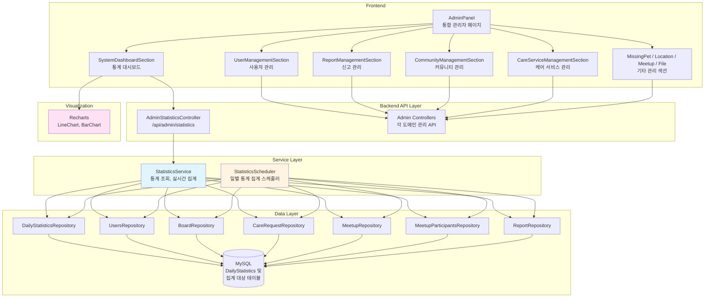
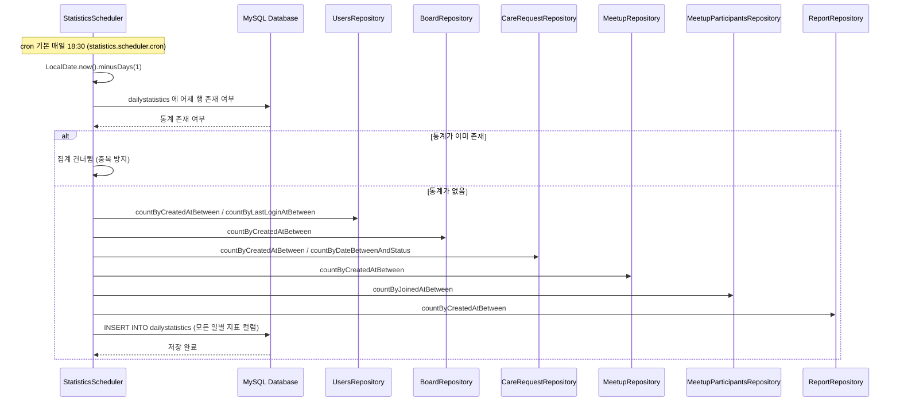
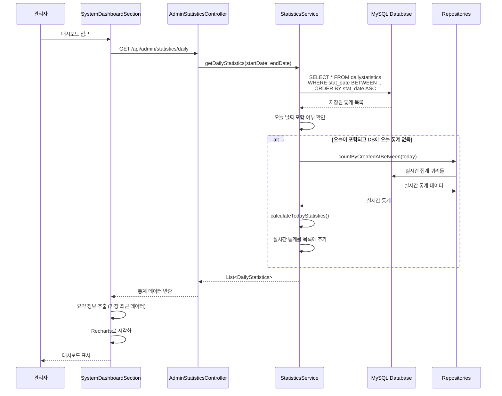
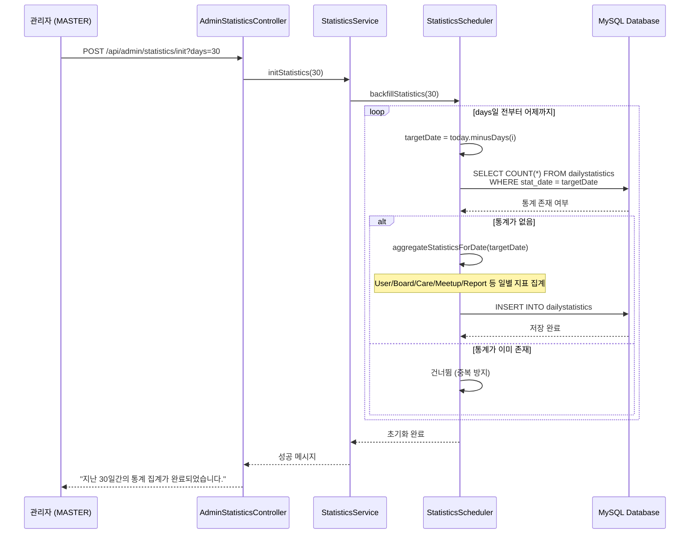

# 관리자 대시보드 & 통계 시스템 아키텍처

## 📋 개요

관리자 대시보드 & 통계 시스템은 Petory 서비스의 운영 현황을 한눈에 파악하기 위한 중앙 집중형 관리 도구입니다. 실시간 쿼리 부하를 줄이기 위해 `DailyStatistics` 테이블을 설계하여 일별 핵심 지표를 요약 저장하고, Recharts를 활용하여 시각화합니다. 통계에는 사용자·게시판·케어 외에 **모임(Meetup)·모임 참여·신고(Report)** 지표가 포함됩니다. 또한 신고 처리, 유저, 콘텐츠, 케어 서비스, 실종/목격, 위치 서비스, 모임, 파일 등을 한곳에서 제어하는 통합 관리자 페이지(`AdminPanel`)를 제공합니다.

## 🏗️ 시스템 아키텍처

### 전체 구조도



## 🔧 핵심 컴포넌트

### 1. StatisticsService (통계 조회 서비스)

**역할**: 일별 통계 조회, 실시간 통계 계산, 과거 데이터 초기화

**주요 메서드**:
- `getDailyStatistics()`: 기간별 일일 통계 조회 (오늘 포함 시 실시간 집계)
- `getDailyStatistics(date)`: 특정 날짜의 통계 조회
- `initStatistics()`: 과거 통계 초기화 (Backfill)
- `calculateTodayStatistics()`: 오늘 날짜의 실시간 통계 계산

**핵심 로직**:

#### 기간별 통계 조회 (실시간 집계 포함)
```java
public List<DailyStatistics> getDailyStatistics(LocalDate startDate, LocalDate endDate) {
    // 1. DB에서 저장된 통계 조회
    List<DailyStatistics> stats = dailyStatisticsRepository
        .findByStatDateBetweenOrderByStatDateAsc(startDate, endDate);
    
    LocalDate today = LocalDate.now();
    
    // 2. 조회 기간에 오늘이 포함되어 있고, DB에 오늘의 통계가 없는 경우
    if (!startDate.isAfter(today) && !endDate.isBefore(today)) {
        boolean todayExists = stats.stream()
            .anyMatch(s -> s.getStatDate().equals(today));
        
        // 3. 실시간 집계 추가
        if (!todayExists) {
            stats.add(calculateTodayStatistics());
        }
    }
    
    return stats;
}
```

#### 실시간 통계 계산
```java
private DailyStatistics calculateTodayStatistics() {
    LocalDate today = LocalDate.now();
    LocalDateTime startOfDay = today.atStartOfDay();
    LocalDateTime endOfDay = LocalDateTime.now(); // 현재 시점까지

    long newUsers = usersRepository.countByCreatedAtBetween(startOfDay, endOfDay);
    long newPosts = boardRepository.countByCreatedAtBetween(startOfDay, endOfDay);
    long newCareRequests = careRequestRepository.countByCreatedAtBetween(startOfDay, endOfDay);
    long completedCares = careRequestRepository.countByDateBetweenAndStatus(startOfDay, endOfDay,
            CareRequestStatus.COMPLETED);
    long activeUsers = usersRepository.countByLastLoginAtBetween(startOfDay, endOfDay);
    long newMeetups = meetupRepository.countByCreatedAtBetween(startOfDay, endOfDay);
    long meetupParticipants = meetupParticipantsRepository.countByJoinedAtBetween(startOfDay, endOfDay);
    long newReports = reportRepository.countByCreatedAtBetween(startOfDay, endOfDay);

    return DailyStatistics.builder()
            .statDate(today)
            .newUsers((int) newUsers)
            .newPosts((int) newPosts)
            .newCareRequests((int) newCareRequests)
            .completedCares((int) completedCares)
            .totalRevenue(BigDecimal.ZERO)
            .activeUsers((int) activeUsers)
            .newMeetups((int) newMeetups)
            .meetupParticipants((int) meetupParticipants)
            .newReports((int) newReports)
            .build();
}
```

### 2. StatisticsScheduler (일별 통계 집계 스케줄러)

**역할**: 매일 자동으로 어제 날짜의 통계를 집계하여 `DailyStatistics` 테이블에 저장

**주요 메서드**:
- `aggregateDailyStatistics()`: 설정된 cron에 따라 매일 실행되어 **어제** 날짜 통계를 집계 (기본: 매일 18:30)
- `aggregateStatisticsForDate()`: 특정 날짜의 통계 집계 (재사용 가능)
- `backfillStatistics()`: 과거 데이터 초기화 (Backfill)

**스케줄 시각**: `application.properties`의 `statistics.scheduler.cron`으로 지정하며, 기본값은 `0 30 18 * * ?`(매일 18:30). `statistics.scheduler.hour` / `statistics.scheduler.minute`는 로그 및 스케줄러 시간 조회 API의 기본 표시에 사용됩니다.

**핵심 로직**:

#### 일별 통계 집계 스케줄러
```java
@Scheduled(cron = "${statistics.scheduler.cron:0 30 18 * * ?}")
@Transactional
public void aggregateDailyStatistics() {
    LocalDate yesterday = LocalDate.now().minusDays(1);
    aggregateStatisticsForDate(yesterday);
}
```

#### 특정 날짜 통계 집계
```java
@Transactional
public void aggregateStatisticsForDate(LocalDate date) {
    log.info("일일 통계 집계 시작: {}", date);
    
    // 1. 중복 방지: 이미 집계된 데이터가 있는지 확인
    if (dailyStatisticsRepository.findByStatDate(date).isPresent()) {
        log.warn("이미 {}의 통계가 존재합니다. 집계를 건너뜁니다.", date);
        return;
    }
    
    LocalDateTime startOfDay = date.atStartOfDay();
    LocalDateTime endOfDay = date.atTime(LocalTime.MAX);
    
    // 2. 신규 가입자
    long newUsers = usersRepository.countByCreatedAtBetween(startOfDay, endOfDay);
    
    // 3. 새 게시글
    long newPosts = boardRepository.countByCreatedAtBetween(startOfDay, endOfDay);
    
    // 4. 케어 요청
    long newCareRequests = careRequestRepository.countByCreatedAtBetween(startOfDay, endOfDay);
    
    // 5. 완료된 케어
    long completedCares = careRequestRepository.countByDateBetweenAndStatus(
        startOfDay, endOfDay, CareRequestStatus.COMPLETED);
    
    // 6. 매출 (현재 0으로 고정)
    BigDecimal totalRevenue = BigDecimal.ZERO;
    
    // 7. DAU (활성 사용자)
    long activeUsers = usersRepository.countByLastLoginAtBetween(startOfDay, endOfDay);

    // 8. 새 모임
    long newMeetups = meetupRepository.countByCreatedAtBetween(startOfDay, endOfDay);

    // 9. 모임 참여
    long meetupParticipants = meetupParticipantsRepository.countByJoinedAtBetween(startOfDay, endOfDay);

    // 10. 신고 접수
    long newReports = reportRepository.countByCreatedAtBetween(startOfDay, endOfDay);

    DailyStatistics stats = DailyStatistics.builder()
            .statDate(date)
            .newUsers((int) newUsers)
            .newPosts((int) newPosts)
            .newCareRequests((int) newCareRequests)
            .completedCares((int) completedCares)
            .totalRevenue(totalRevenue)
            .activeUsers((int) activeUsers)
            .newMeetups((int) newMeetups)
            .meetupParticipants((int) meetupParticipants)
            .newReports((int) newReports)
            .build();

    dailyStatisticsRepository.save(stats);
    log.info("일일 통계 집계 완료: {}", stats);
}
```

### 3. DailyStatistics 엔티티

**역할**: 일별 통계 데이터를 저장하는 엔티티

**주요 필드**:
- `statDate`: 통계 날짜 (Unique, NOT NULL)
- `newUsers`: 신규 가입자 수
- `newPosts`: 새 게시글 수
- `newCareRequests`: 새 케어 요청 수
- `completedCares`: 완료된 케어 수
- `totalRevenue`: 일 매출 (현재 0으로 고정)
- `activeUsers`: 일일 활성 사용자 수 (DAU)
- `newMeetups`: 새 모임 수
- `meetupParticipants`: 모임 참여(가입) 수
- `newReports`: 신고 접수 수

**엔티티 구조**:
```java
@Entity
@Table(name = "dailystatistics")
public class DailyStatistics {
    @Id
    @GeneratedValue(strategy = GenerationType.IDENTITY)
    private Long id;

    @Column(name = "stat_date", unique = true, nullable = false)
    private LocalDate statDate;

    @Builder.Default
    @Column(name = "new_users")
    private Integer newUsers = 0;

    @Builder.Default
    @Column(name = "new_posts")
    private Integer newPosts = 0;

    @Builder.Default
    @Column(name = "new_care_requests")
    private Integer newCareRequests = 0;

    @Builder.Default
    @Column(name = "completed_cares")
    private Integer completedCares = 0;

    @Builder.Default
    @Column(name = "total_revenue")
    private BigDecimal totalRevenue = BigDecimal.ZERO;

    @Builder.Default
    @Column(name = "active_users")
    private Integer activeUsers = 0;

    @Builder.Default
    @Column(name = "new_meetups")
    private Integer newMeetups = 0;

    @Builder.Default
    @Column(name = "meetup_participants")
    private Integer meetupParticipants = 0;

    @Builder.Default
    @Column(name = "new_reports")
    private Integer newReports = 0;

    // createdAt, updatedAt (@PrePersist / @PreUpdate)
}
```

### 4. SystemDashboardSection (프론트엔드 통계 대시보드)

**역할**: `adminApi.fetchDailyStatistics()`로 일별 통계를 불러와 Recharts로 시각화합니다.

**주요 기능**:
- 상단 요약 카드: 응답 배열의 **마지막 항목**(가장 최근 일자, 오늘이 실시간 보정되면 오늘)으로 요약 — 신규 가입, DAU, 새 게시글, 새 케어 요청, 새 모임, 모임 참여, 신규 신고, 매출(예상) 등
- **MASTER** 전용: 「통계 수동 집계」 버튼 → `POST /api/admin/statistics/init?days=30` 호출 후 목록 갱신
- Line Chart(최근 30일): `newUsers`, `newMeetups`, `activeUsers`, `newReports` 등 복수 시리즈
- Bar Chart(스택): `newPosts`, `newCareRequests`, `newMeetups`, `newReports`

**핵심 로직 (요약)**:
```javascript
// 요약: 최근 일자 스냅샷
const data = await adminApi.fetchDailyStatistics();
if (data.length > 0) {
  const latest = data[data.length - 1];
  setSummary({
    newUsers: latest.newUsers,
    newPosts: latest.newPosts,
    newCareRequests: latest.newCareRequests,
    newMeetups: latest.newMeetups ?? 0,
    meetupParticipants: latest.meetupParticipants ?? 0,
    newReports: latest.newReports ?? 0,
    activeUsers: latest.activeUsers,
    totalRevenue: latest.totalRevenue
  });
}
```

## 🔄 비즈니스 로직 흐름

### 1. 기간별 통계 조회 및 실시간 집계 흐름

**단계별 처리 과정** (`StatisticsService.getDailyStatistics()`):

1. **DB에서 저장된 통계 조회**
   - `startDate`와 `endDate` 사이의 통계 조회 (최신순)
   - `DailyStatistics` 테이블에서 조회

2. **오늘 날짜 포함 여부 확인**
   - 조회 기간에 오늘 날짜가 포함되는지 확인
   - `!startDate.isAfter(today) && !endDate.isBefore(today)` 조건 확인

3. **오늘 통계 확인**
   - 조회된 통계 목록에서 오늘 날짜의 통계가 있는지 확인
   - Stream을 사용하여 `statDate.equals(today)` 체크

4. **실시간 집계 추가** (조건부)
   - 오늘이 포함되어 있고, DB에 오늘의 통계가 없는 경우:
     - `calculateTodayStatistics()` 호출
     - 실시간 집계 결과를 목록에 추가

5. **응답 반환**
   - 저장된 통계 목록 + 실시간 집계 결과 반환

**특징:**
- 오늘이 포함되어 있을 때만 실시간 집계 (성능 최적화)
- DB에 저장된 과거 데이터와 실시간 데이터 병합

### 2. 오늘 날짜 실시간 통계 계산 흐름

**단계별 처리 과정** (`StatisticsService.calculateTodayStatistics()`):

1. **시간 범위 설정**
   - 시작 시간: 오늘 자정 (`today.atStartOfDay()`)
   - 종료 시간: 현재 시점 (`LocalDateTime.now()`)

2. **신규 가입자 수 집계**
   - `usersRepository.countByCreatedAtBetween(startOfDay, endOfDay)`
   - 생성일시가 오늘 범위 내인 사용자 수

3. **새 게시글 수 집계**
   - `boardRepository.countByCreatedAtBetween(startOfDay, endOfDay)`
   - 생성일시가 오늘 범위 내인 게시글 수

4. **새 케어 요청 수 집계**
   - `careRequestRepository.countByCreatedAtBetween(startOfDay, endOfDay)`
   - 생성일시가 오늘 범위 내인 케어 요청 수

5. **완료된 케어 수 집계**
   - `careRequestRepository.countByDateBetweenAndStatus(startOfDay, endOfDay, COMPLETED)`
   - 날짜가 오늘 범위 내이고 상태가 `COMPLETED`인 케어 요청 수

6. **활성 사용자 수 집계 (DAU)**
   - `usersRepository.countByLastLoginAtBetween(startOfDay, endOfDay)`
   - 마지막 로그인 시간이 오늘 범위 내인 사용자 수

7. **모임·신고 지표 집계**
   - `meetupRepository.countByCreatedAtBetween(...)` — 새 모임 수
   - `meetupParticipantsRepository.countByJoinedAtBetween(...)` — 모임 참여 수
   - `reportRepository.countByCreatedAtBetween(...)` — 신고 접수 수

8. **DailyStatistics 객체 생성**
   - 통계 날짜: 오늘
   - 집계된 데이터 설정
   - 매출: `BigDecimal.ZERO` (현재 고정)

9. **응답 반환**
   - 생성된 `DailyStatistics` 객체 반환 (DB에 저장하지 않음)

**특징:**
- 현재 시점까지의 실시간 집계 (오늘 하루 전체가 아님)
- DB에 저장하지 않고 메모리에서만 생성 (다음날 스케줄러가 집계)

### 3. 특정 날짜 통계 조회 흐름

**단계별 처리 과정** (`StatisticsService.getDailyStatistics(date)`):

1. **오늘 날짜 확인**
   - 조회하려는 날짜가 오늘인지 확인

2. **분기 처리**
   - **오늘인 경우**: `calculateTodayStatistics()` 호출 (실시간 집계)
   - **과거 날짜인 경우**: DB에서 조회 (`dailyStatisticsRepository.findByStatDate(date)`)
     - 존재하면 반환
     - 존재하지 않으면 `null` 반환

3. **응답 반환**
   - 계산된 또는 조회된 통계 반환

**특징:**
- 오늘은 실시간 집계, 과거는 DB 조회

### 4. 일별 통계 집계 스케줄러 흐름

**단계별 처리 과정** (`StatisticsScheduler.aggregateDailyStatistics()`):

1. **스케줄러 실행**
   - `statistics.scheduler.cron`에 따라 실행 (기본: 매일 18:30, `0 30 18 * * ?`)

2. **어제 날짜 계산**
   - `LocalDate.now().minusDays(1)`로 어제 날짜 계산

3. **통계 집계**
   - `aggregateStatisticsForDate(yesterday)` 호출

**특징:**
- 매일 자동 실행
- 어제 날짜의 통계 집계 (오늘은 아직 진행 중이므로)

### 5. 특정 날짜 통계 집계 흐름

**단계별 처리 과정** (`StatisticsScheduler.aggregateStatisticsForDate()`):

1. **중복 집계 방지**
   - `dailyStatisticsRepository.findByStatDate(date).isPresent()`로 확인
   - 이미 집계된 통계가 있으면 로그 기록 후 종료 (중복 방지)

2. **시간 범위 설정**
   - 시작 시간: 해당 날짜의 자정 (`date.atStartOfDay()`)
   - 종료 시간: 해당 날짜의 23:59:59 (`date.atTime(LocalTime.MAX)`)

3. **신규 가입자 수 집계**
   - `usersRepository.countByCreatedAtBetween(startOfDay, endOfDay)`
   - 해당 날짜 범위 내 생성된 사용자 수

4. **새 게시글 수 집계**
   - `boardRepository.countByCreatedAtBetween(startOfDay, endOfDay)`
   - 해당 날짜 범위 내 생성된 게시글 수

5. **새 케어 요청 수 집계**
   - `careRequestRepository.countByCreatedAtBetween(startOfDay, endOfDay)`
   - 해당 날짜 범위 내 생성된 케어 요청 수

6. **완료된 케어 수 집계**
   - `careRequestRepository.countByDateBetweenAndStatus(startOfDay, endOfDay, COMPLETED)`
   - 해당 날짜 범위 내 완료된 케어 요청 수

7. **매출 집계**
   - 현재: `BigDecimal.ZERO` (고정값, 향후 구현)

8. **활성 사용자 수 집계 (DAU)**
   - `usersRepository.countByLastLoginAtBetween(startOfDay, endOfDay)`
   - 해당 날짜 범위 내 로그인한 사용자 수

9. **새 모임·모임 참여·신고**
   - `meetupRepository.countByCreatedAtBetween`, `meetupParticipantsRepository.countByJoinedAtBetween`, `reportRepository.countByCreatedAtBetween`

10. **DailyStatistics 저장**
   - 집계된 데이터로 `DailyStatistics` 엔티티 생성
   - DB 저장 (`dailyStatisticsRepository.save()`)
   - 로그 기록

**특징:**
- 중복 집계 방지 (사전 확인)
- 하루 전체 데이터 집계 (자정 ~ 23:59:59)
- DB에 저장하여 영구 보존

### 6. 과거 통계 초기화 (Backfill) 흐름

**단계별 처리 과정** (`StatisticsService.initStatistics()` → `StatisticsScheduler.backfillStatistics()`):

1. **초기화 시작**
   - API: `POST /api/admin/statistics/init?days=...` (MASTER) 또는 프론트 「통계 수동 집계」
   - `StatisticsService.initStatistics(days)` → 과거 `days`일 구간 백필

2. **스케줄러에 위임**
   - `statisticsScheduler.backfillStatistics(days)` 호출

3. **과거 날짜 순회**
   - `days`일 전부터 어제까지 순회
   - 각 날짜에 대해 `aggregateStatisticsForDate()` 호출
   - 중복 체크는 `aggregateStatisticsForDate()` 내부에서 처리

4. **집계 완료**
   - 모든 날짜에 대한 집계 완료 후 로그 기록

**특징:**
- 과거 데이터 초기화 지원 (Backfill)
- 중복 집계 방지 (기존 데이터는 건너뜀)
- MASTER 권한 필요

## 📊 데이터 흐름

### 1. 일별 통계 집계 흐름 (스케줄러)



### 2. 통계 조회 및 실시간 집계 흐름



### 3. 과거 데이터 초기화 (Backfill) 흐름



## 🎯 핵심 설계 전략

### 1. 일별 요약 데이터 전략 (Daily Summary Pattern)

**문제**: 실시간으로 무거운 집계 쿼리를 실행하면 DB 부하가 증가하고 응답 시간이 느려짐

**해결**: 일별 요약 데이터를 미리 집계하여 저장
- 스케줄러(기본 매일 18:30, `statistics.scheduler.cron`으로 조정)가 **어제** 날짜의 통계를 집계하여 `DailyStatistics` 테이블에 저장
- 대시보드 조회 시 간단한 `SELECT` 쿼리만 실행
- 오늘 날짜는 실시간 집계로 보정 (선택적)

**효과**:
- DB 부하 대폭 감소
- 빠른 응답 시간
- 과거 데이터 조회 성능 향상

### 2. 실시간 집계 보정 전략

**문제**: 오늘 날짜의 통계는 아직 스케줄러가 집계하지 않았음

**해결**: 조회 시점에 오늘이 포함되어 있고 DB에 오늘의 통계가 없으면 실시간 집계
- `calculateTodayStatistics()`로 현재 시점까지의 통계 계산
- 실시간 집계 결과를 조회 결과에 추가
- 다음날 스케줄러가 정확한 어제 데이터를 집계

**효과**:
- 오늘 데이터도 대시보드에서 확인 가능
- 실시간성과 성능의 균형 유지

### 3. 중복 집계 방지 전략

**문제**: 스케줄러가 중복 실행되거나 수동 초기화 시 중복 집계 가능

**해결**: 집계 전에 이미 존재하는지 확인
- `dailyStatisticsRepository.findByStatDate(date).isPresent()`로 확인
- 이미 존재하면 집계 건너뜀
- `statDate`에 `UNIQUE` 제약 조건으로 DB 레벨 보호

**효과**:
- 데이터 일관성 보장
- 불필요한 집계 작업 방지

### 4. 통합 관리자 페이지 전략

**문제**: 각 도메인별 관리 기능이 분산되어 있음

**해결**: 중앙 집중형 관리자 페이지 (`AdminPanel`)
- 단일 페이지에서 모든 관리 기능 접근
- 메뉴 기반 섹션 전환: 대시보드, 사용자, 신고, 커뮤니티, 실종/목격, 케어, 위치 서비스, 모임, 파일 등
- 권한 기반 접근 제어 (`ADMIN`, `MASTER`)

**효과**:
- 관리자 편의성 향상
- 일관된 UI/UX
- 효율적인 운영 관리

### 5. 시각화 전략

**문제**: 숫자 데이터만으로는 트렌드 파악이 어려움

**해결**: Recharts를 활용한 다양한 차트 제공
- **Line Chart**: 성장·리스크 추이 (예: 신규 가입, 새 모임, 활성 유저, 신고)
- **Bar Chart**(스택): 활성화 지표 (게시글, 케어 요청, 모임, 신고)
- **요약 카드**: 핵심 지표를 한눈에 확인

**효과**:
- 직관적인 데이터 이해
- 트렌드 파악 용이
- 의사결정 지원

## 🔄 도메인 간 연동

### 1. User 도메인 연동
- **용도**: 신규 가입자 수, 활성 사용자 수 (DAU) 집계
- **방법**: `UsersRepository.countByCreatedAtBetween()`, `countByLastLoginAtBetween()`
- **효과**: 사용자 성장 및 활성도 모니터링

### 2. Board 도메인 연동
- **용도**: 새 게시글 수 집계
- **방법**: `BoardRepository.countByCreatedAtBetween()`
- **효과**: 커뮤니티 활성도 모니터링

### 3. Care 도메인 연동
- **용도**: 새 케어 요청 수, 완료된 케어 수 집계
- **방법**: `CareRequestRepository.countByCreatedAtBetween()`, `countByDateBetweenAndStatus(COMPLETED)`
- **효과**: 케어 서비스 이용 현황 모니터링

### 4. Meetup 도메인 연동
- **용도**: 새 모임 수, 모임 참여 수 집계
- **방법**: `MeetupRepository.countByCreatedAtBetween()`, `MeetupParticipantsRepository.countByJoinedAtBetween()`
- **효과**: 오프라인 모임 활성도 모니터링

### 5. Report 도메인 연동
- **용도**: 신고 접수 수 집계
- **방법**: `ReportRepository.countByCreatedAtBetween()`
- **효과**: 커뮤니티 안전·운영 이슈 모니터링

## 📈 성능 최적화

### 1. DB 최적화

#### 인덱스 전략
```sql
-- 통계 날짜별 조회 (Unique Index)
CREATE UNIQUE INDEX idx_dailystatistics_stat_date ON dailystatistics(stat_date);

-- 기간별 조회 최적화
CREATE INDEX idx_dailystatistics_date_range ON dailystatistics(stat_date);

-- 집계 쿼리 최적화 (Users)
CREATE INDEX idx_users_created_at ON users(created_at);
CREATE INDEX idx_users_last_login_at ON users(last_login_at);

-- 집계 쿼리 최적화 (Board)
CREATE INDEX idx_board_created_at ON board(created_at);

-- 집계 쿼리 최적화 (CareRequest)
CREATE INDEX idx_care_request_created_at ON care_request(created_at);
CREATE INDEX idx_care_request_date_status ON care_request(date, status);

-- 집계 쿼리 최적화 (Meetup / 참여 / 신고) — 엔티티·스키마에 맞게 조정
-- CREATE INDEX idx_meetup_created_at ON meetup(created_at);
-- CREATE INDEX idx_meetup_participants_joined_at ON meetup_participants(joined_at);
-- CREATE INDEX idx_report_created_at ON report(created_at);
```

**선정 이유**:
- 통계 날짜별 조회가 빈번함
- 집계 쿼리의 성능 향상
- 기간별 조회 최적화

### 2. 애플리케이션 레벨 최적화

#### 일별 요약 데이터 활용
- **배치 집계**: 스케줄러로 미리 집계하여 저장
- **간단한 조회**: 대시보드 조회 시 `SELECT` 쿼리만 실행
- **실시간 보정**: 오늘 데이터만 선택적으로 실시간 집계

#### 트랜잭션 관리
- `@Transactional`로 데이터 일관성 보장
- 읽기 전용 트랜잭션 (`@Transactional(readOnly = true)`) 사용

#### 프론트엔드 최적화
- **메모이제이션**: `useMemo`, `useCallback` 활용
- **지연 로딩**: 필요 시에만 데이터 조회
- **ResponsiveContainer**: 반응형 차트 렌더링

## 🔐 보안 고려사항

### 1. 권한 제어
- **통계 조회**: `ADMIN`, `MASTER` (`GET /api/admin/statistics/daily`)
- **통계 초기화(백필)**: `MASTER` (`POST /api/admin/statistics/init`)
- **스케줄러 시간 조회**: `ADMIN`, `MASTER` (`GET /api/admin/statistics/scheduler/time`)
- **스케줄러 시간 변경 요청**: `MASTER` (`PUT /api/admin/statistics/scheduler/time`) — 응답에 안내되듯 실제 cron 반영은 `application.properties` 수정 후 재시작이 필요하고, 동적 반영은 향후 과제
- **관리자 페이지**: `ADMIN`, `MASTER`

### 2. 데이터 검증
- **기본 기간**: `endDate` 없으면 오늘, `startDate` 없으면 `endDate` 기준 최근 30일(`endDate.minusDays(29)`)
- **역순 범위**: 컨트롤러에서 `startDate > endDate`를 별도 거부하지 않음(클라이언트·운영 규칙으로 올바른 범위 사용 권장)
- **중복 집계 방지**: `statDate`에 `UNIQUE` 제약 + 집계 전 존재 여부 확인

### 3. 입력 검증
- SQL Injection 완화: JPA/파라미터 바인딩 사용

## 📝 주요 API 엔드포인트

백엔드 구현 클래스: `AdminStatisticsController` (`/api/admin/statistics`).

### 통계 조회
```
GET /api/admin/statistics/daily?startDate={yyyy-MM-dd}&endDate={yyyy-MM-dd}
→ List<DailyStatistics>
- ADMIN, MASTER 접근 가능
- 기본값: 최근 30일
- 오늘 포함 시 실시간 집계 추가
```

### 통계 초기화
```
POST /api/admin/statistics/init?days={days}
→ String (성공 메시지)
- MASTER만 접근 가능
- 과거 데이터 초기화 (Backfill)
```

### 스케줄러 시간 (조회 / 변경 요청)
```
GET /api/admin/statistics/scheduler/time
→ { hour, minute, time, cron, description } — ADMIN, MASTER

PUT /api/admin/statistics/scheduler/time
Body: { "hour": 18, "minute": 30 }
→ 설정 응답 + 재시작 안내 — MASTER
(실제 스케줄 반영은 properties + 재시작; 코드 주석 TODO와 동일)
```

## 🎯 핵심 포인트 요약

### 1. 일별 요약 데이터 전략
- **배치 집계**: 기본 매일 18:30에 어제 날짜 통계 집계 (`statistics.scheduler.cron`으로 변경 가능)
- **간단한 조회**: 대시보드 조회 시 `SELECT` 쿼리만 실행
- **DB 부하 감소**: 실시간 집계 쿼리 대신 미리 집계된 데이터 활용

### 2. 실시간 집계 보정
- **오늘 데이터**: 조회 시점에 실시간 집계로 보정
- **선택적 적용**: 오늘이 포함되어 있고 DB에 없을 때만 실행
- **성능 균형**: 실시간성과 성능의 균형 유지

### 3. 중복 집계 방지
- **사전 확인**: 집계 전에 이미 존재하는지 확인
- **DB 제약**: `statDate`에 `UNIQUE` 제약 조건
- **데이터 일관성**: 중복 집계 방지로 일관성 보장

### 4. 통합 관리자 페이지
- **중앙 집중형**: 단일 페이지에서 모든 관리 기능 접근
- **섹션 기반**: 메뉴 기반 섹션 전환
- **권한 제어**: 역할 기반 접근 제어

### 5. 시각화
- **Line Chart**: 신규 가입·새 모임·활성 유저·신고 등 복수 시리즈
- **Bar Chart**: 게시글·케어·모임·신고 등 스택 바
- **요약 카드**: 가입, DAU, 게시/케어/모임/참여/신고, 매출(예상)

### 6. 성능 최적화
- **인덱스 전략**: 통계 날짜, 집계 쿼리 최적화
- **배치 집계**: 스케줄러로 미리 집계
- **프론트엔드 최적화**: 메모이제이션, 지연 로딩
