# Petory 시스템 아키텍처 다이어그램

## 🏗️ 전체 시스템 아키텍처

### 시스템 전체 구조도

```mermaid
graph TB
    subgraph "Client Layer"
        USER[사용자<br/>User]
        ADMIN[관리자<br/>Admin]
    end
    
    subgraph "Frontend Layer"
        REACT[React SPA<br/>- Styled-components<br/>- Recharts<br/>- Axios]
        SSE[SSE Client<br/>EventSource]
        WS[WebSocket Client<br/>STOMP.js]
    end
    
    subgraph "API Gateway & Security"
        GATEWAY[Spring Security<br/>JWT Filter]
        CONTROLLER[REST Controllers<br/>WebSocket Handlers<br/>SSE Endpoints]
    end
    
    subgraph "Business Logic Layer"
        subgraph "Core Domains"
            USER_SVC[User Service<br/>인증/인가/소셜로그인]
            BOARD_SVC[Board Service<br/>커뮤니티/인기글]
            CARE_SVC[Care Service<br/>펫케어 매칭]
            MISSING_SVC[MissingPet Service<br/>실종 제보]
            MEETUP_SVC[Meetup Service<br/>오프라인 모임]
            LOCATION_SVC[Location Service<br/>위치 기반 서비스]
        end
        
        subgraph "Support Domains"
            CHAT_SVC[Chat Service<br/>실시간 채팅]
            NOTIF_SVC[Notification Service<br/>알림 시스템]
            REPORT_SVC[Report Service<br/>신고 및 제재]
            STATS_SVC[Statistics Service<br/>통계 집계]
            FILE_SVC[File Service<br/>파일 관리]
            ACTIVITY_SVC[Activity Service<br/>활동 로그]
        end
    end
    
    subgraph "Data Layer"
        REPO[JPA Repositories]
        MYSQL[(MySQL 8.0<br/>관계형 데이터베이스)]
        REDIS[(Redis<br/>캐시 및 알림 버퍼)]
    end
    
    subgraph "External Services"
        NAVER_MAP[Naver Map API<br/>Geocoding/Directions]
        EMAIL[SMTP Server<br/>이메일 발송]
        OAUTH[OAuth2 Providers<br/>Google/Kakao/Naver]
    end
    
    subgraph "Scheduler Layer"
        STATS_SCHED[Statistics Scheduler<br/>일별 통계 집계]
        POPULAR_SCHED[Popularity Scheduler<br/>인기글 스냅샷]
        SANCTION_SCHED[Sanction Scheduler<br/>제재 자동 해제]
        CARE_SCHED[Care Scheduler<br/>케어 요청 만료]
    end
    
    USER --> REACT
    ADMIN --> REACT
    REACT --> SSE
    REACT --> WS
    REACT --> GATEWAY
    SSE --> GATEWAY
    WS --> GATEWAY
    
    GATEWAY --> CONTROLLER
    
    CONTROLLER --> USER_SVC
    CONTROLLER --> BOARD_SVC
    CONTROLLER --> CARE_SVC
    CONTROLLER --> MISSING_SVC
    CONTROLLER --> MEETUP_SVC
    CONTROLLER --> LOCATION_SVC
    CONTROLLER --> CHAT_SVC
    CONTROLLER --> NOTIF_SVC
    CONTROLLER --> REPORT_SVC
    CONTROLLER --> STATS_SVC
    CONTROLLER --> FILE_SVC
    CONTROLLER --> ACTIVITY_SVC
    
    USER_SVC --> REPO
    BOARD_SVC --> REPO
    CARE_SVC --> REPO
    CARE_SVC --> CHAT_SVC
    MISSING_SVC --> REPO
    MEETUP_SVC --> REPO
    MEETUP_SVC --> CHAT_SVC
    LOCATION_SVC --> REPO
    CHAT_SVC --> REPO
    NOTIF_SVC --> REPO
    NOTIF_SVC --> REDIS
    REPORT_SVC --> REPO
    STATS_SVC --> REPO
    FILE_SVC --> REPO
    ACTIVITY_SVC --> REPO
    
    REPO --> MYSQL
    
    STATS_SCHED --> STATS_SVC
    POPULAR_SCHED --> BOARD_SVC
    SANCTION_SCHED --> REPORT_SVC
    CARE_SCHED --> CARE_SVC
    
    LOCATION_SVC --> NAVER_MAP
    USER_SVC --> EMAIL
    USER_SVC --> OAUTH
    
    style REACT fill:#61dafb
    style GATEWAY fill:#6db33f
    style MYSQL fill:#4479a1
    style REDIS fill:#dc382d
    style CHAT_SVC fill:#61dafb
    style NOTIF_SVC fill:#ffa500
```

## 🔄 데이터 흐름도

### 1. 사용자 요청 처리 흐름

```mermaid
sequenceDiagram
    participant U as 사용자
    participant F as React Frontend
    participant S as Spring Security
    participant C as Controller
    participant SV as Service
    participant R as Repository
    participant DB as MySQL/Redis
    
    U->>F: 사용자 액션 (클릭/입력)
    F->>S: HTTP Request + JWT Token
    S->>S: 토큰 검증 및 사용자 인증
    alt 토큰 만료
        S->>F: 401 Unauthorized
        F->>S: Refresh Token으로 재발급
    end
    S->>C: 인증된 요청 전달
    C->>SV: 비즈니스 로직 호출
    SV->>R: 데이터 조회/저장
    R->>DB: SQL 쿼리 실행
    DB-->>R: 데이터 반환
    R-->>SV: Entity 반환
    SV->>SV: 비즈니스 로직 처리
    SV-->>C: DTO 반환
    C-->>F: JSON 응답
    F-->>U: UI 업데이트
```

### 2. 실시간 알림 흐름


### 3. 실시간 채팅 흐름

```mermaid
sequenceDiagram
    participant U1 as 사용자 1
    participant F1 as Frontend 1
    participant WS as WebSocket Server
    participant F2 as Frontend 2
    participant U2 as 사용자 2
    participant DB as MySQL
    
    U1->>F1: 메시지 입력
    F1->>WS: STOMP 메시지 전송
    WS->>DB: 메시지 저장
    WS->>F2: STOMP 메시지 브로드캐스트
    F2->>U2: 실시간 메시지 표시
    
    Note over WS,DB: 읽음 상태 업데이트
    F2->>WS: 읽음 상태 전송
    WS->>DB: 읽음 상태 저장
    WS->>F1: 읽음 상태 브로드캐스트
    F1->>U1: 읽음 표시 업데이트
```

### 4. 펫케어 매칭 프로세스

```mermaid
flowchart TD
    START[사용자: 펫케어 요청 생성] --> CHECK1{이메일 인증<br/>확인}
    CHECK1 -->|미인증| EMAIL[이메일 인증 페이지]
    CHECK1 -->|인증완료| CREATE[CareRequest 생성]
    CREATE --> CHAT[채팅방 자동 생성]
    CREATE --> NOTIF1[알림 발송]
    
    NOTIF1 --> WAIT[지원자 대기]
    WAIT --> APPLY[지원자: 지원 신청]
    APPLY --> NOTIF2[요청자에게 알림]
    
    NOTIF2 --> APPROVE[요청자: 지원 승인]
    APPROVE --> STATUS1[상태: IN_PROGRESS]
    STATUS1 --> CHAT2[채팅 활성화]
    
    CHAT2 --> COMPLETE[케어 완료]
    COMPLETE --> STATUS2[상태: COMPLETED]
    STATUS2 --> REVIEW[상호 리뷰 작성]
    REVIEW --> END[프로세스 완료]
    
    style EMAIL fill:#ffcccc
    style CREATE fill:#ccffcc
    style CHAT fill:#ccccff
    style REVIEW fill:#ffffcc
```

### 5. 모임 생성 및 참여 프로세스

```mermaid
flowchart TD
    START[사용자: 모임 생성] --> CHECK{이메일 인증<br/>확인}
    CHECK -->|미인증| EMAIL[이메일 인증 페이지]
    CHECK -->|인증완료| CREATE[Meetup 생성]
    CREATE --> CHAT[그룹 채팅방 자동 생성]
    CREATE --> STATUS1[상태: RECRUITING]
    
    STATUS1 --> JOIN[다른 사용자: 참여 신청]
    JOIN --> CHECK2{인원 체크}
    CHECK2 -->|초과| REJECT[참여 거부]
    CHECK2 -->|가능| ADD[참여자 추가]
    ADD --> CHAT2[채팅방 자동 추가]
    ADD --> COUNT[인원 수 증가]
    
    COUNT --> CHECK3{최대 인원<br/>도달?}
    CHECK3 -->|Yes| STATUS2[상태: CLOSED]
    CHECK3 -->|No| STATUS1
    
    STATUS2 --> EVENT[모임 일시]
    EVENT --> STATUS3[상태: COMPLETED]
    STATUS3 --> END[프로세스 완료]
    
    style EMAIL fill:#ffcccc
    style CREATE fill:#ccffcc
    style CHAT fill:#ccccff
    style STATUS2 fill:#ffffcc
```

## 🗂️ 도메인 구조도

### 도메인별 책임 분리

```mermaid
graph LR
    subgraph "Core Business Domains"
        USER[User Domain<br/>사용자/인증]
        BOARD[Board Domain<br/>커뮤니티]
        CARE[Care Domain<br/>펫케어]
        MISSING[MissingPet Domain<br/>실종 제보]
        MEETUP[Meetup Domain<br/>모임]
        LOCATION[Location Domain<br/>위치 서비스]
    end
    
    subgraph "Cross-Cutting Domains"
        CHAT[Chat Domain<br/>채팅]
        NOTIF[Notification Domain<br/>알림]
        REPORT[Report Domain<br/>신고]
        FILE[File Domain<br/>파일]
    end
    
    subgraph "Infrastructure Domains"
        STATS[Statistics Domain<br/>통계]
        ACTIVITY[Activity Domain<br/>활동 로그]
    end
    
    USER --> BOARD
    USER --> CARE
    USER --> MISSING
    USER --> MEETUP
    USER --> LOCATION
    
    BOARD --> NOTIF
    BOARD --> REPORT
    BOARD --> FILE
    
    CARE --> CHAT
    CARE --> NOTIF
    CARE --> REPORT
    
    MEETUP --> CHAT
    MEETUP --> NOTIF
    
    MISSING --> NOTIF
    MISSING --> FILE
    
    LOCATION --> FILE
    
    style USER fill:#ff9999
    style CHAT fill:#99ccff
    style NOTIF fill:#ffcc99
    style REPORT fill:#ff99cc
```

## 🔐 인증 및 보안 흐름

### JWT 인증 프로세스

```mermaid
sequenceDiagram
    participant U as 사용자
    participant F as Frontend
    participant A as AuthController
    participant S as AuthService
    participant DB as MySQL
    participant JWT as JWT Util
    
    U->>F: 로그인 요청
    F->>A: POST /api/auth/login
    A->>S: 인증 처리
    S->>DB: 사용자 조회 및 비밀번호 검증
    DB-->>S: 사용자 정보
    S->>JWT: Access Token 생성 (15분)
    S->>JWT: Refresh Token 생성 (1일)
    S->>DB: Refresh Token 저장
    S-->>A: 토큰 반환
    A-->>F: JWT 토큰 응답
    F->>F: localStorage에 저장
    
    Note over F: 이후 모든 API 요청
    F->>A: API Request + Access Token
    A->>JWT: 토큰 검증
    alt 토큰 유효
        JWT-->>A: 검증 성공
        A->>A: 요청 처리
    else 토큰 만료
        JWT-->>A: 401 Unauthorized
        F->>A: Refresh Token으로 재발급 요청
        A->>S: 토큰 갱신
        S->>DB: Refresh Token 검증
        S->>JWT: 새 Access Token 생성
        S-->>A: 새 토큰 반환
        A-->>F: 새 Access Token
        F->>A: 원래 요청 재시도
    end
```

### OAuth2 소셜 로그인 흐름

```mermaid
sequenceDiagram
    participant U as 사용자
    participant F as Frontend
    participant B as Backend
    participant O as OAuth Provider<br/>Google/Kakao/Naver
    participant DB as MySQL
    
    U->>F: 소셜 로그인 클릭
    F->>B: GET /api/auth/oauth2/authorize/{provider}
    B->>O: OAuth2 인증 요청
    O->>U: 로그인 페이지
    U->>O: 로그인
    O->>B: Authorization Code
    B->>O: Access Token 요청
    O-->>B: Access Token + User Info
    B->>B: 이메일로 기존 계정 확인
    alt 기존 계정 존재
        B->>DB: 소셜 계정 연결
    else 신규 사용자
        B->>DB: 신규 계정 생성
        B->>DB: 소셜 계정 저장
    end
    B->>B: JWT 토큰 생성
    B-->>F: JWT 토큰 반환
    F->>F: 로그인 완료
```

## 📊 스케줄러 작업 흐름

### 일별 통계 집계 프로세스

```mermaid
flowchart TD
    START[스케줄러 실행<br/>매일 18:30] --> COLLECT[데이터 수집]
    
    COLLECT --> USER_COUNT[신규 사용자 수]
    COLLECT --> POST_COUNT[신규 게시글 수]
    COLLECT --> CARE_COUNT[신규 케어 요청 수]
    COLLECT --> COMPLETE_COUNT[완료된 케어 수]
    COLLECT --> ACTIVE_COUNT[활성 사용자 수]
    
    USER_COUNT --> AGGREGATE[통계 집계]
    POST_COUNT --> AGGREGATE
    CARE_COUNT --> AGGREGATE
    COMPLETE_COUNT --> AGGREGATE
    ACTIVE_COUNT --> AGGREGATE
    
    AGGREGATE --> CHECK{오늘 통계<br/>존재?}
    CHECK -->|Yes| UPDATE[기존 통계 업데이트]
    CHECK -->|No| CREATE[새 통계 생성]
    
    UPDATE --> SAVE[DailyStatistics 저장]
    CREATE --> SAVE
    
    SAVE --> END[작업 완료]
    
    style START fill:#ffcccc
    style AGGREGATE fill:#ccffcc
    style SAVE fill:#ccccff
```

## 🗄️ 데이터베이스 구조

### 주요 테이블 관계도

```mermaid
erDiagram
    users ||--o{ pet : "소유"
    users ||--o{ board : "작성"
    users ||--o{ comment : "작성"
    users ||--o{ care_request : "요청"
    users ||--o{ care_application : "지원"
    users ||--o{ meetup : "주최"
    users ||--o{ meetup_participants : "참여"
    users ||--o{ missing_pet_board : "신고"
    users ||--o{ notification : "수신"
    users ||--o{ report : "신고/처리"
    users ||--o{ user_sanction : "제재"
    
    board ||--o{ comment : "댓글"
    board ||--o{ board_reaction : "반응"
    board ||--o{ board_view_log : "조회"
    board ||--o{ board_popularity_snapshot : "인기도"
    
    care_request ||--o{ care_application : "지원"
    care_request ||--|| care_review : "리뷰"
    care_request ||--o{ care_request_comment : "댓글"
    
    meetup ||--o{ meetup_participants : "참여자"
    
    location_service ||--o{ location_service_review : "리뷰"
    
    attachment_file }o--|| users : "USER_PROFILE"
    attachment_file }o--|| pet : "PET_PROFILE"
    attachment_file }o--|| board : "BOARD"
    attachment_file }o--|| care_request : "CARE_REQUEST"
    attachment_file }o--|| missing_pet_board : "MISSING_PET"
```

## 🔄 캐싱 전략 다이어그램

### Redis 캐싱 구조

```mermaid
graph TB
    subgraph "Redis Cache Structure"
        NOTIF_CACHE[notification:userId<br/>최신 알림 50개<br/>TTL: 24h]
        BOARD_CACHE[boardDetail:boardId<br/>게시글 상세<br/>TTL: 1h]
        EMAIL_CACHE[email_verification:pre_registration:email<br/>회원가입 전 인증<br/>TTL: 24h]
        LOCATION_CACHE[locationService:category:top10<br/>인기 위치 서비스<br/>TTL: 6h]
    end
    
    subgraph "Cache Operations"
        READ[조회 요청] --> CHECK{캐시<br/>존재?}
        CHECK -->|Yes| HIT[캐시 히트<br/>즉시 반환]
        CHECK -->|No| MISS[캐시 미스<br/>DB 조회]
        MISS --> WRITE[캐시에 저장]
        WRITE --> RETURN[데이터 반환]
        
        UPDATE[데이터 변경] --> EVICT[캐시 무효화<br/>@CacheEvict]
        EVICT --> DB_WRITE[DB에 저장]
    end
    
    style NOTIF_CACHE fill:#ff9999
    style BOARD_CACHE fill:#99ff99
    style EMAIL_CACHE fill:#9999ff
    style LOCATION_CACHE fill:#ffff99
```

## 🚀 배포 아키텍처 (향후)

### 현재 구조 (개발 환경)

```mermaid
graph TB
    DEV[개발자 로컬 환경]
    DEV --> FRONTEND[React Dev Server<br/>localhost:3000]
    DEV --> BACKEND[Spring Boot<br/>localhost:8080]
    DEV --> MYSQL_LOCAL[MySQL Local<br/>localhost:3306]
    DEV --> REDIS_LOCAL[Redis Local<br/>localhost:6379]
    
    FRONTEND --> BACKEND
    BACKEND --> MYSQL_LOCAL
    BACKEND --> REDIS_LOCAL
    BACKEND --> EXTERNAL[External APIs<br/>Naver Map/OAuth]
```

### 제안 배포 구조


## 📈 성능 최적화 전략

### 쿼리 최적화 전략

```mermaid
graph LR
    PROBLEM[N+1 문제] --> SOLUTION1[배치 조회<br/>IN 절 사용]
    PROBLEM --> SOLUTION2[JOIN FETCH<br/>한 번에 조회]
    PROBLEM --> SOLUTION3[페이징 처리<br/>LIMIT/OFFSET]
    
    SOLUTION1 --> RESULT1[1000개 게시글<br/>2001개 쿼리 → 3개 쿼리]
    SOLUTION2 --> RESULT2[관계 데이터<br/>한 번에 로딩]
    SOLUTION3 --> RESULT3[대량 데이터<br/>분할 조회]
    
    CACHE[캐싱 전략] --> REDIS1[Redis<br/>알림/인기글]
    CACHE --> SPRING[Spring Cache<br/>게시글 상세]
    
    INDEX[인덱스 전략] --> SINGLE[단일 인덱스<br/>외래키/정렬]
    INDEX --> COMPOSITE[복합 인덱스<br/>조건+정렬]
    INDEX --> SPATIAL[공간 인덱스<br/>위치 검색]
    
    style PROBLEM fill:#ffcccc
    style RESULT1 fill:#ccffcc
    style RESULT2 fill:#ccffcc
    style RESULT3 fill:#ccffcc
```

## 🔒 보안 아키텍처

### 보안 레이어 구조

```mermaid
graph TB
    REQUEST[HTTP Request] --> CORS[CORS Filter]
    CORS --> JWT[JWT Authentication Filter]
    JWT --> SECURITY[Spring Security]
    SECURITY --> ROLE[Role-based Access Control]
    ROLE --> METHOD[Method-level Security<br/>@PreAuthorize]
    METHOD --> CONTROLLER[Controller]
    
    JWT -->|인증 실패| ERROR1[401 Unauthorized]
    ROLE -->|권한 없음| ERROR2[403 Forbidden]
    METHOD -->|접근 거부| ERROR3[403 Forbidden]
    
    CONTROLLER --> VALIDATION[Input Validation<br/>@Valid]
    VALIDATION --> SERVICE[Service Layer]
    
    style JWT fill:#ff9999
    style SECURITY fill:#ff9999
    style ROLE fill:#ff9999
    style METHOD fill:#ff9999
    style VALIDATION fill:#ffcc99
```

## 📱 프론트엔드 아키텍처

### React 컴포넌트 구조

```mermaid
graph TB
    APP[App.js<br/>라우팅/전역 상태] --> NAV[Navigation<br/>탭 네비게이션]
    APP --> HOME[HomePage<br/>홈 화면]
    APP --> BOARD[CommunityBoard<br/>커뮤니티]
    APP --> CARE[CareRequestList<br/>펫케어]
    APP --> MISSING[MissingPetBoardPage<br/>실종 제보]
    APP --> MEETUP[MeetupPage<br/>모임]
    APP --> LOCATION[LocationServiceMap<br/>위치 서비스]
    APP --> ADMIN[AdminPanel<br/>관리자]
    APP --> CHAT[ChatWidget<br/>채팅]
    
    APP --> AUTH[AuthContext<br/>인증 상태]
    APP --> THEME[ThemeContext<br/>테마]
    
    AUTH --> API1[authApi<br/>로그인/회원가입]
    BOARD --> API2[boardApi<br/>게시글/댓글]
    CARE --> API3[careRequestApi<br/>케어 요청]
    MISSING --> API4[missingPetApi<br/>실종 제보]
    MEETUP --> API5[meetupApi<br/>모임]
    LOCATION --> API6[locationServiceApi<br/>위치 서비스]
    CHAT --> API7[chatApi<br/>채팅]
    
    API1 --> BACKEND[Backend API<br/>localhost:8080]
    API2 --> BACKEND
    API3 --> BACKEND
    API4 --> BACKEND
    API5 --> BACKEND
    API6 --> BACKEND
    API7 --> BACKEND
    
    style APP fill:#61dafb
    style AUTH fill:#ff9999
    style BACKEND fill:#6db33f
```

## 🎯 핵심 아키텍처 패턴

### 1. 레이어드 아키텍처

```
┌─────────────────────────────────┐
│      Presentation Layer         │
│   (Controller, DTO Converter)  │
└──────────────┬──────────────────┘
               │
┌──────────────▼──────────────────┐
│      Business Logic Layer       │
│   (Service, Domain Logic)       │
└──────────────┬──────────────────┘
               │
┌──────────────▼──────────────────┐
│      Data Access Layer          │
│   (Repository, Entity)          │
└──────────────┬──────────────────┘
               │
┌──────────────▼──────────────────┐
│      Database Layer              │
│   (MySQL, Redis)                 │
└──────────────────────────────────┘
```

### 2. 도메인 주도 설계 (DDD)

```
com.linkup.Petory.domain/
├── user/           # 사용자 도메인
│   ├── controller/
│   ├── service/
│   ├── repository/
│   └── entity/
├── board/          # 게시판 도메인
├── care/           # 펫케어 도메인
├── meetup/         # 모임 도메인
├── location/       # 위치 서비스 도메인
└── ...
```

### 3. 이벤트 기반 연동

```
도메인 서비스 → NotificationService → Redis + MySQL → SSE → Frontend
도메인 서비스 → ChatService → WebSocket → Frontend
도메인 서비스 → ReportService → 자동 제재 처리
```

## 📊 기술 스택 요약

### Backend Stack
- **Framework**: Spring Boot 3.5.7
- **Language**: Java 17
- **ORM**: Spring Data JPA (Hibernate)
- **Database**: MySQL 8.0
- **Cache**: Redis
- **Security**: Spring Security + JWT
- **WebSocket**: Spring WebSocket (STOMP)
- **Scheduling**: Spring Scheduler
- **Email**: JavaMailSender

### Frontend Stack
- **Framework**: React 19
- **Styling**: Styled-components
- **Charts**: Recharts
- **HTTP**: Axios
- **WebSocket**: SockJS + STOMP.js
- **SSE**: EventSource API

### External Services
- **Map**: Naver Map API
- **OAuth**: Google, Kakao, Naver

- **Email**: SMTP Server
## 🔄 주요 비즈니스 프로세스

### 펫케어 매칭 프로세스 상세

```mermaid
stateDiagram-v2
    [*] --> 요청생성: 사용자 요청
    요청생성 --> 지원대기: CareRequest 생성
    지원대기 --> 지원접수: 지원자 신청
    지원접수 --> 매칭완료: 지원 승인
    지원접수 --> 지원대기: 지원 거부
    매칭완료 --> 케어진행: IN_PROGRESS
    케어진행 --> 케어완료: 케어 수행
    케어완료 --> 리뷰작성: COMPLETED
    리뷰작성 --> [*]: 상호 리뷰 완료
    
    지원대기 --> 요청취소: 사용자 취소
    매칭완료 --> 요청취소: 사용자 취소
    요청취소 --> [*]
```

### 모임 참여 프로세스 상세

```mermaid
stateDiagram-v2
    [*] --> 모집중: 모임 생성
    모집중 --> 참여완료: 참여자 추가
    모집중 --> 모집마감: 최대 인원 도달
    참여완료 --> 모집마감: 최대 인원 도달
    모집마감 --> 모임진행: 모임 일시
    모임진행 --> 모임완료: COMPLETED
    모임완료 --> [*]
    
    모집중 --> 모임취소: 주최자 취소
    참여완료 --> 참여취소: 참여자 취소
    참여취소 --> 모집중
    모임취소 --> [*]
```

## 🎨 UI/UX 아키텍처

### 컴포넌트 계층 구조


## 📝 API 엔드포인트 구조

### REST API 구조

```
/api/auth/*              - 인증/인가
/api/users/*             - 사용자 관리
/api/boards/*            - 게시판
/api/care-requests/*     - 펫케어 요청
/api/meetups/*           - 모임
/api/missing-pets/*      - 실종 제보
/api/location-services/* - 위치 서비스
/api/chat/*              - 채팅
/api/notifications/*     - 알림
/api/reports/*           - 신고
/api/admin/*              - 관리자 기능
/api/geocoding/*         - 지오코딩
```

### WebSocket 엔드포인트

```
/ws/chat                 - 채팅 WebSocket
/ws/chat/{conversationId} - 특정 채팅방
```

### SSE 엔드포인트

```
/api/notifications/stream - 실시간 알림 스트림
```

---

이 문서는 Petory 프로젝트의 전체 시스템 아키텍처를 시각적으로 표현한 것입니다.
각 다이어그램은 Mermaid 형식으로 작성되어 GitHub나 문서 뷰어에서 자동으로 렌더링됩니다.

