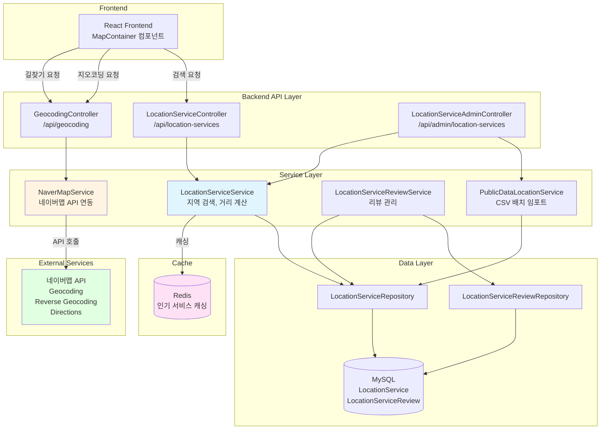
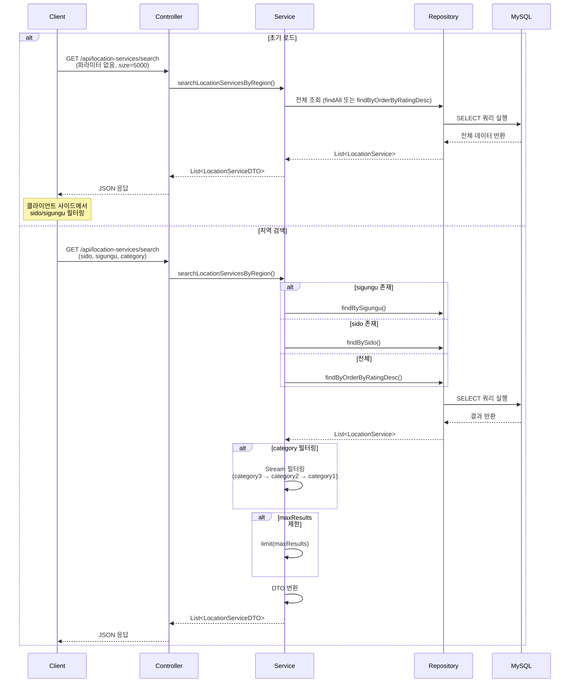
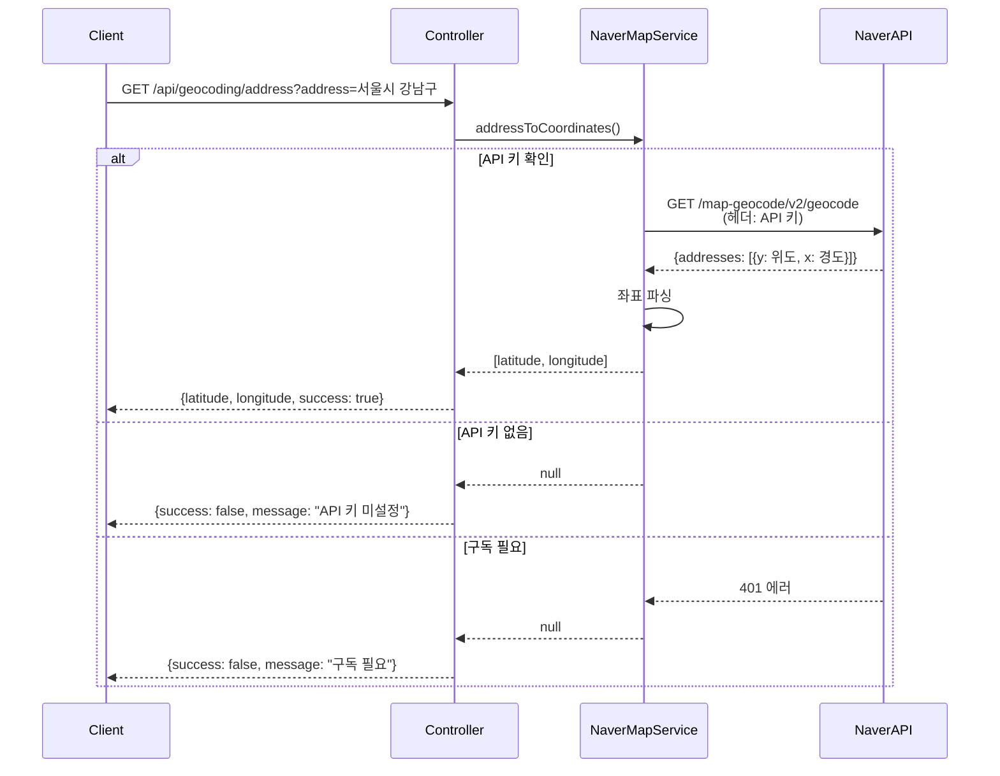
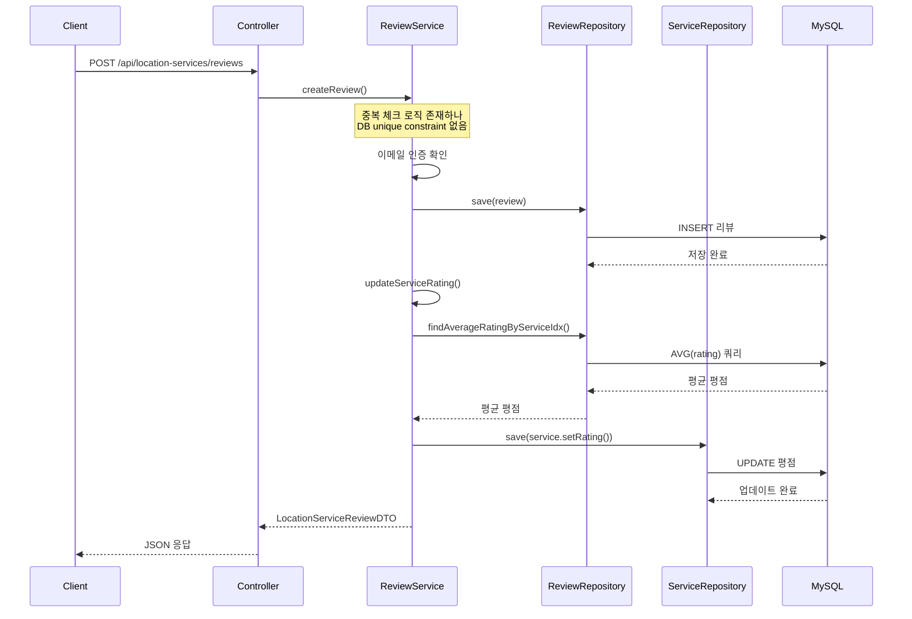

# 위치 기반 서비스 (LBS) 아키텍처

## 📋 개요

위치 기반 서비스(LBS) 도메인은 반려동물 관련 위치 정보(병원, 카페, 공원, 펫샵 등)를 제공하는 핵심 도메인입니다. 지역 계층적 탐색, 거리 계산, 네이버맵 API 연동을 통해 사용자에게 정확하고 편리한 위치 기반 서비스를 제공합니다.

## 🏗️ 시스템 아키텍처

### 전체 구조도



## 🔧 핵심 컴포넌트

### 1. LocationServiceService (위치 서비스 검색)

**역할**: 지역 계층적 탐색, 카테고리 필터링, 거리 계산

**주요 메서드**:
- `searchLocationServicesByRegion()`: 지역 계층별 검색
- `calculateDistance()`: Haversine 공식으로 거리 계산
- `getPopularLocationServices()`: 인기 서비스 조회 (캐싱)

**핵심 로직**:

#### 지역 계층 우선순위 (실제 사용)
```
sido > sigungu > 전체
```

**참고**: 백엔드에는 `roadName`, `eupmyeondong` 검색 기능이 구현되어 있으나, 프론트엔드에서는 현재 `sido`와 `sigungu`만 사용합니다. 초기 로드는 파라미터 없이 전체 데이터를 조회한 후 클라이언트 사이드에서 필터링합니다.

#### 카테고리 필터링
- `category3` → `category2` → `category1` 순서로 검색
- 대소문자 무시 (`toLowerCase()`)
- 최대 결과 수 제한 지원 (`maxResults`)

#### 거리 계산 (Haversine 공식)
```java
public Double calculateDistance(Double lat1, Double lng1, Double lat2, Double lng2) {
    final int R = 6371000; // 지구 반경 (미터)
    
    double dLat = Math.toRadians(lat2 - lat1);
    double dLng = Math.toRadians(lng2 - lng1);
    
    double a = Math.sin(dLat / 2) * Math.sin(dLat / 2) +
            Math.cos(Math.toRadians(lat1)) * Math.cos(Math.toRadians(lat2)) *
            Math.sin(dLng / 2) * Math.sin(dLng / 2);
    
    double c = 2 * Math.atan2(Math.sqrt(a), Math.sqrt(1 - a));
    
    return R * c; // 미터 단위
}
```

### 2. NaverMapService (네이버맵 API 연동)

**역할**: 외부 네이버맵 API와의 통신 담당

**주요 기능**:

#### Geocoding (주소 → 좌표)
- **엔드포인트**: `GET /api/geocoding/address?address={주소}`
- **네이버맵 API**: `https://naveropenapi.apigw.ntruss.com/map-geocode/v2/geocode`
- **응답**: `[latitude, longitude]`
- **에러 처리**: API 키 미설정, 구독 필요 시 fallback

#### Reverse Geocoding (좌표 → 주소)
- **엔드포인트**: `GET /api/geocoding/coordinates?lat={위도}&lng={경도}`
- **네이버맵 API**: `https://naveropenapi.apigw.ntruss.com/map-reversegeocode/v2/gc`
- **응답**: `{address, roadAddress, jibunAddress}`
- **주소 구성**: 시도 > 시군구 > 읍면동 > 리

#### Directions (길찾기)
- **엔드포인트**: `GET /api/geocoding/directions?start={경도,위도}&goal={경도,위도}&option={옵션}`
- **네이버맵 API**: `https://maps.apigw.ntruss.com/map-direction/v1/driving`
- **옵션**: `traoptimal`(최적), `trafast`(최단), `tracomfort`(편한길)
- **에러 처리**: 구독 필요 시 웹 URL 방식 안내

**보안**:
- API 키는 `application.properties`에 저장
- 헤더에 API 키 포함 (`X-NCP-APIGW-API-KEY-ID`, `X-NCP-APIGW-API-KEY`)
- 프론트엔드 API 키는 Referer 제한으로 보호

### 3. LocationServiceReviewService (리뷰 관리)

**역할**: 위치 서비스 리뷰 CRUD 및 평점 업데이트

**주요 기능**:
- 리뷰 생성/수정/삭제
- 이메일 인증 필수
- 평점 자동 업데이트

**참고**: 코드상으로는 `existsByServiceIdxAndUserIdx()`를 통한 중복 리뷰 체크가 구현되어 있으나, DB 레벨의 unique constraint는 없어 동시성 문제 가능성이 있습니다.

**평점 업데이트 로직**:
```java
@Transactional
public void updateServiceRating(Long serviceIdx) {
    Optional<Double> averageRating = reviewRepository.findAverageRatingByServiceIdx(serviceIdx);
    
    if (averageRating.isPresent()) {
        LocationService service = serviceRepository.findById(serviceIdx)
                .orElseThrow(() -> new RuntimeException("서비스를 찾을 수 없습니다."));
        
        service.setRating(averageRating.get());
        serviceRepository.save(service);
    }
}
```

### 4. PublicDataLocationService (공공데이터 배치 임포트)

**역할**: CSV 파일을 통한 대량 위치 데이터 임포트

**주요 기능**:
- CSV 파일 파싱
- 배치 저장 (1000개 단위)
- 중복 데이터 처리
- 트랜잭션 분리 (`Propagation.REQUIRES_NEW`)

**배치 처리 전략**:
- 각 배치를 별도 트랜잭션으로 처리
- 실패 시 해당 배치만 롤백, 나머지는 계속 진행
- 로깅으로 진행 상황 추적

## 🔄 비즈니스 로직 흐름

### 1. 지역 계층 검색 흐름

**단계별 처리 과정** (`LocationServiceService.searchLocationServicesByRegion()`):

1. **지역 계층 우선순위 검색**
   - 우선순위: `roadName` > `eupmyeondong` > `sigungu` > `sido` > 전체
   - **실제 사용**: `sido` > `sigungu` > 전체 (프론트엔드에서 `sido`, `sigungu`만 사용)
   - 가장 구체적인 지역 정보부터 검색
   - 해당 지역이 없으면 다음 우선순위로 검색

2. **카테고리 필터링** (선택사항)
   - 카테고리 계층 검색: `category3` → `category2` → `category1` 순서
   - 대소문자 무시 (`toLowerCase()`)
   - Stream API를 사용한 메모리 필터링

3. **최대 결과 수 제한** (선택사항)
   - `maxResults` 파라미터로 결과 수 제한
   - null이거나 0이면 제한 없음
   - 기본값: 초기 로드 5000개, 지역 검색 500개

4. **DTO 변환**
   - 엔티티를 DTO로 변환하여 반환

**초기 로드 (파라미터 없음)**:
- 파라미터 없이 전체 데이터 조회 (size=5000)
- 클라이언트 사이드에서 `sido`/`sigungu` 필터링
- 서버 부하 감소를 위한 전략

**특징:**
- 지역 계층 우선순위로 정확한 검색
- 카테고리 계층 검색으로 유연한 필터링
- 성능 로깅으로 쿼리/필터링/DTO 변환 시간 측정

### 2. 지오코딩 (주소 → 좌표) 흐름

**단계별 처리 과정** (`NaverMapService.addressToCoordinates()`):

1. **API 키 확인**
   - `application.properties`에서 API 키 확인
   - API 키가 없으면 `null` 반환 및 로깅

2. **주소 정리**
   - `+` 문자를 공백으로 변환
   - 연속된 공백을 하나로 통일
   - 앞뒤 공백 제거

3. **네이버맵 API 호출**
   - 엔드포인트: `https://maps.apigw.ntruss.com/map-geocode/v2/geocode`
   - 헤더에 API 키 포함 (`X-NCP-APIGW-API-KEY-ID`, `X-NCP-APIGW-API-KEY`)
   - 쿼리 파라미터: `query={정리된 주소}`

4. **응답 파싱**
   - 응답에서 `addresses` 배열 추출
   - 첫 번째 주소의 `y`(위도), `x`(경도) 추출
   - `Double[]` 형태로 반환 `[latitude, longitude]`

5. **에러 처리**
   - API 키 미설정: `null` 반환
   - 401 에러 (구독 필요): 로깅 및 `null` 반환
   - 기타 에러: 예외 캐치 후 `null` 반환

**특징:**
- API 키는 서버에만 저장 (보안)
- 에러 처리로 안정성 확보
- 상세 로깅으로 문제 추적 가능

### 3. 역지오코딩 (좌표 → 주소) 흐름

**단계별 처리 과정** (`NaverMapService.coordinatesToAddress()`):

1. **API 키 확인**
   - API 키가 없으면 에러 응답 반환

2. **네이버맵 API 호출**
   - 엔드포인트: `https://maps.apigw.ntruss.com/map-reversegeocode/v2/gc`
   - 쿼리 파라미터: `coords={경도,위도}`, `output=json`, `orders=legalcode,admcode,addr,roadaddr`

3. **응답 파싱**
   - 응답에서 `results` 배열 추출
   - `region` 정보에서 주소 조합:
     - `area1` (시도) > `area2` (시군구) > `area3` (읍면동) > `area4` (리)
   - `land` 정보에서 도로명 주소 추출 (`name` + `number1` + `number2`)

4. **결과 구성**
   - `address`: 도로명 주소 또는 지번 주소
   - `roadAddress`: 도로명 주소
   - `jibunAddress`: 지번 주소

5. **에러 처리**
   - 401 에러 (구독 필요): 명확한 에러 메시지 반환
   - 기타 에러: 예외 캐치 후 에러 응답 반환

**특징:**
- 도로명 주소와 지번 주소 모두 제공
- 주소 계층 구조 유지
- 에러 시 명확한 메시지 반환

### 4. 길찾기 (Directions) 흐름

**단계별 처리 과정** (`NaverMapService.getDirections()`):

1. **API 키 확인**
   - API 키가 없으면 에러 응답 반환

2. **네이버맵 API 호출**
   - 엔드포인트: `https://maps.apigw.ntruss.com/map-direction/v1/driving`
   - 쿼리 파라미터:
     - `start={경도,위도}` (출발지)
     - `goal={경도,위도}` (도착지)
     - `option={traoptimal|trafast|tracomfort}` (경로 옵션)

3. **경로 옵션**
   - `traoptimal`: 최적 경로 (기본값)
   - `trafast`: 최단 경로
   - `tracomfort`: 편한길

4. **응답 처리**
   - 성공 시: `route` 데이터 반환
   - 실패 시: 에러 메시지 반환

5. **에러 처리**
   - 401 에러 (구독 필요): "구독 필요" 메시지 반환
   - 웹 URL 방식 안내 (구독 필요 시)

**특징:**
- 차량 경로 검색 (driving)
- 여러 경로 옵션 지원
- 구독 필요 시 웹 URL 방식 안내

### 5. 리뷰 작성 및 평점 업데이트 흐름

**리뷰 작성** (`LocationServiceReviewService.createReview()`):

1. **중복 리뷰 확인**
   - `existsByServiceIdxAndUserIdx()`로 중복 확인
   - 중복이면 예외 발생
   - **참고**: DB 레벨 unique constraint는 없어 동시성 문제 가능성 있음

2. **이메일 인증 확인**
   - **이메일 인증 필수**: `user.getEmailVerified()` 확인
   - 미인증 시 `EmailVerificationRequiredException` 발생

3. **리뷰 저장**
   - 서비스, 사용자, 평점, 댓글 정보 저장
   - DB 저장

4. **서비스 평점 업데이트**
   - `updateServiceRating()` 호출
   - 해당 서비스의 모든 리뷰 평점 평균 계산
   - 서비스 엔티티의 `rating` 필드 업데이트

**평점 업데이트 로직** (`LocationServiceReviewService.updateServiceRating()`):

1. **평균 평점 계산**
   - `reviewRepository.findAverageRatingByServiceIdx()` 호출
   - 해당 서비스의 모든 리뷰 평점의 평균값 계산 (AVG 쿼리)

2. **서비스 평점 업데이트**
   - 평균 평점이 있으면 서비스 엔티티의 `rating` 필드 업데이트
   - 평균 평점이 없으면 업데이트하지 않음

3. **DB 저장**
   - 서비스 엔티티 저장

**리뷰 수정/삭제**:
- 수정: 이메일 인증 확인 → 평점/댓글 업데이트 → 평점 재계산
- 삭제: 이메일 인증 확인 → Soft Delete (`isDeleted = true`) → 평점 재계산

**특징:**
- 리뷰 생성/수정/삭제 시 자동으로 평점 업데이트
- 이메일 인증 필수
- Soft Delete 방식으로 데이터 보존

### 6. 거리 계산 흐름

**단계별 처리 과정** (`LocationServiceService.calculateDistance()`):

1. **입력 검증**
   - 위도, 경도 값이 null이 아닌지 확인
   - null이면 `null` 반환

2. **Haversine 공식 계산**
   - 지구 반경: `R = 6371000` (미터)
   - 위도 차이 (`dLat`), 경도 차이 (`dLng`)를 라디안으로 변환
   - Haversine 공식으로 대원 거리 계산
   - 결과를 미터 단위로 반환

**Haversine 공식**:
- 지구를 구로 가정한 대원 거리 계산
- 정확도: ±0.5% (실용적 수준)
- 미터 단위 반환

**사용 사례**:
- 내 위치에서 각 서비스까지의 거리 계산
- 반경 기반 검색 (프론트엔드에서 필터링)

**특징:**
- 정확한 거리 계산
- 미터 단위 반환
- 실용적인 정확도 (±0.5%)

## 📊 데이터 흐름

### 1. 지역 계층 검색 흐름



### 2. 지오코딩 흐름



### 3. 리뷰 작성 및 평점 업데이트 흐름



## 🎯 핵심 설계 전략

### 1. 지역 계층 우선순위 전략

**문제**: 사용자가 다양한 지역 단위로 검색할 수 있음

**해결**: 우선순위 기반 검색
- 가장 구체적인 지역 정보부터 검색
- **실제 사용**: `sido` > `sigungu` > 전체
- 초기 로드는 파라미터 없이 전체 데이터 조회 후 클라이언트 사이드 필터링
- 결과 수를 최소화하여 성능 향상

**현재 구현 상태**:
- 백엔드: `roadName`, `eupmyeondong`, `sigungu`, `sido` 검색 모두 지원
- 프론트엔드: `sido`, `sigungu`만 사용 (UI에서 선택 가능)
- 초기 로드: 전체 데이터 조회 후 클라이언트 사이드에서 `sido`/`sigungu` 필터링

**효과**: 
- 불필요한 데이터 조회 감소
- 검색 정확도 향상
- 응답 시간 단축
- 클라이언트 사이드 필터링으로 서버 부하 감소

### 2. 카테고리 계층 검색 전략

**문제**: 카테고리 분류가 3단계로 구성됨 (`category1` > `category2` > `category3`)

**해결**: 계층적 필터링
- `category3` 우선 확인 (가장 구체적)
- 없으면 `category2` 확인
- 없으면 `category1` 확인
- 대소문자 무시 (`toLowerCase()`)

**효과**:
- 유연한 카테고리 검색 지원
- 사용자 입력 오류 허용

### 3. 거리 계산 전략

**문제**: 두 좌표 간 거리를 정확하게 계산해야 함

**해결**: Haversine 공식 사용
- 지구를 구로 가정한 대원 거리 계산
- 미터 단위로 반환
- 정확도: ±0.5% (실용적 수준)

**사용 사례**:
- 내 위치에서 각 서비스까지의 거리 계산
- 반경 기반 검색 (프론트엔드에서 필터링)

### 4. 네이버맵 API 연동 전략

**문제**: 외부 API 의존성 및 구독 필요성

**해결**: 
- **에러 처리**: API 키 미설정, 구독 필요 시 명확한 에러 메시지
- **Fallback**: 구독 필요 시 웹 URL 방식 안내
- **로깅**: API 호출 성공/실패 상세 로깅
- **보안**: API 키는 서버에만 저장, 프론트엔드 API 키는 Referer 제한

**API 키 관리**:
- `application.properties`에 저장
- 환경별 분리 (로컬/개발/운영)
- 민감 정보 보호

### 5. 캐싱 전략

**문제**: 인기 서비스 조회가 빈번함

**해결**: Redis 캐싱
- `@Cacheable(value = "popularLocationServices", key = "#category")`
- 카테고리별 상위 10개 캐싱
- 캐시 만료 시 자동 갱신

**효과**:
- 인기 서비스 조회 시 DB 쿼리 감소
- 응답 시간 단축

### 6. 공공데이터 배치 임포트 전략

**문제**: 대량 데이터(수만 건)를 효율적으로 임포트해야 함

**해결**: 배치 처리
- 1000개 단위로 배치 분할
- 각 배치를 별도 트랜잭션으로 처리 (`Propagation.REQUIRES_NEW`)
- 실패 시 해당 배치만 롤백, 나머지는 계속 진행
- 진행 상황 로깅

**효과**:
- 메모리 효율적 처리
- 부분 실패 허용
- 진행 상황 추적 가능

## 🔄 도메인 간 연동

### 1. Meetup 도메인 연동
- **용도**: 모임 위치 검색 시 거리 계산
- **방법**: `LocationServiceService.calculateDistance()` 호출
- **효과**: 모임 검색 시 거리 정보 제공

### 2. Missing Pet 도메인 연동
- **용도**: 실종 위치 주소 변환
- **방법**: `NaverMapService.addressToCoordinates()` 호출
- **효과**: 주소를 좌표로 변환하여 지도 표시

### 3. User 도메인 연동
- **용도**: 리뷰 작성 시 이메일 인증 확인
- **방법**: `Users.emailVerified` 필드 확인
- **효과**: 신뢰할 수 있는 리뷰만 작성 가능

## 📈 성능 최적화

### 1. DB 최적화

#### 인덱스 전략
```sql
-- 지역별 검색 인덱스 (실제 사용)
CREATE INDEX idx_location_sido ON locationservice(sido);
CREATE INDEX idx_location_sigungu ON locationservice(sigungu);

-- 백엔드에 구현되어 있으나 현재 미사용
CREATE INDEX idx_location_eupmyeondong ON locationservice(eupmyeondong);
CREATE INDEX idx_location_road_name ON locationservice(road_name);

-- 카테고리별 검색 인덱스
CREATE INDEX idx_location_category ON locationservice(category3, category2, category1);

-- 평점 정렬 인덱스
CREATE INDEX idx_location_rating ON locationservice(rating DESC);
```

**선정 이유**:
- 지역 계층별 검색이 빈번함 (`sido`, `sigungu` 중심)
- 카테고리 필터링이 자주 사용됨
- 평점 순 정렬이 필요함
- 초기 로드 시 전체 데이터 조회 후 클라이언트 사이드 필터링

### 2. 애플리케이션 레벨 최적화

#### 캐싱
- **인기 서비스**: 카테고리별 상위 10개 Redis 캐싱
- **효과**: 인기 서비스 조회 시 DB 쿼리 감소

#### 결과 수 제한
- `maxResults` 파라미터로 불필요한 데이터 전송 방지
- 기본값: 500개
- 프론트엔드에서 페이징 처리

#### 스트림 처리
- Java Stream API로 메모리 효율적 필터링
- 지연 평가로 불필요한 연산 방지

### 3. 외부 API 최적화

#### 네이버맵 API 호출 최소화
- 프론트엔드에서 직접 호출 (지도 표시)
- 백엔드는 필요한 경우에만 호출 (주소 변환, 길찾기)
- API 키 보호 (Referer 제한)

#### 에러 처리
- API 호출 실패 시 명확한 에러 메시지
- 구독 필요 시 웹 URL 방식 안내
- 로깅으로 문제 추적 가능

## 🔐 보안 고려사항

### 1. API 키 보호
- **백엔드 API 키**: `application.properties`에 저장, 환경별 분리
- **프론트엔드 API 키**: Referer 제한으로 보호
- **민감 정보**: 로그에 API 키 일부만 표시 (`***` 처리)

### 2. 입력 검증
- 주소, 좌표 형식 검증
- SQL Injection 방지 (JPA 사용)
- XSS 방지 (DTO 변환 시 이스케이프)

### 3. 권한 제어
- 리뷰 작성: 이메일 인증 필수
- 관리자 기능: `@PreAuthorize("hasAnyRole('ADMIN','MASTER')")`

## 📝 주요 API 엔드포인트

### 위치 서비스 검색
```
GET /api/location-services/search
  ?sido={시도}          # 실제 사용
  &sigungu={시군구}      # 실제 사용
  &eupmyeondong={읍면동} # 백엔드 지원, 프론트엔드 미사용
  &roadName={도로명}     # 백엔드 지원, 프론트엔드 미사용
  &category={카테고리}
  &size={최대 결과 수}   # 초기 로드: 5000, 지역 검색: 500

# 초기 로드: 파라미터 없이 전체 데이터 조회 (size=5000)
# 지역 검색: sido 또는 sido+sigungu 조합 사용
```

### 지오코딩
```
GET /api/geocoding/address?address={주소}
→ {latitude, longitude, success}
```

### 역지오코딩
```
GET /api/geocoding/coordinates?lat={위도}&lng={경도}
→ {address, roadAddress, jibunAddress, success}
```

### 길찾기
```
GET /api/geocoding/directions
  ?start={경도,위도}
  &goal={경도,위도}
  &option={traoptimal|trafast|tracomfort}
→ {success, data: {route: {...}}}
```

## 🎯 핵심 포인트 요약

### 1. 지역 계층 검색
- **실제 사용 우선순위**: sido > sigungu > 전체
- **초기 로드**: 파라미터 없이 전체 데이터 조회 후 클라이언트 사이드 필터링
- **백엔드 지원**: `roadName`, `eupmyeondong` 검색 기능 구현되어 있으나 프론트엔드 미사용
- **효과**: 검색 정확도 향상, 성능 최적화, 클라이언트 사이드 필터링으로 서버 부하 감소

### 2. 네이버맵 API 연동
- **기능**: Geocoding, Reverse Geocoding, Directions
- **보안**: API 키 보호, 에러 처리
- **Fallback**: 구독 필요 시 웹 URL 방식 안내

### 3. 거리 계산
- **공식**: Haversine 공식
- **단위**: 미터
- **정확도**: ±0.5%

### 4. 리뷰 시스템
- **평점 자동 업데이트**: 리뷰 생성/수정/삭제 시
- **이메일 인증**: 리뷰 작성 필수
- **참고**: 코드상 중복 리뷰 체크 로직은 존재하나, DB 레벨 unique constraint는 없음

### 5. 성능 최적화
- **캐싱**: 인기 서비스 Redis 캐싱
- **인덱스**: 지역별, 카테고리별 인덱스
- **배치 처리**: 공공데이터 1000개 단위 배치 임포트

### 6. 확장성
- **공공데이터 연동**: CSV 배치 임포트로 대량 데이터 수집
- **카테고리 계층**: 3단계 카테고리로 유연한 검색
- **결과 제한**: `maxResults`로 성능 제어
