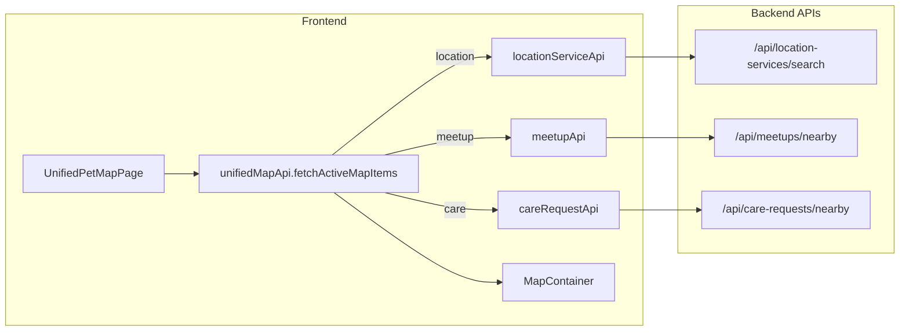

# 위치 기반 서비스 아키텍처 (프론트·백엔드 대조)

이 문서는 **Location 도메인(시설 검색·지오코딩·리뷰)** 과, 같은 “위치” 맥락에서 쓰이는 **통합 탐색 지도(UnifiedPetMap)** 를 **프론트엔드 모듈 ↔ 백엔드 API** 기준으로 정리한 것이다.  
백엔드 구현 기준 경로는 `Petory/backend/main/java/com/linkup/Petory/domain/location/`, 프론트는 `Petory/frontend/src/` 기준이다.

---

## 1. 범위 정리

| 구분 | 설명 |
|------|------|
| **Location (시설)** | DB에 저장된 장소 POI 검색, 카테고리·키워드·반경·지역 계층, AI 추천(`/recommend`) |
| **Geocoding** | 주소↔좌표, 길찾기 (NCP Maps API를 서버 `NaverMapService`에서 호출) |
| **Location Review** | 시설 리뷰 CRUD, 시설 `rating` 집계 갱신 |
| **통합 탐색 (프론트)** | 한 지도에서 **주변서비스 / 모임 / 펫케어** 탭별로 서로 다른 API만 호출 (`UnifiedPetMapPage`, `unifiedMapApi.js`) |

> 통합 탐색은 **백엔드에 단일 “통합 지도” BFF가 있는 구조가 아니라**, 프론트가 도메인별 REST를 조합하는 구조다.

---

## 2. 프론트엔드 모듈 요약

| 역할 | 주요 파일 |
|------|-----------|
| 시설 검색·AI 추천 | `api/locationServiceApi.js` → `GET /api/location-services/search`, `GET /api/location-services/recommend` |
| 지오코딩·길찾기 | `api/geocodingApi.js` → `GET /api/geocoding/address`, `coordinates`, `directions` |
| 시설 리뷰 | `api/locationServiceReviewApi.js` → ` /api/location-service-reviews` |
| 지도 엔진 래퍼 | `components/LocationService/MapContainer.js` (Naver Maps, 마커·클릭 콜백) |
| **통합 탐색** | `components/UnifiedMap/UnifiedPetMapPage.js`, `DomainTabHeader.js`, `RadiusFilter.js`, `api/unifiedMapApi.js` |
| 주소+지도 선택 (재사용) | `components/MissingPet/AddressMapSelector.js` 등 |

데모 모드: `mock/isDemoMode.js`에 따라 일부 API는 목 데이터로 대체된다 (`unifiedMapApi`의 Care 레이어는 데모에서 빈 배열 등).

---

## 3. 백엔드 레이어 요약

| 레이어 | 대표 타입 |
|--------|-----------|
| API | `LocationServiceController`, `GeocodingController`, `LocationServiceReviewController`, `AdminLocationController` |
| 서비스 | `LocationServiceService`, `LocationRecommendAgentService`, `NaverMapService`, `LocationServiceReviewService`, `PublicDataLocationService` 등 |
| 저장소 | `LocationServiceRepository` (Adapter 패턴), `SpringDataJpaLocationServiceRepository` (Native/JPQL) |
| DB | MySQL — `locationservice` POINT(SRID 4326), FULLTEXT, 공간 검색 쿼리 |

---

## 4. API 대조표 (프론트 → 백엔드)

### 4.1 시설 (Location)

| 프론트 | HTTP | 백엔드 엔드포인트 | 비고 |
|--------|------|-------------------|------|
| `locationServiceApi.searchPlaces` | GET | `/api/location-services/search` | 쿼리: `latitude`, `longitude`, `radius`(m), `keyword`, 지역 필드, `category`, `size` |
| `locationServiceApi.recommendPlaces` | GET | `/api/location-services/recommend` | 로그인 필요(`@PreAuthorize`). LLM 보조 추천 |
| (관리자 UI) `listLocationServices`, `importPublicData` 등 | GET/POST | `/api/admin/location-services` | `AdminLocationController` — 역할 MASTER/ADMIN 등 컨트롤러 주석·시큐리티와 일치 |

**반경 단위 주의 (실제 버그 방지 포인트)**  
- 백엔드 `LocationServiceController` / `LocationServiceService`는 **`radius`를 미터(m)** 로 받는다.  
- 프론트 `unifiedMapApi.fetchActiveMapItems`는 UI에서 km로 받아 **`radius * 1000`으로 m 변환** 후 `searchPlaces`에 넘긴다.

**검색 분기 (서비스 단일 진입점)**  
`LocationServiceService.searchLocationServices()` 내부: **키워드 → (위도·경도·반경 모두 있으면) 반경 → 그 외 지역 계층** 순.  
컨트롤러는 `size`를 정규화한다: 미지정 → 기본 100, `<= 0` → 상한 없음(`null`).

### 4.2 지오코딩

| 프론트 | HTTP | 백엔드 |
|--------|------|--------|
| `geocodingApi.addressToCoordinates` | GET `/api/geocoding/address` | `GeocodingController` → `NaverMapService` |
| `geocodingApi.coordinatesToAddress` | GET `/api/geocoding/coordinates` | 동일 |
| `geocodingApi.getDirections` | GET `/api/geocoding/directions` | `start`/`goal`은 **경도,위도** 문자열 |

### 4.3 시설 리뷰

| 프론트 | HTTP | 백엔드 |
|--------|------|--------|
| `locationServiceReviewApi` | POST/PUT/DELETE/GET | `/api/location-service-reviews` |

### 4.4 통합 탐색 지도 (프론트 조합)

| 탭 (프론트 라벨) | `unifiedMapApi` 분기 | 호출 API |
|------------------|---------------------|----------|
| 주변서비스 | `type === 'location'` | `locationServiceApi.searchPlaces` |
| 모임 | `type === 'meetup'` | `meetupApi.getNearbyMeetups` → `GET /api/meetups/nearby` |
| 펫케어 | `type === 'care'` | `careRequestApi.getNearby` → `GET /api/care-requests/nearby` |

백엔드 Meetup/Care는 **Location 패키지가 아닌** 각각 `meetup`, `care` 도메인에 있다. 지도 UX만 공유한다.

---

## 5. 통합 탐색 UI 동작 (프론트)

- **상단 세그먼트**: 주변서비스 / 모임 / 펫케어 중 하나만 활성.
- **옵션 접기**: 반경·내 위치·탭별 컨트롤(검색/생성 등)을 접어 지도 영역 확보 (`UnifiedPetMapPage` + `DomainTabHeader`).
- **데이터**: 활성 탭에 대해서만 `fetchActiveMapItems` 호출 (불필요한 API 동시 호출 방지).
- **정규화**: `toMapItem()`이 `MapContainer`가 기대하는 필드(`idx`, `name`, `latitude`, `longitude`, `markerColor` 등)와 통합 메타(`type`, `title`, `subtitle`)를 함께 둔다.

```mermaid
flowchart LR
  subgraph FE["Frontend"]
    U[UnifiedPetMapPage]
    UM[unifiedMapApi.fetchActiveMapItems]
    LS[locationServiceApi]
    MU[meetupApi]
    CR[careRequestApi]
    MC[MapContainer]
  end
  subgraph BE["Backend APIs"]
    LAPI["/api/location-services/search"]
    MAPI["/api/meetups/nearby"]
    CAPI["/api/care-requests/nearby"]
  end
  U --> UM
  UM -->|location| LS --> LAPI
  UM -->|meetup| MU --> MAPI
  UM -->|care| CR --> CAPI
  UM --> MC
```

---

## 6. Location 검색·저장 (백엔드 핵심)

### 6.1 반경 검색

- 저장소: `SpringDataJpaLocationServiceRepository.findByRadius` — MySQL 공간 함수(`ST_Within`, `ST_Distance_Sphere`, SRID 4326) 등 (구현체의 Native SQL 참고).
- 애플리케이션: `LocationServiceService`에서 후보에 대해 Haversine으로 **표시용 거리(m)** 를 붙이는 경로가 있다. 반경 필터 자체는 DB 쿼리가 담당.

### 6.2 키워드 검색

- FULLTEXT `MATCH ... AGAINST ... BOOLEAN MODE` (리포지토리의 Native 쿼리).

### 6.3 AI 추천

- `/recommend`: 검색으로 후보를 만든 뒤 `LocationRecommendAgentService`가 재정렬·한 줄 사유 등을 붙인다 (상세는 서비스 구현 참고).

---

## 7. 리뷰 및 평점 (현행 구현)

리뷰 생성·수정·삭제 후 `LocationServiceReviewService.updateServiceRating(serviceIdx)` 호출.

**과거**: `findAverageRating` → 엔티티 로드 → `setRating` → `save` (동시성에 취약할 수 있음).

**현행**: `LocationServiceRepository.updateRatingByAvg(serviceIdx)` — **Native `@Modifying` UPDATE 한 번**으로 `locationservice.rating`을 리뷰 평균과 동기화 (서브쿼리는 인라인 뷰 형태로 MySQL 호환 고려).  
문서·시퀀스 다이어그램은 “AVG 서브쿼리 후 단일 UPDATE”로 이해하면 된다.

---

## 8. 외부 연동 (Naver Cloud Platform Maps)

- `NaverMapService`가 Geocoding / Reverse Geocoding / Directions URL을 호출한다.
- 클라이언트 ID/시크릿은 **서버 설정**에 두는 것이 정상이며, 프론트에 키를 심지 않는다.

---

## 9. 관리자·배치 (정정)

이전 문서에 “관리자 Location 컨트롤러 없음”으로 적힌 부분은 **현재 코드와 불일치**한다.

- **`AdminLocationController`**: `@RequestMapping("/api/admin/location-services")` 로 존재한다. 공공데이터 임포트 등은 여기서 노출된다.
- **`PublicDataLocationService`**: CSV 배치 등 — 관리자 API와 연결 여부는 컨트롤러 메서드 목록을 보면 된다.

---

## 10. 도메인 간 관계 (Meetup / Care)

- **Meetup**: 위치·반경 API는 Meetup 도메인 자체 쿼리(`findNearbyMeetups` 등)를 사용한다. Location 서비스와 직접 엔티티 FK로 묶여 있지 않다.
- **Care Request**: 지도 nearby는 `CareRequest`에 **위도/경도/주소** 필드가 있어야 하며, 마이그레이션 스크립트는 `backend/main/resources/sql/migration/carerequest-add-location-columns.sql` 등을 참고한다.

---

## 11. 운영·보안 체크리스트

- `GET /search`의 `size`: 기본 100, 0 이하 무제한 — **대량 응답·OOM** 가능성, 프론트·모바일에서 상한 정책 검토.
- Geocoding/외부 API: 실패 시 사용자 메시지·HTTP 상태 일관성 (`GeocodingController` 동작 기준).
- 리뷰: 이메일 인증, 중복은 애플리케이션 로직 — DB unique는 별도 검토 여지.

---

## 12. 관련 문서

- 통합 지도 제품/프론트 설계: `docs/refactoring/locaiton,meetup 통합 지도 설꼐` (파일명 오타 있음, 추후 정리 권장)
- 백엔드 이슈 분류: `docs/refactoring/Petory-Backend-Refactoring-vs-Troubleshooting.md`

---

*마지막 갱신: 코드베이스 기준으로 프론트·백엔드 경로를 대조해 재작성함.*
