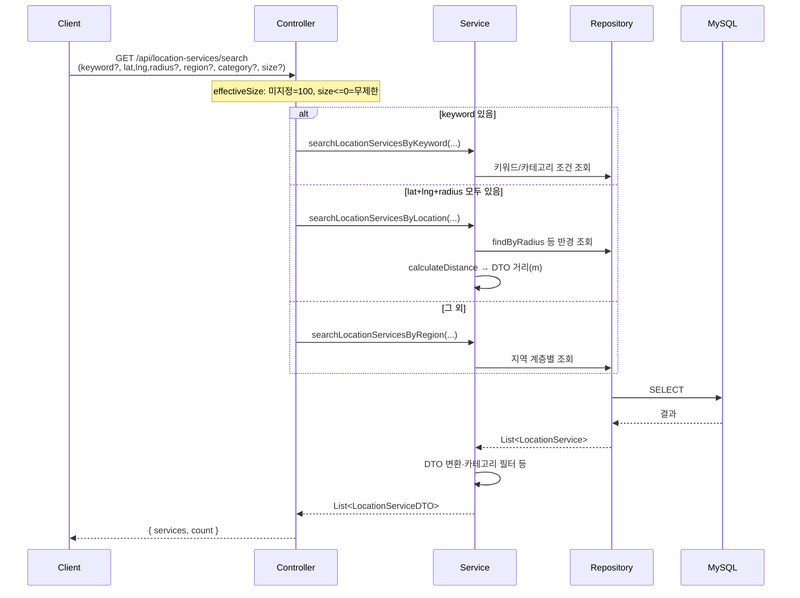
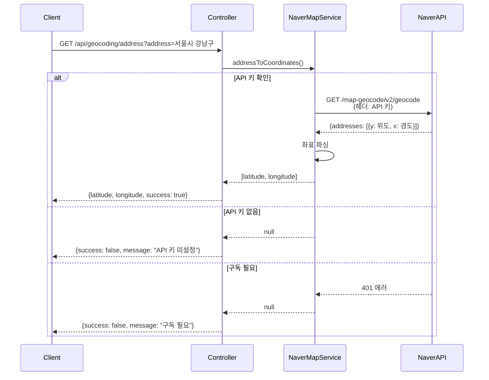
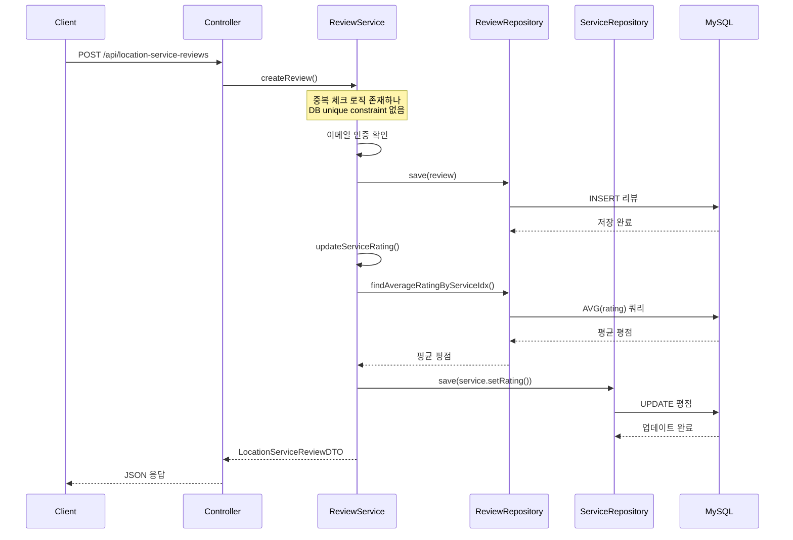

# 위치 기반 서비스 (LBS) 아키텍처

## 📋 개요

위치 기반 서비스(LBS) 도메인은 반려동물 관련 위치 정보(병원, 카페, 공원, 펫샵 등)를 제공하는 핵심 도메인입니다. `LocationServiceController`는 **키워드 검색 → 위치·반경 검색 → 지역(시도/시군구/읍면동/도로명) 검색** 순으로 분기하고, 별도 **`/recommend`** 로 LLM 기반 추천(`LocationRecommendAgentService`)을 제공합니다. 네이버 클라우드 **Maps API**(`maps.apigw.ntruss.com`)로 지오코딩·역지오코딩·길찾기를 호출합니다.

## 🏗️ 시스템 아키텍처

### 전체 구조도

```mermaid
graph TB
    subgraph "Frontend"
        FE[React Frontend<br/>MapContainer 컴포넌트]
    end
    
    subgraph "Backend API Layer"
        LSC[LocationServiceController<br/>/api/location-services]
        GC[GeocodingController<br/>/api/geocoding]
        LSRC[LocationServiceReviewController<br/>/api/location-service-reviews]
    end
    
    subgraph "Service Layer"
        LSS[LocationServiceService<br/>검색·거리·Soft Delete]
        LRA[LocationRecommendAgentService<br/>AI 추천 문구]
        NMS[NaverMapService<br/>NCP Maps API]
        LSRVS[LocationServiceReviewService<br/>리뷰]
        LSAS[LocationServiceAdminService<br/>카카오맵 제거로 비활성화 stub]
        PDLS[PublicDataLocationService<br/>CSV 임포트·컨트롤러 없음]
    end
    
    subgraph "Data Layer"
        LSR[LocationServiceRepository]
        LSRVR[LocationServiceReviewRepository]
        MySQL[(MySQL<br/>LocationService<br/>LocationServiceReview)]
    end
    
    subgraph "External Services"
        NAVER[네이버맵 API<br/>Geocoding<br/>Reverse Geocoding<br/>Directions]
    end
    
    subgraph "Cache"
        REDIS[(Redis<br/>Spring Cache<br/>@Cacheable 등)]
    end
    
    FE -->|검색·추천| LSC
    FE -->|지오코딩·길찾기| GC
    FE -->|리뷰| LSRC
    
    LSC --> LSS
    LSC --> LRA
    GC --> NMS
    LSRC --> LSRVS
    
    LSS --> LSR
    LSS -->|@Cacheable| REDIS
    LSRVS --> LSRVR
    LSRVS --> LSR
    PDLS --> LSR
    LSAS --> LSR
    
    LSR --> MySQL
    LSRVR --> MySQL
    
    NMS -->|API 호출| NAVER
    
    style LSS fill:#e1f5ff
    style NMS fill:#fff4e1
    style REDIS fill:#ffe1f5
    style NAVER fill:#e1ffe1
```

## 🔧 핵심 컴포넌트

### 1. LocationServiceService (위치 서비스 검색)

**역할**: 하이브리드 검색(키워드 / 위치·반경 / 지역), 카테고리 필터링, 거리 계산, Soft Delete

**주요 메서드**:
- `searchLocationServices()`: 컨트롤러·추천 엔드포인트의 **단일 진입점**. 내부에서 키워드 → 위치·반경 → 지역 순으로 분기
- `searchLocationServicesByKeyword()`: FULLTEXT `MATCH(name, description, category1, category2, category3) AGAINST(... IN BOOLEAN MODE)` — Soft Delete 제외
- `searchLocationServicesByLocation()`: DB `findByRadius`(ST_Within 바운딩 박스 + ST_Distance_Sphere 이중 필터) 후 Haversine으로 DTO에 거리(m) 부여
- `searchLocationServicesByRegion()`: 시도/시군구/읍면동/도로명 계층 검색 (성능 로깅 포함)
- `deleteService()`: Soft Delete (`isDeleted = true`, `deletedAt`)
- `calculateDistance()`: Haversine 공식 (미터)
- `getPopularLocationServices()`: 카테고리별 상위 평점 조회, `@Cacheable("popularLocationServices")` — **공개 REST에서 이 메서드를 호출하는 엔드포인트는 없음** (메서드만 존재)

**핵심 로직**:

#### 검색 분기 (`searchLocationServices()`)
컨트롤러는 `locationServiceService.searchLocationServices()`를 한 번 호출하며, 내부에서 아래 순서로 분기한다.

1. `keyword`가 있으면 → 키워드 검색
2. `latitude`, `longitude`, `radius`가 모두 있으면 → 반경 검색(`findByRadius`)
3. 그 외 → `searchLocationServicesByRegion()` (시도/시군구/읍면동/도로명)

#### 지역 계층 우선순위 (지역 검색 시)
```
roadName > eupmyeondong > sigungu > sido > 전체
```

**참고**: UI에서 시도·시군구만 쓰는 경우가 많지만, API는 키워드·반경·상세 지역 파라미터를 모두 받을 수 있다.

**`radius <= 0` 처리**: 컨트롤러에서 `null`로 변환한 뒤 서비스에 전달하면, 서비스의 상수 `DEFAULT_RADIUS_METERS = 10_000`(10km)이 적용된다.

#### 카테고리 필터링
- `category3` → `category2` → `category1` 순서로 검색
- 대소문자 무시 (`toLowerCase()`)
- 최대 결과 수 제한 지원 (`maxResults`)

#### 거리 계산 (Haversine 공식)
```java
public Double calculateDistance(Double lat1, Double lng1, Double lat2, Double lng2) {
    final int R = 6371000; // 지구 반경 (미터)
    
    double dLat = Math.toRadians(lat2 - lat1);
    double dLng = Math.toRadians(lng2 - lng1);
    
    double a = Math.sin(dLat / 2) * Math.sin(dLat / 2) +
            Math.cos(Math.toRadians(lat1)) * Math.cos(Math.toRadians(lat2)) *
            Math.sin(dLng / 2) * Math.sin(dLng / 2);
    
    double c = 2 * Math.atan2(Math.sqrt(a), Math.sqrt(1 - a));
    
    return R * c; // 미터 단위
}
```

### 2. NaverMapService (네이버맵 API 연동)

**역할**: 외부 네이버맵 API와의 통신 담당

**주요 기능**:

#### Geocoding (주소 → 좌표)
- **엔드포인트**: `GET /api/geocoding/address?address={주소}`
- **네이버 클라우드 Maps API**: `https://maps.apigw.ntruss.com/map-geocode/v2/geocode`
- **응답**: `[latitude, longitude]`
- **에러 처리**: API 키 미설정, 구독 필요 시 fallback

#### Reverse Geocoding (좌표 → 주소)
- **엔드포인트**: `GET /api/geocoding/coordinates?lat={위도}&lng={경도}`
- **네이버 클라우드 Maps API**: `https://maps.apigw.ntruss.com/map-reversegeocode/v2/gc` (`coords` = 경도,위도)
- **응답**: `{address, roadAddress, jibunAddress}`
- **주소 구성**: 시도 > 시군구 > 읍면동 > 리

#### Directions (길찾기)
- **엔드포인트**: `GET /api/geocoding/directions?start={경도,위도}&goal={경도,위도}&option={옵션}`
- **네이버맵 API**: `https://maps.apigw.ntruss.com/map-direction/v1/driving`
- **옵션**: `traoptimal`(최적), `trafast`(최단), `tracomfort`(편한길)
- **에러 처리**: 구독 필요 시 웹 URL 방식 안내

**보안**:
- API 키는 `application.properties`에 저장
- 헤더에 API 키 포함 (`X-NCP-APIGW-API-KEY-ID`, `X-NCP-APIGW-API-KEY`)
- 프론트엔드 API 키는 Referer 제한으로 보호

### 3. LocationServiceReviewService (리뷰 관리)

**역할**: 위치 서비스 리뷰 CRUD 및 평점 업데이트

**주요 기능**:
- 리뷰 생성/수정/삭제
- 이메일 인증 필수
- 평점 자동 업데이트

**참고**: 코드상으로는 `existsByServiceIdxAndUserIdx()`를 통한 중복 리뷰 체크가 구현되어 있으나, DB 레벨의 unique constraint는 없어 동시성 문제 가능성이 있습니다.

**평점 업데이트 로직**:
```java
@Transactional
public void updateServiceRating(Long serviceIdx) {
    Optional<Double> averageRating = reviewRepository.findAverageRatingByServiceIdx(serviceIdx);
    
    if (averageRating.isPresent()) {
        LocationService service = serviceRepository.findById(serviceIdx)
                .orElseThrow(LocationServiceNotFoundException::new);
        
        service.setRating(averageRating.get());
        serviceRepository.save(service);
    }
}
```

### 4. PublicDataLocationService (공공데이터 배치 임포트)

**역할**: CSV 파일을 통한 대량 위치 데이터 임포트

**주요 기능**:
- CSV 파일 파싱
- 배치 저장 (1000개 단위)
- 중복 데이터 처리
- 트랜잭션 분리 (`Propagation.REQUIRES_NEW`)

**배치 처리 전략**:
- 각 배치를 별도 트랜잭션으로 처리
- 실패 시 해당 배치만 롤백, 나머지는 계속 진행
- 로깅으로 진행 상황 추적

## 🔄 비즈니스 로직 흐름

### 1. 위치 서비스 검색 흐름 (`GET /search`)

**컨트롤러** (`LocationServiceController.searchLocationServices`):

1. **`size` (effectiveSize) 결정**
   - 생략 시 **기본 100건**
   - `size <= 0`이면 서비스에 `null` 전달 → **상한 없음**(전체에 가까운 조회)

2. **`locationServiceService.searchLocationServices()` 단일 호출**
   - 분기 로직은 서비스 계층에 집중되어 있으며 내부에서 아래 순서로 동작:

   **키워드 우선** (`keyword` 비어 있지 않음)
   - `searchLocationServicesByKeyword(keyword, category, effectiveSize)`

   **위치·반경** (`latitude`, `longitude`, `radius` 모두 존재)
   - `radius` ≤ 0이면 서비스 상수 `DEFAULT_RADIUS_METERS = 10_000`m 적용
   - `searchLocationServicesByLocation(...)` — `findByRadius`(ST_Within 바운딩 박스 + ST_Distance_Sphere 이중 필터) 후 Haversine으로 거리 필드 채움

   **그 외 지역 검색**
   - `searchLocationServicesByRegion(sido, sigungu, eupmyeondong, roadName, category, effectiveSize)`
   - 지역 계층 우선순위: `roadName` > `eupmyeondong` > `sigungu` > `sido` > 전체

**카테고리 필터링** (모든 경로 공통):
- `category3` → `category2` → `category1` 순, 대소문자 무시

**특징:**
- 컨트롤러는 서비스의 단일 진입점 메서드를 호출하며, 분기 로직은 서비스 계층에 집중
- 성능 로깅으로 DB 쿼리/카테고리 필터링/DTO 변환 시간 각각 측정

### 2. 지오코딩 (주소 → 좌표) 흐름

**단계별 처리 과정** (`NaverMapService.addressToCoordinates()`):

1. **API 키 확인**
   - `application.properties`에서 API 키 확인
   - API 키가 없으면 `null` 반환 및 로깅

2. **주소 정리**
   - `+` 문자를 공백으로 변환
   - 연속된 공백을 하나로 통일
   - 앞뒤 공백 제거

3. **네이버맵 API 호출**
   - 엔드포인트: `https://maps.apigw.ntruss.com/map-geocode/v2/geocode`
   - 헤더에 API 키 포함 (`X-NCP-APIGW-API-KEY-ID`, `X-NCP-APIGW-API-KEY`)
   - 쿼리 파라미터: `query={정리된 주소}`

4. **응답 파싱**
   - 응답에서 `addresses` 배열 추출
   - 첫 번째 주소의 `y`(위도), `x`(경도) 추출
   - `Double[]` 형태로 반환 `[latitude, longitude]`

5. **에러 처리**
   - API 키 미설정: `null` 반환
   - 401 에러 (구독 필요): 로깅 및 `null` 반환
   - 기타 에러: 예외 캐치 후 `null` 반환

**특징:**
- API 키는 서버에만 저장 (보안)
- 에러 처리로 안정성 확보
- 상세 로깅으로 문제 추적 가능

### 3. 역지오코딩 (좌표 → 주소) 흐름

**단계별 처리 과정** (`NaverMapService.coordinatesToAddress()`):

1. **API 키 확인**
   - API 키가 없으면 에러 응답 반환

2. **네이버맵 API 호출**
   - 엔드포인트: `https://maps.apigw.ntruss.com/map-reversegeocode/v2/gc`
   - 쿼리 파라미터: `coords={경도,위도}`, `output=json`, `orders=legalcode,admcode,addr,roadaddr`

3. **응답 파싱**
   - 응답에서 `results` 배열 추출
   - `region` 정보에서 주소 조합:
     - `area1` (시도) > `area2` (시군구) > `area3` (읍면동) > `area4` (리)
   - `land` 정보에서 도로명 주소 추출 (`name` + `number1` + `number2`)

4. **결과 구성**
   - `address`: 도로명 주소 또는 지번 주소
   - `roadAddress`: 도로명 주소
   - `jibunAddress`: 지번 주소

5. **에러 처리**
   - 401 에러 (구독 필요): 명확한 에러 메시지 반환
   - 기타 에러: 예외 캐치 후 에러 응답 반환

**특징:**
- 도로명 주소와 지번 주소 모두 제공
- 주소 계층 구조 유지
- 에러 시 명확한 메시지 반환

### 4. 길찾기 (Directions) 흐름

**단계별 처리 과정** (`NaverMapService.getDirections()`):

1. **API 키 확인**
   - API 키가 없으면 에러 응답 반환

2. **네이버맵 API 호출**
   - 엔드포인트: `https://maps.apigw.ntruss.com/map-direction/v1/driving`
   - 쿼리 파라미터:
     - `start={경도,위도}` (출발지)
     - `goal={경도,위도}` (도착지)
     - `option={traoptimal|trafast|tracomfort}` (경로 옵션)

3. **경로 옵션**
   - `traoptimal`: 최적 경로 (기본값)
   - `trafast`: 최단 경로
   - `tracomfort`: 편한길

4. **응답 처리**
   - 성공 시: `route` 데이터 반환
   - 실패 시: 에러 메시지 반환

5. **에러 처리**
   - 401 에러 (구독 필요): "구독 필요" 메시지 반환
   - 웹 URL 방식 안내 (구독 필요 시)

**특징:**
- 차량 경로 검색 (driving)
- 여러 경로 옵션 지원
- 구독 필요 시 웹 URL 방식 안내

### 5. 리뷰 작성 및 평점 업데이트 흐름

**리뷰 작성** (`LocationServiceReviewService.createReview()`):

1. **중복 리뷰 확인**
   - `existsByServiceIdxAndUserIdx()`로 중복 확인
   - 중복이면 예외 발생
   - **참고**: DB 레벨 unique constraint는 없어 동시성 문제 가능성 있음

2. **이메일 인증 확인**
   - **이메일 인증 필수**: `user.getEmailVerified()` 확인
   - 미인증 시 `EmailVerificationRequiredException` 발생

3. **리뷰 저장**
   - 서비스, 사용자, 평점, 댓글 정보 저장
   - DB 저장

4. **서비스 평점 업데이트**
   - `updateServiceRating()` 호출
   - 해당 서비스의 모든 리뷰 평점 평균 계산
   - 서비스 엔티티의 `rating` 필드 업데이트

**평점 업데이트 로직** (`LocationServiceReviewService.updateServiceRating()`):

1. **평균 평점 계산**
   - `reviewRepository.findAverageRatingByServiceIdx()` 호출
   - 해당 서비스의 모든 리뷰 평점의 평균값 계산 (AVG 쿼리)

2. **서비스 평점 업데이트**
   - 평균 평점이 있으면 서비스 엔티티의 `rating` 필드 업데이트
   - 평균 평점이 없으면 업데이트하지 않음

3. **DB 저장**
   - 서비스 엔티티 저장

**리뷰 수정/삭제**:
- 수정: 이메일 인증 확인 → 평점/댓글 업데이트 → 평점 재계산
- 삭제: 이메일 인증 확인 → Soft Delete (`isDeleted = true`) → 평점 재계산

**특징:**
- 리뷰 생성/수정/삭제 시 자동으로 평점 업데이트
- 이메일 인증 필수
- Soft Delete 방식으로 데이터 보존

### 6. 거리 계산 흐름

**단계별 처리 과정** (`LocationServiceService.calculateDistance()`):

1. **입력 검증**
   - 위도, 경도 값이 null이 아닌지 확인
   - null이면 `null` 반환

2. **Haversine 공식 계산**
   - 지구 반경: `R = 6371000` (미터)
   - 위도 차이 (`dLat`), 경도 차이 (`dLng`)를 라디안으로 변환
   - Haversine 공식으로 대원 거리 계산
   - 결과를 미터 단위로 반환

**Haversine 공식**:
- 지구를 구로 가정한 대원 거리 계산
- 정확도: ±0.5% (실용적 수준)
- 미터 단위 반환

**사용 사례**:
- `searchLocationServicesByLocation()`에서 후보 각각에 대해 사용자 좌표까지의 거리(m) 표시
- 반경 검색 자체는 **DB `findByRadius`** 로 수행되며, Haversine은 결과 DTO의 거리 필드용

**특징:**
- 정확한 거리 계산
- 미터 단위 반환
- 실용적인 정확도 (±0.5%)

## 📊 데이터 흐름

### 1. 위치 서비스 검색 흐름


```mermaid
sequenceDiagram
    participant Client
    participant Controller
    participant Service
    participant Repository
    participant MySQL
    
    Client->>Controller: GET /api/location-services/search<br/>(keyword?, lat,lng,radius?, region?, category?, size?)
    Note over Controller: effectiveSize: 미지정=100, size<=0=무제한
    
    alt keyword 있음
        Controller->>Service: searchLocationServicesByKeyword(...)
        Service->>Repository: 키워드/카테고리 조건 조회
    else lat+lng+radius 모두 있음
        Controller->>Service: searchLocationServicesByLocation(...)
        Service->>Repository: findByRadius 등 반경 조회
        Service->>Service: calculateDistance → DTO 거리(m)
    else 그 외
        Controller->>Service: searchLocationServicesByRegion(...)
        Service->>Repository: 지역 계층별 조회
    end
    
    Repository->>MySQL: SELECT
    MySQL-->>Repository: 결과
    Repository-->>Service: List<LocationService>
    Service->>Service: DTO 변환·카테고리 필터 등
    Service-->>Controller: List<LocationServiceDTO>
    Controller-->>Client: { services, count }
```

### 2. 지오코딩 흐름


```mermaid
sequenceDiagram
    participant Client
    participant Controller
    participant NaverMapService
    participant NaverAPI
    
    Client->>Controller: GET /api/geocoding/address?address=서울시 강남구
    Controller->>NaverMapService: addressToCoordinates()
    
    alt API 키 확인
        NaverMapService->>NaverAPI: GET /map-geocode/v2/geocode<br/>(헤더: API 키)
        NaverAPI-->>NaverMapService: {addresses: [{y: 위도, x: 경도}]}
        
        NaverMapService->>NaverMapService: 좌표 파싱
        NaverMapService-->>Controller: [latitude, longitude]
        Controller-->>Client: {latitude, longitude, success: true}
    else API 키 없음
        NaverMapService-->>Controller: null
        Controller-->>Client: {success: false, message: "API 키 미설정"}
    else 구독 필요
        NaverAPI-->>NaverMapService: 401 에러
        NaverMapService-->>Controller: null
        Controller-->>Client: {success: false, message: "구독 필요"}
    end
```

### 3. 리뷰 작성 및 평점 업데이트 흐름


```mermaid
sequenceDiagram
    participant Client
    participant Controller
    participant ReviewService
    participant ReviewRepository
    participant ServiceRepository
    participant MySQL
    
    Client->>Controller: POST /api/location-service-reviews
    Controller->>ReviewService: createReview()
    
    Note over ReviewService: 중복 체크 로직 존재하나<br/>DB unique constraint 없음
    
    ReviewService->>ReviewService: 이메일 인증 확인
    
    ReviewService->>ReviewRepository: save(review)
    ReviewRepository->>MySQL: INSERT 리뷰
    MySQL-->>ReviewRepository: 저장 완료
    
    ReviewService->>ReviewService: updateServiceRating()
    ReviewService->>ReviewRepository: findAverageRatingByServiceIdx()
    ReviewRepository->>MySQL: AVG(rating) 쿼리
    MySQL-->>ReviewRepository: 평균 평점
    ReviewRepository-->>ReviewService: 평균 평점
    
    ReviewService->>ServiceRepository: save(service.setRating())
    ServiceRepository->>MySQL: UPDATE 평점
    MySQL-->>ServiceRepository: 업데이트 완료
    
    ReviewService-->>Controller: LocationServiceReviewDTO
    Controller-->>Client: JSON 응답
```

## 🎯 핵심 설계 전략

### 1. 하이브리드 검색·결과 상한 전략

**문제**: 키워드·현재 위치·지역 필터 등 요청 유형이 다양함

**해결**: `GET /search`에서 **키워드 → 위치·반경 → 지역** 순으로 분기
- 키워드가 있으면 지역 파라미터 없이도 이름/주소 등으로 검색 가능
- 위도·경도·반경이 모두 있으면 DB 반경 검색 후 거리(m) 표시
- 그 외에는 `searchLocationServicesByRegion()`으로 시도/시군구/읍면동/도로명 계층 처리

**결과 수 (`size`)**:
- 생략 시 기본 **100건**
- `size <= 0`이면 서비스 레이어에 상한 없음(대량 응답 가능 — 클라이언트·운영 정책과 함께 고려)

**지역-only UI**를 쓰는 경우에도 API는 상기 파라미터를 모두 지원한다.

**효과**: 
- 검색 의도에 맞는 경로로 조회
- 기본 상한으로 응답 크기 제어

### 2. 카테고리 계층 검색 전략

**문제**: 카테고리 분류가 3단계로 구성됨 (`category1` > `category2` > `category3`)

**해결**: 계층적 필터링
- `category3` 우선 확인 (가장 구체적)
- 없으면 `category2` 확인
- 없으면 `category1` 확인
- 대소문자 무시 (`toLowerCase()`)

**효과**:
- 유연한 카테고리 검색 지원
- 사용자 입력 오류 허용

### 3. 거리 계산 전략

**문제**: 두 좌표 간 거리를 정확하게 계산해야 함

**해결**: Haversine 공식 사용
- 지구를 구로 가정한 대원 거리 계산
- 미터 단위로 반환
- 정확도: ±0.5% (실용적 수준)

**사용 사례**:
- `searchLocationServicesByLocation()`에서 각 후보까지의 거리(m) 계산
- 반경 필터링은 **저장소 `findByRadius`**(ST_Within 바운딩 박스 사전 필터 + ST_Distance_Sphere 정밀 필터 이중 적용) — Haversine은 DTO 거리 표시용

### 4. AI 추천 (`GET /recommend`) 전략

**흐름**: `/search`와 동일한 분기로 후보를 최대 **30건**까지 확보한 뒤, `LocationRecommendAgentService.enrichWithRecommendations()`로 LLM이 재정렬·한 줄 추천 사유(`recommendationReason`)를 붙인다.

### 5. 네이버맵 API 연동 전략

**문제**: 외부 API 의존성 및 구독 필요성

**해결**: 
- **에러 처리**: API 키 미설정, 구독 필요 시 명확한 에러 메시지
- **Fallback**: 구독 필요 시 웹 URL 방식 안내
- **로깅**: API 호출 성공/실패 상세 로깅
- **보안**: API 키는 서버에만 저장, 프론트엔드 API 키는 Referer 제한

**API 키 관리**:
- `application.properties`에 저장
- 환경별 분리 (로컬/개발/운영)
- 민감 정보 보호

### 6. 캐싱 전략

**문제**: 동일 카테고리 인기 목록을 반복 조회할 때 DB 부담을 줄이고자 함

**해결**: **Spring Cache** + Redis-backed `CacheManager` (`RedisConfig`)
- `LocationServiceService.getPopularLocationServices()`에 `@Cacheable(value = "popularLocationServices", key = "#category")`
- 카테고리별 상위 평점 조회 결과 캐시
- `popularLocationServices`는 `RedisConfig`에서 이름별 TTL을 따로 두지 않아 **기본 캐시 설정(예: 30분)** 을 따름
- **참고**: 현재 공개 API 어디에서도 `getPopularLocationServices()`를 호출하지 않을 수 있음 — 메서드·캐시 설정은 존재

**효과**:
- (엔드포인트가 연결되면) DB 왕복 감소, 응답 시간 단축

### 7. 공공데이터 배치 임포트 전략

**문제**: 대량 데이터(수만 건)를 효율적으로 임포트해야 함

**해결**: 배치 처리
- 1000개 단위로 배치 분할
- 각 배치를 별도 트랜잭션으로 처리 (`Propagation.REQUIRES_NEW`)
- 실패 시 해당 배치만 롤백, 나머지는 계속 진행
- 진행 상황 로깅

**효과**:
- 메모리 효율적 처리
- 부분 실패 허용
- 진행 상황 추적 가능

## 🔄 도메인 간 연동

### 1. Meetup 도메인 연동
- **코드 기준**: Meetup 모듈에서 `LocationServiceService` 또는 `calculateDistance()`를 직접 호출하는 경로는 확인되지 않음. 모임·거리 관련 로직은 Meetup 쪽 구현(별도 쿼리/유틸)을 따른다.
- 문서상 “LBS 거리 계산 재사용”은 **검증되지 않은 서술**이므로 도메인별 코드를 확인 후 연동을 적는 것이 좋다.

### 2. Missing Pet 도메인 연동
- **용도**: 실종 제보 주소 → 좌표 등 지도 표시
- **방법**: 클라이언트 또는 다른 모듈에서 **`GeocodingController` → `NaverMapService.addressToCoordinates()`** 경로를 쓸 수 있음 (백엔드에 공통 지오코딩 API 제공)

### 3. User 도메인 연동
- **용도**: 리뷰 작성 시 이메일 인증 확인
- **방법**: `Users.emailVerified` 필드 확인
- **효과**: 신뢰할 수 있는 리뷰만 작성 가능

## 📈 성능 최적화

### 1. DB 최적화

#### 인덱스 전략
```sql
-- sigungu 인덱스 힌트 (쿼리에서 USE INDEX로 직접 지정)
CREATE INDEX idx_locationservice_sigungu_deleted_rating ON locationservice(sigungu, is_deleted, rating);

-- eupmyeondong 인덱스 힌트 (쿼리에서 USE INDEX로 직접 지정)
CREATE INDEX idx_locationservice_eupmyeondong_deleted_rating ON locationservice(eupmyeondong, is_deleted, rating);

-- sido 검색 인덱스
CREATE INDEX idx_location_sido ON locationservice(sido);

-- 카테고리별 검색 인덱스
CREATE INDEX idx_location_category ON locationservice(category3, category2, category1);

-- 평점 정렬 인덱스
CREATE INDEX idx_location_rating ON locationservice(rating DESC);
```

**선정 이유**:
- 지역 계층별 검색이 빈번함 (`sido`, `sigungu` 중심)
- 카테고리 필터링이 자주 사용됨
- 평점 순 정렬이 필요함
- 키워드·반경 검색과 병행되는 조회 패턴 지원

### 2. 애플리케이션 레벨 최적화

#### 캐싱
- **인기 서비스**: `getPopularLocationServices()`에 `@Cacheable("popularLocationServices")` — Spring Cache + Redis, 기본 TTL(명시적 이름 설정 없음)
- **효과**: 해당 메서드를 실제로 노출하는 API가 있으면 DB 부하 감소

#### 결과 수 제한
- `GET /search`의 `size`: 생략 시 **100**, `<= 0`이면 상한 없음
- 프론트에서 페이징·추가 필터와 조합

#### 스트림 처리
- Java Stream API로 메모리 효율적 필터링
- 지연 평가로 불필요한 연산 방지

### 3. 외부 API 최적화

#### 네이버맵 API 호출 최소화
- 프론트엔드에서 직접 호출 (지도 표시)
- 백엔드는 필요한 경우에만 호출 (주소 변환, 길찾기)
- API 키 보호 (Referer 제한)

#### 에러 처리
- API 호출 실패 시 명확한 에러 메시지
- 구독 필요 시 웹 URL 방식 안내
- 로깅으로 문제 추적 가능

## 🔐 보안 고려사항

### 1. API 키 보호
- **백엔드 API 키**: `application.properties`에 저장, 환경별 분리
- **프론트엔드 API 키**: Referer 제한으로 보호
- **민감 정보**: 로그에 API 키 일부만 표시 (`***` 처리)

### 2. 입력 검증
- 주소, 좌표 형식 검증
- SQL Injection 방지 (JPA 사용)
- XSS 방지 (DTO 변환 시 이스케이프)

### 3. 권한 제어
- 리뷰 작성: 이메일 인증 필수
- **`AdminLocationController`는 존재하지 않음** — 관련 서비스(`LocationServiceAdminService`, `PublicDataLocationService`)는 존재하지만, 현재 외부에 노출되는 Admin 전용 컨트롤러가 없음

## 📝 주요 API 엔드포인트

**인증**: `SecurityConfig` 기준 `GET /api/geocoding/**`는 공개(permitAll). **`/api/location-services/**`, `/api/location-service-reviews/**` 등은 로그인(authenticated) 필요.**

### 위치 서비스 검색·추천·삭제
```
GET /api/location-services/search
  ?keyword={키워드}              # 있으면 키워드 검색 우선
  &latitude=&longitude=&radius= # 셋 다 있으면 반경 검색 (radius≤0 시 기본 10km 등은 컨트롤러/서비스 참고)
  &sido=&sigungu=&eupmyeondong=&roadName=
  &category={카테고리}
  &size={최대 결과 수}           # 생략 시 100, ≤0 이면 상한 없음

GET /api/location-services/recommend
  ? (search와 동일 쿼리)        # 후보 최대 30건 → LLM 추천 문구

DELETE /api/location-services/{serviceIdx}
                               # Soft Delete
```

### 위치 서비스 리뷰 (`LocationServiceReviewController`)
```
POST   /api/location-service-reviews
PUT    /api/location-service-reviews/{reviewIdx}
DELETE /api/location-service-reviews/{reviewIdx}
GET    /api/location-service-reviews/service/{serviceIdx}
GET    /api/location-service-reviews/user/{userIdx}
```

### 지오코딩
```
GET /api/geocoding/address?address={주소}
→ {latitude, longitude, success}
```

### 역지오코딩
```
GET /api/geocoding/coordinates?lat={위도}&lng={경도}
→ {address, roadAddress, jibunAddress, success}
```

### 길찾기
```
GET /api/geocoding/directions
  ?start={경도,위도}
  &goal={경도,위도}
  &option={traoptimal|trafast|tracomfort}
→ {success, data: {route: {...}}}
```

### 관리자 API
`AdminLocationController`는 현재 존재하지 않습니다. `LocationServiceAdminService`(카카오맵 API 제거로 비활성화된 stub)와 `PublicDataLocationService`(CSV 배치 임포트)는 서비스 계층에만 존재하며, 외부 노출 엔드포인트가 없습니다.

## 🎯 핵심 포인트 요약

### 1. 하이브리드 검색·상한
- **단일 진입점**: 컨트롤러 → `searchLocationServices()` → 내부 분기(키워드 → 반경 → 지역)
- **반경 검색**: `findByRadius` — ST_Within 바운딩 박스 사전 필터 + ST_Distance_Sphere 정밀 필터
- **`DEFAULT_RADIUS_METERS = 10_000`**: `radius <= 0` 또는 미지정 시 서비스 상수 적용
- **`size`**: 기본 100, `<= 0`이면 무제한(컨트롤러에서 `null`로 변환 후 전달)
- **지역 우선순위**(지역 경로): `roadName` > `eupmyeondong` > `sigungu` > `sido` > 전체

### 2. 네이버 클라우드 Maps API
- **기능**: Geocoding, Reverse Geocoding, Directions (`maps.apigw.ntruss.com`)
- **보안**: API 키는 서버 `application.properties` (`naver.map.api.client-id` 등)
- **Fallback**: 구독 필요 시 웹 URL 방식 안내 등

### 3. 거리·반경
- **Haversine**: DTO 거리(m) 표시용 (실제 반경 필터링은 DB에서)
- **반경 필터**: `findByRadius` — ST_Within(바운딩 박스) + ST_Distance_Sphere(정밀) 이중 필터

### 4. AI 추천
- **`GET /recommend`**: 후보 30건 → `LocationRecommendAgentService`로 `recommendationReason` 등

### 5. 리뷰 시스템
- **베이스 경로**: `/api/location-service-reviews`
- **평점 자동 업데이트**: 리뷰 생성/수정/삭제 시
- **이메일 인증**: 리뷰 작성 필수
- **참고**: 중복 체크는 애플리케이션 로직, DB unique 없음

### 6. 성능·캐시
- **`@Cacheable("popularLocationServices")`**: 공개 엔드포인트 미연결 가능성 있음
- **인덱스**: 지역·카테고리·평점 등
- **배치**: 공공데이터 1000건 단위

### 7. 확장성
- **공공데이터**: CSV 배치 임포트
- **카테고리**: 3단계 계층 필터
- **Soft Delete**: `DELETE /api/location-services/{id}`
