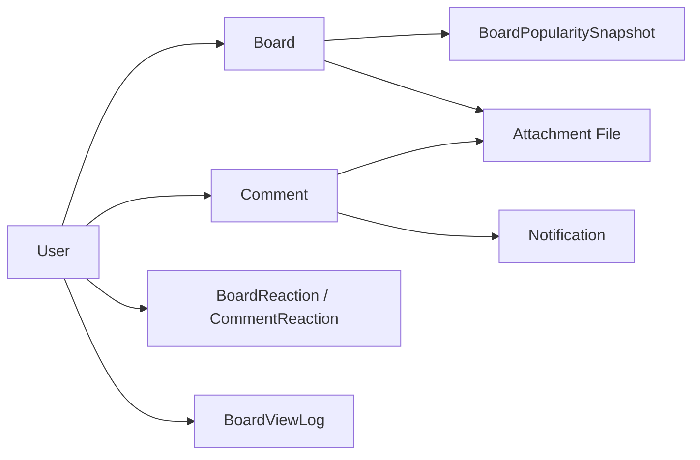

# Board 도메인 포트폴리오 페이지 초안

## 1. 페이지 목적

이 페이지는 Petory의 Board 도메인을 단순한 게시판 CRUD가 아니라, **사용자 참여형 커뮤니티에서 실제로 문제가 되는 조회·반응·집계 흐름을 개선한 사례**로 보여주기 위한 문서입니다.

핵심 메시지는 아래 3가지입니다.

1. 사용자는 게시글, 댓글, 반응, 인기글을 자연스럽게 사용한다.
2. 백엔드는 그 흐름을 단순 CRUD로 처리하지 않고 조회 성능, 집계 비용, 중복 조회 방지까지 고려했다.
3. 성능·집계 이슈를 테스트와 문서로 남기고, 리팩토링 근거를 코드와 함께 설명할 수 있다.

---

## 2. 한 줄 소개

**웹 Hero / OG (§5.4):**

> 커뮤니티 Board — 목록 N+1·반응 토글·조회수 중복 제어·인기글 스냅샷을 중심으로 읽기 성능과 데이터 흐름을 다듬었습니다.

**작성자용 확장 (웹 Hero에는 §6.1 사용):**

> Board 도메인은 반려동물 보호자들이 글을 올리고, 공감하고, 소통하는 커뮤니티 영역이며, 저는 이 도메인을 구현하면서 **목록 조회 성능, 반응 토글, 조회수 중복 방지, 인기글 배치 집계**를 주요 개선 포인트로 다뤘습니다.

---

## 3. 이 도메인을 포트폴리오에서 보여줘야 하는 이유

많은 게시판 프로젝트는 글 작성과 댓글 작성까지만 설명하고 끝납니다. 하지만 실제 서비스에서는 그보다 아래 문제가 더 중요합니다.

- 게시글이 많아졌을 때 목록 조회가 느려지지 않는가
- 좋아요/싫어요와 댓글 수를 매번 비효율적으로 계산하고 있지 않은가
- 같은 사용자의 새로고침으로 조회수가 계속 오르지 않는가
- 인기글을 요청마다 실시간 계산해서 DB 비용을 키우고 있지 않은가

Board 도메인은 이 질문들에 대해 코드 레벨의 답을 가지고 있습니다.

- 게시글 목록 조회는 작성자 `JOIN FETCH`와 반응·첨부 배치 조회로 N+1을 줄였습니다.
- 반응 시스템은 토글 방식으로 설계해 UX와 데이터 정합성을 함께 맞췄습니다.
- 조회수는 `BoardViewLog`를 통해 중복 증가를 제어합니다.
- 인기글은 스냅샷 우선 전략으로 조회 시점의 집계 부담을 줄였습니다.

즉, 이 페이지는 "게시판을 만들었다"가 아니라 **"게시판의 조회 성능과 데이터 흐름을 서비스 관점에서 개선했다"**를 보여주는 페이지여야 합니다.

---

## 4. 사용자 관점 기능 설명 (작성자용 — 웹 미노출)

> §5.0·§5.5: github.io 메인 페이지에는 넣지 않는다. 면접 대본·코드 grep 출발점. 웹 카피는 §6 + §5.2 design 카드로 압축.

### 4.1 게시글 작성과 목록 조회

사용자는 카테고리를 선택해 게시글을 작성하고, 목록에서 최신 글을 빠르게 탐색할 수 있습니다. 게시글에는 첨부 이미지를 연결할 수 있고, 목록에서는 반응 수와 대표 이미지를 함께 보여줄 수 있습니다.

이 흐름의 핵심은 단순 조회가 아니라, 목록 화면에서 필요한 데이터가 많다는 점입니다.

- 게시글 본문
- 작성자 정보
- 좋아요 / 싫어요 수
- 첨부 이미지

이 데이터를 매 게시글마다 따로 읽으면 금방 N+1 문제가 생기기 때문에, 서비스 레이어에서 **작성자는 `JOIN FETCH`로 한 번에**, **반응·첨부는 ID 묶음 배치 조회(IN·집계)**로 나누어 최적화했습니다.

근거 코드:

- `backend/main/java/com/linkup/Petory/domain/board/service/BoardService.java`
- `mapBoardsWithReactionsBatch(...)`
- `getReactionCountsBatch(...)`

### 4.2 댓글과 반응

사용자는 게시글에 댓글을 달고, 댓글에도 좋아요/싫어요 반응을 남길 수 있습니다. 댓글 작성 시 게시글 작성자에게 알림이 가며, 댓글 삭제는 Soft Delete로 처리해 운영상 복구 가능성을 남겼습니다.

여기서 보여줄 포인트는 2가지입니다.

- 댓글 자체가 또 하나의 참여 단위라는 점
- 댓글 목록도 반응 수와 첨부파일 때문에 쉽게 N+1 문제가 생긴다는 점

근거 코드:

- `backend/main/java/com/linkup/Petory/domain/board/service/CommentService.java`
- `getCommentsWithPaging(...)`
- `mapCommentsWithReactionCountsBatch(...)`

### 4.3 좋아요 / 싫어요 토글

반응 시스템은 단순 카운트 증가가 아니라 토글 규칙으로 설계했습니다.

- 같은 반응을 다시 누르면 취소
- 다른 반응으로 바꾸면 기존 반응 제거 후 새 반응 적용
- 게시글 엔티티의 `likeCount`, `dislikeCount`를 즉시 갱신

이 방식은 읽기 성능에 유리합니다. 상세 화면이나 목록 화면에서 매번 전체 반응을 다시 세지 않고도 바로 표시할 수 있기 때문입니다.

근거 코드:

- `backend/main/java/com/linkup/Petory/domain/board/service/ReactionService.java`
- `reactToBoard(...)`
- `updateBoardReactionCounts(...)`

### 4.4 조회수 중복 방지

조회 로직은 단순 새로고침 누적을 막기 위해 **사용자별 조회 로그**를 두는 방식으로 설계했습니다.

- `viewerId`가 없으면 조회수는 증가
- `viewerId`가 있으면 `BoardViewLog` 기준 첫 조회만 증가
- 이미 조회한 사용자라면 새로고침만으로는 조회수가 오르지 않음

다만 현재 보안 설정상 게시판 조회 API는 공개 GET처럼 선언돼 있어도 실제 런타임에서는 인증이 필요한 상태입니다. 그래서 이 문서에서는 "비로그인 사용자까지 포함한 공개 조회 정책"보다는, **서비스 레이어에 중복 조회 제어 로직이 들어가 있다**는 점을 중심으로 설명하는 편이 더 정확합니다.

근거 코드:

- `backend/main/java/com/linkup/Petory/domain/board/service/BoardService.java`
- `shouldIncrementView(...)`
- `backend/main/java/com/linkup/Petory/domain/board/entity/BoardViewLog.java`

### 4.5 인기글 스냅샷

인기글은 **기본적으로는 스냅샷을 우선 조회**하고, 스냅샷이 없을 때만 보완적으로 생성하거나 대체 데이터를 반환하는 구조입니다.

- 주간 / 월간 단위 인기글 제공
- 대상 카테고리는 현재 `"자랑"` 게시판
- 점수는 `좋아요 * 3 + 댓글 * 2 + 조회 로그 기준 조회수`
- 스케줄러가 주기적으로 스냅샷 생성
- 스냅샷이 없으면 요청 시점에 생성하거나 최근 데이터로 fallback

이 설계는 "가능하면 읽기 응답은 가볍게 유지하고, 집계 비용은 미리 분리한다"는 선택입니다. 다만 현재 구현은 스냅샷이 비어 있을 때 on-demand 생성과 fallback도 함께 갖고 있어서, **완전한 배치 전용 구조라기보다 스냅샷 우선 전략**에 가깝습니다.

근거 코드:

- `backend/main/java/com/linkup/Petory/domain/board/service/BoardPopularityService.java`
- `backend/main/java/com/linkup/Petory/domain/board/service/BoardPopularityScheduler.java`

### 4.6 프론트엔드와 API 계약

목록·상세·댓글 페이징·반응 POST는 REST로 묶여 있고, 클라이언트는 인증 헤더가 붙은 Axios 모듈로 동일 계약을 소비합니다. 데모 모드가 아닐 때 실제 백엔드는 `http://localhost:8080/api/boards` 베이스로 붙습니다.

여기서 주의할 점은, 컨트롤러에는 `permitAll()`이 붙어 있는 GET API가 일부 있어도 실제 보안 설정의 `/api/**` 규칙 때문에 게시판 조회 계열도 인증 전제로 동작한다는 점입니다. 따라서 포트폴리오 설명에서도 "공개 게시판"보다는 **인증 기반 커뮤니티 API**로 표현하는 편이 코드와 맞습니다.

근거 코드:

- `frontend/src/api/boardApi.js` — 게시글 CRUD, 검색, 반응
- `frontend/src/api/commentApi.js` — 댓글 목록·작성
- (운영/모더레이션) `frontend/src/api/communityAdminApi.js` — 블라인드·삭제·복구 등 관리자 전용 경로

---

## 5. github.io 페이지 구성 (확정안)

> **이 절만 `BoardDomain.jsx` 구현 기준으로 본다.** §4·§7·§8은 작성자용 원고·참고 자료이며, 웹 페이지에 그대로 붙이지 않는다.

### 5.0 설계 원칙

| 구분 | 원칙 |
|------|------|
| **독자** | github.io 방문자 — 스크롤 30초 안에 "무엇을·왜·얼마나" 판단 |
| **베이스 카피** | §6 서술형 3문단 (소개 → 기술 → 결과). §4·§5.3 전체는 넣지 않음 |
| **중복 금지** | §4(사용자 기능)와 §5.3(기술 포인트) 내용 겹침 → 웹에서는 §6 한 벌 + pillars + 표로 압축 |
| **깊이 분리** | 인덱스 DDL·Before/After 쿼리·리팩터 상세 → `/domains/board/optimization`, `/domains/board/refactoring` |
| **톤** | UserDomain과 동일 — pillars → 개요(핵심 문장 + 수치 표) → 본문 3카드 → 한계 → 관련 링크 |

**목표 체류 시간:** 본문 스크롤 **1~2분**. §4 전체를 옮기면 5분짜리 설계 문서가 되어 이탈한다.

### 5.1 페이지 맵 (`BoardDomain.jsx`)

TOC 5개. UserDomain의 `pillars` + `intro`(수치 표) 패턴을 따른다.

```
게시판 도메인
├── [Hero] 제목 + §6.1 한 문단 (문제·집중 방향)
├── [pillars] 핵심 기능 — pill 4~5개
├── [intro] 도메인 개요 — §6.2 요약 1문단 + 성능 Before/After 표
├── [design] 기술 결정 — 카드 5개 (A~E, 각 2~3 bullet + 코드 1블록 이하)
├── [limits] 한계 & 다음 개선 — §5.5 bullet 5개
└── [docs] 관련 페이지 — optimization / refactoring / missing-pet 링크
```

**웹에 넣지 않는 것 (현행 `BoardDomain.jsx`에서 빼거나 서브페이지로):**

- troubleshooting 섹션 전체 (optimization 페이지와 중복)
- performance 섹션 전체 (인덱스 DDL, Before/After SQL — optimization으로)
- ER 다이어그램 (선택: optimization 또는 접기; 메인은 flowchart만)
- API 전체 테이블 (bullet 3~4개 또는 docs 링크로 대체)

### 5.2 섹션별 상세

#### Hero (제목 아래 1문단)

§6.1을 그대로 쓰되, **3문장 이내**로 유지.

> Board 도메인은 Petory 사용자들이 일상·정보·질문·자랑 글을 올리고 소통하는 커뮤니티 영역입니다. 처음에는 일반적인 게시판처럼 보였지만, 실제 구현에서는 목록 조회 성능·반응 정합성·조회 중복 제어·인기글 집계 비용 같은 **읽기 중심 문제**를 먼저 풀어야 했습니다. 저는 이 도메인에서 단순 CRUD 설명보다, 데이터가 많아졌을 때도 흐름이 무너지지 않도록 조회 구조를 다듬는 데 집중했습니다.

#### `pillars` — 핵심 기능 (pill 태그)

UserDomain `corePillars`와 동일 UI. 클릭 없이 스캔용.

```
목록 N+1 최적화 | 반응 토글 | 조회수 중복 방지 | 인기글 스냅샷 | FULLTEXT 검색
```

#### `intro` — 도메인 개요

**카드 1:** §6.2를 **1문단**으로 (JOIN FETCH + 배치 + ViewLog + 스냅샷 우선 전략을 한 흐름으로).

**카드 2:** 성능 표 (UserDomain intro 표와 동일 레이아웃).

| 지표 | Before | After |
|------|--------|-------|
| 목록 조회 쿼리 수 | 301개 | 3개 |
| 실행 시간 | 745ms | 30ms |
| 메모리 | 22.50MB | 2MB |

표 아래 **한 줄 전제** (§5.4):

> 100개 게시글 목록(작성자·반응·첨부 포함)·테스트 DB·`entityManager.clear()` 후 측정. 운영 수치는 환경에 따라 다를 수 있음.

**카드 3 (선택):** §7 flowchart — §6.2와 같은 카드 또는 바로 아래.



#### `design` — 기술 결정 (카드 5개)

§4·§5.3 내용을 **카드당 2~3 bullet + 코드 스니펫 1개 이하**로만 압축. §6.2와 문장 수준 중복이면 bullet만 남기고 문단은 생략.

| 카드 | 제목 | bullet 요지 | 코드 (택 1) |
|------|------|-------------|-------------|
| A | 목록 N+1 | 작성자 `JOIN FETCH` / 반응·첨부 ID 배치 IN+GROUP BY | `getReactionCountsBatch` 호출부 4~6줄 |
| B | 댓글 N+1 | `CommentService` ID 묶음 배치 | 생략 가능 (optimization 링크) |
| C | 실시간 vs 배치 | 반응 `likeCount` 즉시 갱신 / 인기글 스케줄러 스냅샷 / 없으면 생성·fallback | 반응 토글 switch 5줄 |
| D | 조회수 품질 | `viewerId` 기준 첫 조회만 / 새로고침 중복 증가 제어 / 인기 점수는 `BoardViewLog` 집계 기준 | `shouldIncrementView` 3~4줄 |
| E | 검색 | `TITLE_CONTENT`는 FULLTEXT / `NICKNAME`은 JOIN 검색 / 페이징 유지 | `searchBoardsWithPaging` 분기 4~6줄 |

**기능 나열(§5.2)은 여기 넣지 않음.** pillars + Hero에서 이미 전달됨. 수정·삭제·이메일 인증·관리자 API는 한 bullet 이하 또는 `docs/domains/board.md` 링크.

#### `limits` — 한계 & 다음 개선

§5.5 bullet 5개 그대로. Card 하나, 문단 없음.

권한 정책까지 완전히 정리된 완성형 사례라기보다, 조회·집계 흐름을 먼저 다듬은 상태라는 점을 한계로 명시한다.

- 인기글 대상: `"자랑"` 카테고리 중심
- 목록 페이징: Offset → 대용량 시 커서 검토
- 조회수: DB 로그 → 트래픽 증가 시 Redis TTL 검토
- 권한 검증: `createBoard`·`addComment`는 JWT principal 기반 사용자 조회로 전환, `updateBoard`·`deleteBoard`·`updateComment`·`deleteComment`에는 `assertBoardOwner` / `assertCommentOwner` 소유권 검증 추가 완료 (403 `BoardForbiddenException` 반환)
- 관리자 조회: 최적화/레거시 흐름 공존, 정리 여지

#### `docs` — 관련 페이지

- [Board 성능 최적화](/domains/board/optimization) — N+1 상세, 인덱스, Before/After
- [Board 리팩토링](/domains/board/refactoring) — 중복 제거, 코드 구조
- [Missing Pet](/domains/missing-pet) — board 패키지 내 별도 도메인성

### 5.3 서브페이지 역할 (기존 JSX 유지·정리)

| 경로 | 역할 | 메인에서 빼는 이유 |
|------|------|-------------------|
| `/domains/board` | **Why + What + How much** (§6 + 표 + flow) | — |
| `/domains/board/optimization` | 인덱스 DDL, 쿼리 Before/After, 배치 단위, 트러블슈팅 | 메인과 70% 중복 |
| `/domains/board/refactoring` | 매핑 중복, 서비스 분리, 리팩터 근거 | 면접 깊은 질문용 |

### 5.4 §2 한 줄 소개 (Hero 보조 / 메타용)

웹 Hero에는 §6.1 사용. §2는 **한 문장**으로만 유지 (OG·카드 미리보기용).

> 커뮤니티 Board — 목록 N+1·반응 토글·조회수 중복 제어·인기글 스냅샷을 중심으로 읽기 성능과 데이터 흐름을 다듬었습니다.

### 5.5 작성자용 원고 vs 웹 페이지 (§4·§6·§7·§8)

| 절 | 역할 | github.io |
|----|------|-----------|
| §4 사용자 기능 | 면접 대본·코드 근거 정리 | **미사용** (§6·design 카드로 흡수) |
| §6 서술형 | **웹 Hero + intro + design 톤의 원문** | **직접 사용** |
| §7 시각 자료 | 촬영·다이어그램 TODO | flowchart만 §5.2 intro; 스크린샷은 추후 1장 |
| §8 코드·문서 링크 | 구현 시 grep 출발점 | GitHub `Petory` blob 링크 2~3개만 docs 섹션 |

### 5.6 구현 체크리스트

- [ ] `sections` TOC를 위 5.1 맵과 동기화 (`pillars`, `intro`, `design`, `limits`, `docs`)
- [ ] 성능 숫자는 **intro 표 한 곳**에만 (Hero·summary 중복 제거)
- [ ] `troubleshooting` / `performance` / `summary` 섹션 제거 또는 optimization으로 이전
- [ ] §6.3 결과 문장은 intro 표 caption 또는 Hero 마지막 문장에 1회만
- [ ] UserDomain과 pill·Card·표 스타일 통일

---

## 6. 페이지에 그대로 쓸 수 있는 서술형 초안 (웹 베이스 카피)

> **§5.2 Hero / intro / design의 문단 원문.** §6.3 결과 수치는 intro 표와 중복되므로 웹에서는 표 caption 또는 Hero 마지막 1문장으로만 쓴다.

### 6.1 소개 문단

Board 도메인은 Petory 사용자들이 일상, 정보, 질문, 자랑 글을 올리고 소통하는 커뮤니티 영역입니다. 처음에는 일반적인 게시판 기능처럼 보였지만, 실제 구현에서는 게시글 목록 조회 성능, 반응 데이터 정합성, 조회 중복 제어, 인기글 집계 비용 같은 읽기 중심 문제를 먼저 해결해야 했습니다. 저는 이 도메인을 구현하면서 단순 CRUD보다 데이터가 많아졌을 때도 흐름이 무너지지 않도록 조회 구조를 다듬는 데 집중했습니다.

### 6.2 기술 포인트 문단

특히 게시글 목록과 댓글 목록은 반응 수와 첨부파일 정보가 함께 필요해 N+1 문제가 쉽게 발생할 수 있었습니다. 작성자 정보는 목록 조회 단계에서 함께 로딩되게 두고, 반응·첨부는 ID를 모아 배치 집계하는 방식으로 서비스 로직을 재구성했습니다. 상세 조회에서는 `viewerId` 기준으로 사용자별 조회 로그를 관리해 중복 증가를 제어했고, 인기글은 스냅샷을 우선 조회하되 없으면 생성하거나 fallback하는 방식으로 읽기 성능과 집계 비용을 분리했습니다.

### 6.3 결과 문단

이 개선으로 게시글 목록 조회는 문서상 성능 비교 시나리오 기준 301개 쿼리에서 3개 쿼리 수준으로 줄었고, 실행 시간도 745ms에서 30ms까지 단축했습니다.

---

## 7. 시각 자료 (작성자용 TODO — 웹은 flowchart만)

> §5.2 intro: §7 mermaid flowchart **1개만** 메인에 포함. 스크린샷·ER·성능 표는 §5.2 intro 표로 대체하거나 optimization 페이지로.

이 문서는 텍스트만으로도 읽히지만, 실제 페이지에서는 아래 자료가 있으면 훨씬 강합니다.

- 게시글 목록 화면
- 게시글 상세 화면
- 댓글 작성 및 반응 UI
- 인기글 영역 화면
- 성능 개선 전후 비교 표
- `Board -> Reaction/Comment/ViewLog -> Snapshot` 관계를 보여주는 간단한 다이어그램

다이어그램 초안:


---

## 8. 코드·문서 근거 (구현 시 참고 — 웹에는 링크 2~3개만)

> JSX `docs` 섹션: Petory GitHub blob 2~3개 + optimization/refactoring 내부 라우트. 전체 목록은 여기 §8에만 둔다.

포트폴리오 페이지를 만들 때 아래 파일들을 함께 참조하면 좋습니다.

### 8.1 핵심 코드

- `backend/main/java/com/linkup/Petory/domain/board/controller/BoardController.java`
- `backend/main/java/com/linkup/Petory/domain/board/service/BoardService.java`
- `backend/main/java/com/linkup/Petory/domain/board/service/CommentService.java`
- `backend/main/java/com/linkup/Petory/domain/board/service/ReactionService.java`
- `backend/main/java/com/linkup/Petory/domain/board/service/BoardPopularityService.java`
- `backend/main/java/com/linkup/Petory/domain/board/service/BoardPopularityScheduler.java`
- `backend/main/java/com/linkup/Petory/domain/board/entity/Board.java`
- `frontend/src/api/boardApi.js`
- `frontend/src/api/commentApi.js`

### 8.2 참고 문서

- `docs/domains/board.md`
- `docs/troubleshooting/board/performance-optimization.md`
- `docs/troubleshooting/board/code-duplication-mapping.md`
- `docs/refactoring/board/board-backend-performance-optimization.md`
- `docs/refactoring/board/board-popularity-snapshot-batch-analysis.md`
- `docs/refactoring/board/comment-reaction-query/troubleshooting.md`

---

## 9. 문서 작성 방향 한 줄 정리

- **이 파일 전체:** 작성자용 원고 + 면접 대본 + §8 코드 인덱스
- **github.io `/domains/board`:** §5 확정안 — §6 3문단 + pillars + 수치 표 + flowchart + 한계 5 bullet + 서브페이지 링크 (1~2분 체류)
- **메시지:** "게시판 CRUD"가 아니라 **커뮤니티 데이터를 읽기 좋고 집계 비용을 분리한 방법** (301→3, 745ms→30ms + 측정 전제 + 솔직한 한계)
