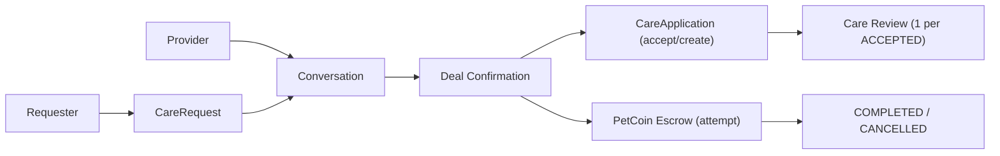

# Care 도메인 포트폴리오 페이지 초안

## 1. 페이지 목적

이 페이지는 Care 도메인을 단순한 "펫시터 매칭 기능"이 아니라, **거래 정합성 리스크와 대용량 조회 성능을 함께 다뤄야 하는 서비스 도메인**으로 설명하기 위한 초안입니다.

이 도메인에서 보여줘야 할 핵심은 아래 3가지입니다.

1. 요청 생성, 채팅, 거래 확정, 상태 변경이 여러 도메인과 얽혀 있어 정합성이 중요하다.
2. 거래가 실제 금전성 데이터인 펫코인 에스크로와 연결되므로, 동시성과 권한 검증이 중요하다.
3. 목록 조회는 사용 빈도가 높기 때문에 성능 최적화가 단순 부가 작업이 아니라 핵심 품질 요소였다.

---

## 2. 한 줄 소개

> Care 도메인은 반려동물 돌봄 요청자와 제공자를 연결하는 매칭 시스템이며, 저는 이 도메인에서 **거래 확정 동시성 제어, 상태 변경과 결제 연계, 요청 목록 N+1 최적화**를 핵심 기술 포인트로 다뤘습니다.

---

## 3. 이 도메인을 포트폴리오에서 보여줘야 하는 이유

Care 도메인은 게시판이나 단순 조회형 기능과 다르게, 상태가 잘못 바뀌면 실제 사용자 분쟁으로 이어질 수 있는 영역입니다.

- 요청자는 돌봄 요청을 올리고 코인 가격을 제시한다.
- 제공자는 댓글이나 채팅으로 조건을 조율할 수 있다.
- 양측이 거래를 확정하면 서비스가 시작되고, 이 과정에서 지원 정보가 승인되거나 생성될 수 있다.
- 완료 또는 취소 시 에스크로 코인이 지급 또는 환불된다.

즉, 이 도메인은 "CRUD를 잘 만들었는가"보다 **상태 전이와 결제 흐름을 얼마나 안전하게 연결했고, 무거운 조회를 얼마나 줄였는가**가 더 중요합니다.

---

## 4. 사용자 관점 기능 설명

### 4.1 케어 요청 생성과 기본 조건 검증

사용자는 제목, 설명, 날짜, 연결할 반려동물, 제시 코인(`offeredCoins`)을 포함해 케어 요청을 생성할 수 있습니다. 생성 시 이메일 인증이 필요하고, 요청자 본인 소유의 반려동물만 연결할 수 있습니다.

핵심 포인트:

- 이메일 인증 기반 책임 있는 요청 생성
- 잔액 부족 시 요청 생성 차단
- 요청 수정 시 반려동물 연결/해제 가능

근거 코드:

- `backend/main/java/com/linkup/Petory/domain/care/service/CareRequestService.java`
- `createCareRequest(...)`
- `updateCareRequest(...)`

### 4.2 채팅 기반 거래 확정

이 도메인의 가장 중요한 UX는 "요청을 올리고 끝"이 아니라, **채팅에서 실제 거래를 확정하는 흐름**입니다.

- 채팅방 참여자가 요청자와 조건 협의
- 양쪽 모두 거래 확정 버튼 클릭
- 두 사람 모두 확정되면 `CareRequest` 상태가 `OPEN -> IN_PROGRESS`
- 기존 `CareApplication`이 있으면 `ACCEPTED`, 없으면 그 자리에서 생성 가능
- 요청자가 제시한 펫코인에 대해 에스크로 생성을 시도

이 흐름은 단순 상태 변경이 아니라 Chat, Payment, Care 도메인이 함께 맞물리는 지점이라 포트폴리오에서 가장 강하게 보여줄 만합니다.

근거 코드:

- `backend/main/java/com/linkup/Petory/domain/chat/service/ConversationService.java`
- `confirmCareDeal(...)`

### 4.3 서비스 완료와 코인 지급

서비스가 완료되면 승인된 제공자 또는 요청자가 완료 상태로 전환할 수 있고, 이때 HOLD 상태의 에스크로가 제공자에게 지급됩니다. 취소 시에는 요청자 환불로 이어집니다.

핵심 포인트:

- 상태 변경 권한은 요청자 또는 승인된 제공자로 제한
- `COMPLETED` 전환 시 완료 시각 기록
- 완료/취소 처리 경로는 `updateStatus(...)`에 모여 있음

근거 코드:

- `backend/main/java/com/linkup/Petory/domain/care/service/CareRequestService.java`
- `updateStatus(...)`

### 4.4 댓글과 리뷰

`SERVICE_PROVIDER` 역할 사용자는 요청 글에 댓글을 남길 수 있고, 요청자는 승인된 지원(`CareApplicationStatus.ACCEPTED`)에 대해 리뷰를 남길 수 있습니다. 리뷰는 1건의 승인된 지원에 대해 1회만 허용되는 구조라, 단순 평점 표시보다 신뢰 시스템의 일부로 설명하는 편이 좋습니다.

### 4.5 API와 인증 전제

컨트롤러만 보면 목록·상세·검색·댓글 조회가 공개 GET처럼 보일 수 있지만, 실제 런타임에서는 `SecurityConfig`의 `/api/**` 규칙 때문에 Care 요청/댓글/리뷰 API도 **인증 기반**으로 동작합니다.

---

## 5. 포트폴리오에서 강조할 기술 포인트

### 5.1 거래 확정 Race Condition 해결

가장 중요한 문제는 `confirmCareDeal()`이 양측 동시 클릭 상황에서 꼬일 수 있다는 점이었습니다. 서로의 변경 사항을 못 본 채 두 트랜잭션이 종료되면, 둘 다 확정했는데도 `CareRequest`가 `OPEN`으로 남는 stuck state가 발생할 수 있습니다.

이 문제는 `Conversation` 조회 시 **비관적 락**을 적용해 해결했습니다.

- `conversationRepository.findByIdWithLock(...)`
- 한 사용자의 확정 로직이 끝난 뒤 다음 요청이 최신 상태를 읽도록 강제
- 동시성 문제를 "중복 실행"이 아니라 "후속 상태 전이 누락"으로 분석하고 접근

포트폴리오 문장 예시:

> 두 사용자가 거의 동시에 거래 확정 버튼을 누를 때 상태 전이가 누락되는 race condition이 있었고, 이를 비관적 락 기반 순차 처리로 해결해 거래 정합성을 보장했습니다.

### 5.2 목록 조회 N+1 최적화

Care 도메인은 목록 화면에서 요청, 지원자 수, 반려동물, 파일, 예방접종 정보가 함께 얽힙니다. 그래서 naive하게 구현하면 조회가 매우 빠르게 무거워집니다.

문서 기준 개선 결과:

- 총 쿼리 수: `약 2400개 -> 4~5개`
- 백엔드 응답 시간: `1084ms -> 66ms`
- 메모리 사용량: `21MB -> 6MB`

이 수치는 `Fetch Join`과 배치 조회 전략을 적절히 섞은 결과라서, "JPA를 썼다"가 아니라 **JPA의 병목을 실제로 다뤘다**는 근거로 쓰기 좋습니다.

근거 문서:

- `docs/troubleshooting/care/care-domain-technical-analysis.md`
- `docs/troubleshooting/care/care-request-n-plus-one-analysis.md`
- `docs/troubleshooting/care/care-request-paging-n-plus-one.md`

### 5.3 완료/취소 처리 경로 일원화

스케줄러가 만료된 요청을 완료 처리할 때도 별도 로직으로 상태만 바꾸지 않고, `CareRequestService.updateStatus(...)`를 호출해 완료 시각 기록과 에스크로 지급/환불을 같은 경로에서 처리하도록 맞췄습니다.

이 점은 작아 보여도 중요합니다.

- 수동 완료
- 스케줄러 완료
- 취소 처리

이 세 경로가 각각 따로 놀면 금방 정합성이 깨집니다. 현재 구현은 **완료/취소 이후 처리**를 한 서비스 메서드에 모아 관리하려는 방향이 명확합니다.

### 5.4 일부 핵심 권한 검증을 서비스 로직에 둔 점

Care 도메인은 누가 무엇을 바꿀 수 있는지가 중요합니다.

- 요청 수정/삭제: 요청자 또는 관리자
- 상태 변경: 요청자 또는 승인된 제공자
- 연결 가능한 반려동물: 요청자 본인 소유 펫만

이런 검증이 컨트롤러가 아니라 서비스 로직 안쪽에 들어가 있는 점은 분명한 장점입니다. 다만 생성·댓글·리뷰 경로에는 요청 바디의 `userId`를 그대로 신뢰하는 구간이 남아 있어, 완전히 닫힌 권한 체계라고 보기는 어렵습니다.

### 5.5 현재 한계와 다음 개선

- 거래 확정: `IN_PROGRESS` 저장 후 에스크로 생성 실패를 로그로만 남겨, 상태 전이와 결제가 원자적으로 묶여 있지 않음
- 권한 검증: `createCareRequest`·댓글 작성·리뷰 작성은 요청 바디의 `userId`를 신뢰하고, 댓글 삭제는 작성자/관리자 확인이 없음
- 리뷰 시점: 현재는 `COMPLETED`가 아니라 `CareApplicationStatus.ACCEPTED` 기준으로 리뷰 작성 가능
- API 인증: 컨트롤러상 공개 GET처럼 보이는 목록·상세·검색·댓글·리뷰도 실제로는 `/api/**` 규칙 때문에 인증 전제
- 상태 전이: `updateStatus(...)`는 스케줄러용 `currentUserId == null` 예외 경로가 있고, 허용 전이 테이블을 엄격히 강제하지 않음

---

## 6. 페이지에 그대로 쓸 수 있는 서술형 초안

### 6.1 소개 문단

Care 도메인은 반려동물 돌봄이 필요한 사용자와 돌봄 제공자를 연결하는 Petory의 핵심 매칭 기능입니다. 저는 이 도메인을 구현하면서 단순 요청 등록보다, 거래 확정 이후 상태 변경과 결제 흐름이 어떻게 맞물리는지를 더 중요하게 봤습니다. 특히 채팅, 케어 요청, 에스크로 결제가 하나의 흐름으로 이어지기 때문에 데이터 정합성이 가장 중요한 과제였습니다.

### 6.2 기술 포인트 문단

가장 큰 이슈는 두 사용자가 거의 동시에 거래 확정 버튼을 누를 때 상태 전이가 누락될 수 있는 동시성 문제였습니다. 이를 해결하기 위해 `Conversation` 조회에 비관적 락을 적용해 확정 로직을 순차적으로 처리했고, 양측 모두 확정된 경우에만 `CareRequest`를 `IN_PROGRESS`로 전환하도록 구성했습니다. 이 과정에서 기존 지원이 있으면 승인하고, 없으면 `CareApplication`을 생성하며, 에스크로도 함께 생성하도록 시도합니다. 또한 요청 목록 조회에서는 Fetch Join과 배치 조회 전략을 적용해, 약 2400개까지 늘어나던 쿼리를 4~5개 수준으로 줄였습니다.

### 6.3 결과 문단

최적화 이후 Care 요청 목록의 백엔드 응답 시간은 1084ms에서 66ms로 줄었고, 쿼리 수도 약 99.8% 감소했습니다. Care 도메인은 단순 매칭 화면을 넘어서, 실제 거래가 일어나는 서비스에서 동시성과 조회 성능을 어떻게 함께 설계할지 보여주는 사례가 되었습니다. 다만 결제 원자성과 권한 정책까지 완전히 닫힌 완성형이라기보다, 핵심 병목과 정합성 이슈를 단계적으로 다듬어 온 사례에 더 가깝습니다.

---

## 7. 시각 자료 추천

- 케어 요청 목록 화면
- 요청 상세와 지원/거래 확정 화면
- 채팅방 내 거래 확정 UI
- 상태 전이 다이어그램 (`OPEN -> IN_PROGRESS -> COMPLETED / CANCELLED`)
- 거래 확정 동시성 시퀀스 다이어그램
- 최적화 전후 성능 표

간단 다이어그램 초안:

---

## 8. 코드 근거 링크 묶음

### 8.1 핵심 코드

- `backend/main/java/com/linkup/Petory/domain/care/service/CareRequestService.java`
- `backend/main/java/com/linkup/Petory/domain/care/service/CareRequestScheduler.java`
- `backend/main/java/com/linkup/Petory/domain/care/service/CareRequestCommentService.java`
- `backend/main/java/com/linkup/Petory/domain/care/service/CareReviewService.java`
- `backend/main/java/com/linkup/Petory/domain/chat/service/ConversationService.java`

### 8.2 참고 문서

- `docs/domains/care.md`
- `docs/troubleshooting/care/care-domain-technical-analysis.md`
- `docs/troubleshooting/care/care-request-n-plus-one-analysis.md`
- `docs/troubleshooting/care/care-request-paging-n-plus-one.md`
- `docs/troubleshooting/care/care-deal-confirmation-race-condition.md`
- `docs/architecture/care/펫 케어 & 매칭 아키텍처.md`
- `docs/architecture/care/펫케어 코인 관련 흐름.md`

---

## 9. 문서 작성 방향 한 줄 정리

Care 페이지는 "펫시터 매칭 기능"보다, **거래 정합성 리스크와 조회 성능 병목을 함께 다뤄 온 서비스 도메인**으로 설명하는 편이 가장 강합니다.
