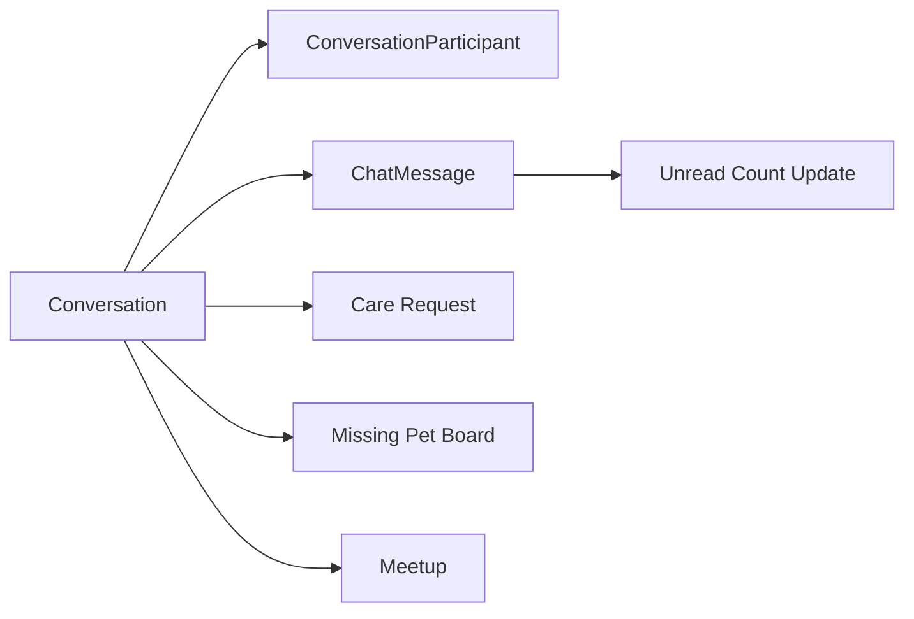

# Chat 도메인 포트폴리오 페이지 초안

## 1. 페이지 목적

이 페이지는 Chat 도메인을 단순 실시간 메시징 기능이 아니라, **여러 비즈니스 도메인을 연결하는 실시간 협업 인프라**로 설명하기 위한 초안입니다.

핵심 메시지는 아래 3가지입니다.

1. 채팅은 독립 기능이면서 동시에 Care, Missing Pet, Meetup의 액션 허브 역할을 한다.
2. 실시간성만큼 중요한 것은 읽음 처리, unread count, 재참여 정책 같은 운영 디테일이다.
3. 메시지 수가 많아질수록 성능 문제는 기능보다 먼저 드러난다.

---

## 2. 한 줄 소개

> Chat 도메인은 1:1, 그룹, 펫케어, 실종 제보, 모임 채팅을 지원하는 로그인 기반 실시간 메시징 기능이며, 저는 이 도메인에서 **도메인별 채팅 생성 규칙, unread count 동시성 제어, 읽음 처리/참여자 조회 최적화**를 핵심 포인트로 다뤘습니다.

---

## 3. 이 도메인을 포트폴리오에서 보여줘야 하는 이유

채팅 기능은 보통 "WebSocket 붙였다" 정도로 끝나기 쉽지만, 실제 서비스에서는 그 다음 문제가 더 어렵습니다.

- 기존 1:1 채팅방을 재사용할 것인가
- 펫케어 거래 확정은 채팅 안에서 어떻게 이어질 것인가
- 모임에서 나간 사람이 다시 들어오면 이전 대화를 어디까지 보여줄 것인가
- 읽음 처리 시 모든 메시지를 다시 읽는 구조를 어떻게 피할 것인가

이 도메인은 단순 메시지 송수신보다, **채팅을 비즈니스 흐름의 일부로 설계했다는 점**이 포트폴리오 가치입니다.

---

## 4. 사용자 관점 기능 설명

### 4.1 다양한 채팅방 타입

Chat 도메인은 `DIRECT`, `GROUP`, `CARE_REQUEST`, `MISSING_PET`, `MEETUP` 등 다양한 채팅방 타입을 지원합니다. 사용자는 직접 채팅을 만들기도 하고, 다른 도메인 흐름에서 채팅이 자동 생성되거나 사용자 액션으로 시작되기도 합니다.

핵심 포인트:

- 펫케어 요청 채팅
- 실종 제보자-목격자 채팅
- 모임 그룹 채팅
- 일반 1:1 또는 그룹 채팅

즉, 채팅은 독립 제품이 아니라 **도메인 간 연결 레이어**입니다.

### 4.2 메시지 전송과 unread count 관리

메시지를 보내면 다른 참여자의 읽지 않은 메시지 수가 증가하고, 마지막 메시지 미리보기와 마지막 메시지 시각도 갱신됩니다.

이때 unread count는 참여자별로 루프를 돌며 증가시키지 않고, DB 레벨의 원자적 증가 쿼리를 사용합니다.

근거 코드:

- `backend/main/java/com/linkup/Petory/domain/chat/service/ChatMessageService.java`
- `sendMessage(...)`
- `participantRepository.incrementUnreadCount(...)`

### 4.3 재참여 정책

모임 채팅처럼 나갔다가 다시 들어오는 경우, 기본 메시지 조회 경로에서는 사용자가 이전 대화를 모두 보는 대신 `joinedAt` 이후 메시지만 보도록 제한됩니다. 이 정책은 단순 편의보다 **대화방 참여 의미를 다시 정의하는 규칙**에 가깝습니다.

근거 코드:

- `backend/main/java/com/linkup/Petory/domain/chat/service/ChatMessageService.java`
- `getMessages(...)`

### 4.4 채팅 안에서 끝나는 비즈니스 액션

특히 Care 도메인에서는 채팅 생성과 거래 확정이 서로 다른 기준으로 연결됩니다. 채팅은 `CARE_APPLICATION` 기준으로 생성 또는 재사용될 수 있고, 거래 확정은 채팅 참여자의 상호 확인이 모였을 때 `CARE_REQUEST` 관련 채팅 경로에서 요청 상태 변경과 후속 코인 처리 로직으로 이어질 수 있어, 채팅은 단순 커뮤니케이션 수단을 넘어 **서비스 상태 전이를 트리거하는 UI** 역할을 합니다.

또 Missing Pet에서는 목격자와 제보자를 바로 연결하고, Meetup에서는 채팅 참여/재참여 시 참여자 상태와 읽음 기준 시점이 함께 갱신됩니다.

---

## 5. 포트폴리오에서 강조할 기술 포인트

### 5.1 채팅 생성 규칙을 중앙 서비스로 모은 점

`ConversationCreatorService.createConversation(...)`는 단순 생성 메서드가 아니라, 채팅방 타입별 규칙을 한 곳에 모으는 역할을 합니다.

- 참여자 유효성 검증
- 1:1 중복 채팅방 재사용
- 관련 도메인(`relatedType`, `relatedIdx`) 연동
- `REQUIRES_NEW` 트랜잭션으로 분리
- 로그인 사용자 기준 생성 권한 검증

이 구조 덕분에 Chat 도메인은 다른 도메인에서 제각각 생성 로직을 흩뿌리지 않고, 규칙을 한 곳에 모아둘 수 있습니다.

### 5.2 unread count 동시성 제어

실시간 채팅에서는 unread count가 아주 자주 바뀝니다. 이를 엔티티를 반복 저장하는 방식으로 처리하면 Lost Update가 생기기 쉽습니다.

현재 구조는:

- 메시지 저장
- `incrementUnreadCount(conversationIdx, senderIdx)` 원자적 실행
- 마지막 메시지 미리보기 갱신

즉, 실시간 기능을 "보여주기" 수준이 아니라 **동시성까지 고려한 집계 구조**로 구현한 사례입니다.

### 5.3 읽음 처리 성능 문제 정리

문서 기준으로 과거 읽음 처리 로직은 채팅방의 전체 메시지를 읽고 Java에서 필터링하는 비효율이 있었습니다. 이 로직을 제거하고, 참여자별 `unreadCount`, `lastReadMessage`, `lastReadAt`만 갱신하는 방식으로 단순화했습니다.

이 개선은 아주 중요합니다.

- 메시지 수가 수천, 수만 건일 때 전체 조회 제거
- 사용하지 않는 MessageReadStatus 기록 로직 제거
- 트랜잭션 범위 축소

근거 문서:

- `docs/troubleshooting/chat/read-status-performance.md`

### 5.4 참여자 조회 N+1 문제 정리

채팅방 목록이나 상세 조회는 `ConversationParticipant` 접근 때문에 N+1이 생기기 쉽습니다. 문서 기준으로 Converter의 LAZY 컬렉션 접근을 제거하고, 배치 조회 결과를 서비스에서 직접 세팅하는 방식으로 바꿨습니다.

이 부분은 "실시간 시스템도 결국 리스트 조회가 많다"는 사실을 잘 보여줍니다.

근거 문서:

- `docs/troubleshooting/chat/n-plus-one-conversationparticipant.md`

### 5.5 도메인 연결점으로서의 채팅

Chat 도메인은 다음 액션들을 연결합니다.

- Care: 일부 거래 확정 흐름
- Missing Pet: 목격자와 제보자 연결
- Meetup: 모임별 그룹 대화와 재참여 기준 관리

또한 현재 Chat API는 전체적으로 로그인 사용자 전용으로 동작합니다.

그래서 이 페이지는 "실시간 메시징"보다, **여러 도메인의 사용자 액션을 이어주는 공용 인프라**라는 관점으로 쓰되, 일부 도메인 연동은 구현 범위와 권한 제약을 함께 설명하는 편이 더 정확합니다.

### 5.6 현재 한계와 다음 개선

이 도메인은 공용 인프라 역할이 분명하지만, 일부 연동 흐름은 아직 완전히 닫혀 있지 않습니다.

- Care 거래 확정: `CARE_REQUEST` 경로는 상태 변경과 후속 코인 처리 로직이 이어지지만, 에스크로 실패를 롤백하지는 않음
- Care 거래 확정: `CARE_APPLICATION` 관련 채팅의 `confirmCareDeal()` 경로는 현재 로그 기록 중심이며 상태 전이가 완전히 구현된 구조는 아님
- ~~Meetup 채팅 참여: `joinMeetupChat()`은 현재 실제 모임 참여자 검증 없이 채팅 참여를 허용함~~ → **[개선 완료]** `meetupParticipantsRepository.existsByMeetupIdxAndUserIdx()`로 모임 참여자 여부 검증 추가
- 재참여 메시지 제한: 기본 메시지 조회는 `joinedAt` 이후만 보여주지만, 커서 기반 과거 조회는 별도 보완 여지가 있음
- 채팅방 상태 변경: `updateConversationStatus()`는 활성 참여자 여부를 기준으로 동작해, 역할별 상태 변경 정책은 더 정교하게 다듬을 수 있음

---

## 6. 페이지에 그대로 쓸 수 있는 서술형 초안

### 6.1 소개 문단

Chat 도메인은 Petory에서 로그인 사용자 간 실시간 소통을 담당하는 기능이지만, 실제로는 여러 도메인의 핵심 액션을 연결하는 역할을 합니다. 저는 이 도메인을 구현하면서 단순 WebSocket 연결보다, 각 도메인에 맞는 채팅 생성 규칙과 읽지 않은 메시지 수 관리, 재참여 정책 같은 운영 디테일을 더 중요하게 다뤘습니다.

### 6.2 기술 포인트 문단

특히 메시지 전송 시에는 참여자별 unread count를 DB 레벨에서 원자적으로 증가시키도록 구성해 동시성 문제를 줄였고, 읽음 처리에서는 전체 메시지를 다시 조회하던 비효율적인 로직을 제거했습니다. 또한 채팅방 목록과 상세 조회 과정에서 발생할 수 있는 참여자 조회 N+1 문제를 줄이기 위해, Converter의 LAZY 컬렉션 접근을 없애고 배치 조회 결과를 서비스 레이어에서 직접 반영하도록 정리했습니다.

### 6.3 결과 문단

그 결과 Chat 도메인은 단순 실시간 메시지 전송을 넘어서, Care의 일부 거래 확정 흐름, Missing Pet의 제보자-목격자 연결, Meetup의 그룹 채팅과 재참여 기준 관리까지 지원하는 공용 소통 인프라가 되었습니다. 이 도메인은 사용자 경험과 성능, 도메인 결합 지점을 함께 다룬 사례로 설명할 수 있습니다.

---

## 7. 시각 자료 추천

- 채팅방 목록 화면
- 실시간 메시지 화면
- 읽지 않은 메시지 수 표시 UI
- 모임 재참여 후 메시지 제한 흐름
- 채팅 도메인과 Care/Missing Pet/Meetup 연동도

간단 다이어그램 초안:

---

## 8. 코드 근거 링크 묶음

### 8.1 핵심 코드

- `backend/main/java/com/linkup/Petory/domain/chat/service/ConversationService.java`
- `backend/main/java/com/linkup/Petory/domain/chat/service/ConversationCreatorService.java`
- `backend/main/java/com/linkup/Petory/domain/chat/service/ChatMessageService.java`
- `backend/main/java/com/linkup/Petory/domain/chat/repository/SpringDataJpaConversationParticipantRepository.java`

### 8.2 참고 문서

- `docs/domains/chat.md`
- `docs/troubleshooting/chat/read-status-performance.md`
- `docs/troubleshooting/chat/n-plus-one-conversationparticipant.md`
- `docs/architecture/chat/채팅 시스템 설계.md`
- `docs/refactoring/chat/chat-code-review-2026-04-14.md`
- `docs/refactoring/chat/chat-backend-security-transaction-2026-04-14.md`

---

## 9. 문서 작성 방향 한 줄 정리

Chat 페이지는 "WebSocket 채팅 구현"보다, **여러 도메인을 연결하고 실시간 상태를 안정적으로 유지하는 공용 인프라 도메인**으로 설명하는 편이 가장 좋습니다.
