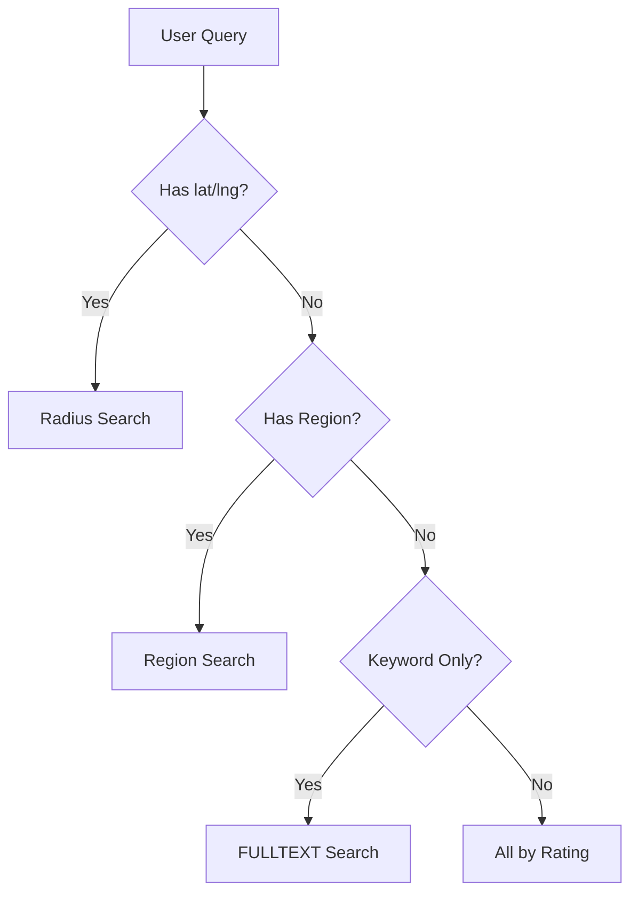

# Location 도메인 포트폴리오 페이지 초안

## 1. 페이지 목적

이 페이지는 Location 도메인을 단순 지도 API 연동 기능이 아니라, **검색 전략과 로딩 구조를 계속 다듬어 사용자 경험과 성능을 함께 개선한 도메인**으로 설명하기 위한 초안입니다.

핵심 메시지는 아래 3가지입니다.

1. 위치 기반 서비스는 단순 "근처 검색"보다 검색 기준의 일관성이 중요하다.
2. 데이터가 많아질수록, 무엇을 어디서 필터링할지 전략이 더 중요해진다.
3. 지도 UX와 DB 쿼리 전략은 함께 설계되어야 한다.

---

## 2. 한 줄 소개

> Location 도메인은 반려동물 관련 장소 정보를 위치, 지역, 키워드 기준으로 탐색하는 기능이며, 저는 이 도메인에서 **검색 분기 설계, 초기 로드 최적화, 지도 이동과 검색 실행 분리**를 핵심 포인트로 다뤘습니다.

---

## 3. 이 도메인을 포트폴리오에서 보여줘야 하는 이유

Location 기능은 겉으로 보면 "지도에 마커 띄우기"처럼 보이지만, 실제로는 그보다 훨씬 복잡합니다.

- 초기 진입 때는 빠르게 주변 정보를 보여줘야 한다.
- 사용자가 지도를 움직일 때 결과가 갑자기 바뀌면 혼란이 커진다.
- 데이터 수가 많아질수록 전체 로드는 곧바로 병목이 된다.
- 키워드, 지역, 반경 검색이 서로 충돌하지 않게 우선순위를 정해야 한다.

Location 도메인은 이런 문제를 **검색 분기 규칙**과 **초기 로드/재검색 전략**으로 풀어낸 사례입니다.

---

## 4. 사용자 관점 기능 설명

### 4.1 지역 계층 검색 지원

백엔드는 시도, 시군구, 읍면동, 도로명 기준의 지역 계층 검색을 지원합니다. 이때 현재 구조는 `roadName > eupmyeondong > sigungu > sido > 전체` 우선순위를 사용합니다. 다만 이 경로는 **현재 메인 지도 UI의 기본 검색 흐름**이라기보다, 서비스 레이어가 별도로 지원하는 검색 경로에 가깝습니다.

핵심 포인트:

- 지역 계층별 명시적 검색 우선순위
- 추후 지역 중심 UX로 확장 가능한 검색 경로
- DB 인덱스를 활용하기 쉬운 구조

근거 코드:

- `backend/main/java/com/linkup/Petory/domain/location/service/LocationServiceService.java`
- `searchLocationServicesByRegion(...)`

### 4.2 반경 기반 주변 검색

현재 메인 지도 UI의 기본 경로는 좌표 기반 반경 검색입니다. `latitude`, `longitude`가 주어지면 이 경로가 우선 선택되고, `radius`가 없으면 기본 10km를 사용합니다. `"이 지역 검색"` 버튼도 시군구 검색으로 바뀌는 것이 아니라, **현재 지도 중심 좌표를 확정한 뒤 같은 반경 검색을 다시 실행하는 흐름**입니다.

핵심 포인트:

- 현재 지도/홈 추천의 기본 검색 경로
- `ST_Within`과 `ST_Distance_Sphere` 기반 DB 필터
- 응답 DTO에 Haversine 거리 계산값 포함

근거 코드:

- `backend/main/java/com/linkup/Petory/domain/location/service/LocationServiceService.java`
- `searchLocationServicesByLocation(...)`
- `calculateDistance(...)`

### 4.3 키워드 단독 검색과 카테고리 필터

위치와 지역 정보가 모두 없을 때는 키워드 단독 FULLTEXT 검색을 사용합니다. 반대로 위치나 지역이 있으면 키워드는 해당 분기 안의 SQL 필터로 적용됩니다. 즉, 현재 구조는 "항상 같은 검색"이 아니라 **입력 조건에 따라 검색 경로와 필터 방식이 달라지는 구조**입니다.

이 점이 중요합니다. 단순히 "검색 기능 있음"이 아니라, **입력 조건에 따라 검색 엔진을 다르게 선택하는 구조**이기 때문입니다.

### 4.4 리뷰와 평점 갱신

사용자는 장소 리뷰를 남길 수 있고, 리뷰 작성/수정/삭제 시 `rating`, `review_count`가 같이 갱신됩니다. 이 값은 서비스 테이블에 직접 반영되고, 반경 검색에서 `reviews` 정렬을 지원하는 근거가 됩니다. 리뷰 작성자는 요청 바디가 아니라 JWT 로그인 사용자 기준으로 고정합니다.

---

## 5. 포트폴리오에서 강조할 기술 포인트

### 5.1 검색 우선순위를 명시적으로 설계한 점

이 도메인에서 가장 강조할 포인트는 `searchLocationServices(...)`의 분기 규칙입니다.

현재 우선순위:

1. 위치가 있으면 반경 검색
2. 위치가 없고 지역이 있으면 지역 검색
3. 위치/지역이 없고 키워드만 있으면 FULLTEXT 검색
4. 아무 조건이 없으면 전체 평점순

이 규칙은 사소한 구현 디테일이 아니라, **사용자가 어떤 입력을 줬을 때 어떤 결과를 기대해야 하는가를 정의한 계약**입니다.

### 5.2 초기 로드 성능 개선

문서 기준으로 초기 로드 최적화 전에는 약 22,699건의 데이터를 한 번에 내려받는 구조였고, 이 때문에 전송량과 메모리 사용량이 컸습니다.

개선 결과:

- 조회 데이터 수: `22,699 -> 1,026`
- 프론트엔드 전체 처리 시간: `1,484ms -> 약 700ms`
- 메모리 사용량: `78.90MB -> 약 28.6MB`

이 수치는 "지도 데이터는 많을 수밖에 없다"는 문제를, **처음부터 전부 로드하지 않도록 전략을 바꿔서 해결했다**는 근거가 됩니다.

측정 전제:

- 테스트 DB 기준
- `size` 제한 없이 전체 조회하던 초기 구조 vs 사용자 위치 기반 10km 검색 비교
- 현재 컨트롤러 기본값은 `size=100`, 메인 지도 UI는 줌 레벨에 따라 `30~500`개 제한을 함께 사용

근거 문서:

- `docs/troubleshooting/location/initial-load-performance.md`

### 5.3 지도 이동과 검색 실행을 분리한 점

현재 메인 지도 UI에서 중요한 포인트는 "시군구 검색으로 전환"이 아니라, **지도 이동과 실제 데이터 재조회 시점을 분리한 점**입니다.

- 지도 이동 시 `mapViewportCenter`만 바뀜
- 실제 조회 기준은 `searchCenter`로 별도 관리
- `"이 지역 검색"` 버튼 클릭 시 현재 중심 좌표를 확정한 뒤 반경 검색 재실행

즉, 이 도메인의 UX 포인트는 "지도를 움직였다고 바로 결과를 바꾸지 않는다"는 쪽에 가깝습니다.

근거 코드:

- `frontend/src/components/UnifiedMap/UnifiedPetMapPage.js`
- `frontend/src/components/UnifiedMap/controls/LocationControls.js`
- `frontend/src/api/unifiedMapApi.js`

### 5.4 검색 분기와 서버 필터를 통합한 점

이 도메인은 키워드, 카테고리, 정렬을 프론트에서 임의로 조합하는 대신, **검색 분기별로 서버 SQL에 통합해 처리**합니다.

- 반경 검색: 공간 조건 + `keyword` + `category` + `sort`
- 지역 검색: 지역 계층 조건 + `keyword` + `category`
- 키워드 단독 검색: FULLTEXT + `category`

이 점은 "클라이언트가 다 거른다"가 아니라, **검색 조건을 서버 쿼리로 일관되게 처리한다**는 쪽에서 설명하는 것이 더 정확합니다.

### 5.5 현재 한계와 다음 개선

현재 한계도 분명합니다.

- 메인 지도 UI의 기본 검색 경로는 여전히 `lat/lng/radius` 반경 검색 중심
- 백엔드는 지역 계층 검색을 지원하지만, 현재 주 사용자 경로에서 적극적으로 쓰이지 않음
- 초기 로드 성능 수치는 과거 전체 조회 시나리오 기준이라 현재 기본 UI 수치와 동일시하면 안 됨
- `/api/location-services`와 리뷰 API는 공개 검색이 아니라 로그인 사용자 전용 API

---

## 6. 페이지에 그대로 쓸 수 있는 서술형 초안

### 6.1 소개 문단

Location 도메인은 반려동물 관련 병원, 카페, 공원, 펫샵 같은 장소를 지역과 위치 기반으로 탐색하는 기능입니다. 저는 이 도메인을 구현하면서 단순 지도 API 연동보다, 검색 기준의 일관성과 초기 로드 성능을 더 중요한 문제로 다뤘습니다. 사용자는 같은 장소를 계속 예측 가능하게 찾고 싶어 하지만, 위치 기반 검색은 기준점이 조금만 바뀌어도 결과가 크게 달라질 수 있기 때문입니다.

### 6.2 기술 포인트 문단

이 문제를 해결하기 위해 검색 로직을 위치 우선, 지역 우선, 키워드 단독 FULLTEXT로 명확히 분기했고, 초기 로드에서는 사용자 주변 데이터를 줄여 가져오도록 구조를 바꿨습니다. 또한 메인 지도에서는 `mapViewportCenter`와 `searchCenter`를 분리해, 지도 이동 자체가 곧바로 결과를 바꾸지 않도록 했습니다. 지역 계층 검색은 백엔드가 별도 지원하지만, 현재 기본 사용자 경로는 반경 검색 중심입니다.

### 6.3 결과 문단

그 결과 문서상 초기 전체 조회 대비 초기 로드 데이터는 22,699건에서 1,026건 수준으로 줄었고, 프론트엔드 전체 처리 시간도 1,484ms에서 약 700ms로 개선됐습니다. 현재 Location 도메인은 단순한 지도 화면을 넘어, 검색 분기와 서버 필터, 재조회 UX를 함께 설계한 사례로 설명할 수 있습니다.

---

## 7. 시각 자료 추천

- 지도 메인 화면
- "이 지역 검색" 버튼 흐름
- 반경 검색 vs 지역 계층 검색 지원 구조
- 초기 로드 최적화 전후 데이터량/응답시간 비교
- 검색 우선순위 플로우차트

간단 다이어그램 초안:

---

## 8. 코드 근거 링크 묶음

### 8.1 핵심 코드

- `backend/main/java/com/linkup/Petory/domain/location/service/LocationServiceService.java`
- `backend/main/java/com/linkup/Petory/domain/location/service/LocationServiceReviewService.java`
- `backend/main/java/com/linkup/Petory/domain/location/repository/SpringDataJpaLocationServiceRepository.java`
- `backend/main/java/com/linkup/Petory/domain/location/controller/LocationServiceController.java`
- `backend/main/java/com/linkup/Petory/domain/location/controller/LocationServiceReviewController.java`
- `frontend/src/components/UnifiedMap/UnifiedPetMapPage.js`
- `frontend/src/components/UnifiedMap/controls/LocationControls.js`
- `frontend/src/api/unifiedMapApi.js`

### 8.2 참고 문서

- `docs/domains/location.md`
- `docs/troubleshooting/location/initial-load-performance.md`
- `docs/troubleshooting/location/search-strategy-comparison.md`
- `docs/troubleshooting/location/current-implementation-analysis.md`
- `docs/refactoring/location/지도-검색-워크플로우-정리.md`
- `docs/refactoring/location/주변서비스-현행vs설계안-비교.md`
- `docs/architecture/location/위치 기반 서비스 아키텍처.md`

---

## 9. 문서 작성 방향 한 줄 정리

Location 페이지는 "지도 기능 구현"보다, **검색 분기와 초기 로드 전략, 지도 이동과 재조회 UX를 함께 설계한 도메인**으로 쓰는 편이 가장 강합니다.
