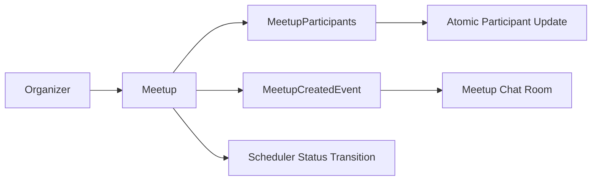

# Meetup 도메인 포트폴리오 페이지 초안

## 1. 페이지 목적

이 페이지는 Meetup 도메인을 단순 모임 CRUD가 아니라, **오프라인 참여 관리에서 동시성, 상태 전이, 채팅 연동을 함께 다뤄야 하는 도메인**으로 설명하기 위한 초안입니다.

핵심 메시지는 아래 3가지입니다.

1. 모임 기능의 핵심은 생성보다 참가와 인원 관리다.
2. 동시에 여러 사용자가 참가할 때 최대 인원 초과가 발생하지 않아야 한다.
3. 핵심 도메인인 모임과 파생 도메인인 채팅방을 분리해 실패 전파를 줄이는 구조가 중요하다.

---

## 2. 한 줄 소개

> Meetup 도메인은 로그인 사용자가 오프라인 반려동물 모임을 생성하고 참여를 관리하는 기능이며, 저는 이 도메인에서 **참가 동시성 제어, 근처 모임 검색 최적화, 이벤트 기반 채팅방 생성**을 핵심 포인트로 다뤘습니다.

---

## 3. 이 도메인을 포트폴리오에서 보여줘야 하는 이유

Meetup 도메인은 겉으로 보면 단순 일정 게시판처럼 보이지만, 실제로는 운영 중 민감한 문제가 바로 드러납니다.

- 최대 인원 초과 참가
- 이미 마감된 모임 참가
- 모임은 성공했는데 채팅방 생성 실패로 전체가 롤백되는 문제
- 주변 모임 검색 시 전체 데이터를 메모리에서 계산하는 비효율

즉, 이 도메인은 단순 CRUD보다 **동시성 제어와 분리된 후속 처리 아키텍처**를 보여주기 좋은 사례입니다.

---

## 4. 사용자 관점 기능 설명

### 4.1 모임 생성

사용자는 제목, 설명, 장소, 좌표, 일정, 최대 인원을 입력해 모임을 생성할 수 있습니다. 생성자는 자동으로 첫 참가자가 되며, 기본 상태는 `RECRUITING`입니다.

핵심 포인트:

- 이메일 인증 후 생성 가능
- 과거 시각 생성 차단
- 주최자 자동 참여
- 채팅방 생성은 트랜잭션 커밋 후 이벤트 기반 처리
- Meetup API 전체는 로그인 사용자 전용

근거 코드:

- `backend/main/java/com/linkup/Petory/domain/meetup/service/MeetupService.java`
- `createMeetup(...)`

### 4.2 모임 참가와 취소

사용자는 모집 중인 모임에 참여하거나, 필요할 경우 참가를 취소할 수 있습니다. 이때 주최자는 취소할 수 없고, 비주최자만 현재 인원 수를 증감시킵니다.

핵심 포인트:

- 중복 참가 방지
- 최대 인원 초과 방지
- 취소 시 채팅방에서도 자동 이탈 시도
- 채팅 이탈 실패가 참가 취소 자체를 막지 않도록 분리

근거 코드:

- `backend/main/java/com/linkup/Petory/domain/meetup/service/MeetupService.java`
- `joinMeetup(...)`
- `cancelMeetupParticipation(...)`

### 4.3 상태 자동 전이

모임 상태는 기본적으로 `RECRUITING`, `CLOSED`, `COMPLETED` 3단계를 사용합니다. 현재 구현에서는 스케줄러가 **매시 정각** 시간과 인원 조건을 보고 벌크 업데이트로 상태를 전환합니다.

핵심 포인트:

- 정원이 가득 찬 `RECRUITING` 모임은 스케줄러 주기에 맞춰 `CLOSED`
- 일정이 지난 모임은 `COMPLETED`
- 운영자가 직접 일일이 닫지 않아도 기본 흐름 유지

현재 한계:

- 정원이 찬 직후 즉시 `CLOSED`가 되는 구조는 아님
- `CLOSED` 이후 참가 취소로 자리가 생겨도 자동으로 `RECRUITING`으로 복구되지는 않음

### 4.4 근처 모임 탐색

사용자는 주변 모임을 반경 기준으로 탐색할 수 있습니다. 현재 구현은 네이티브 쿼리로 먼저 ID와 정렬을 뽑고, 이후 주최자만 한 번 더 Fetch하여 DTO를 조립하는 2단계 전략을 사용합니다.

이 구조는 "가까운 모임"이라는 UX를 유지하면서도 메모리 로드를 줄이기 위해 선택한 방식입니다.

---

## 5. 포트폴리오에서 강조할 기술 포인트

### 5.1 참가 Race Condition 해결

Meetup 도메인의 가장 대표적인 문제는 동시 참가 시 최대 인원을 넘길 수 있다는 점입니다. 이 문제를 피하기 위해 현재 구조는 아래 방식을 사용합니다.

- 모임 조회 시 락 기반 검증
- `incrementParticipantsIfAvailable(...)` 원자적 UPDATE
- 저장 시 PK 충돌이 나면 다시 감소시키고 중복 참가 예외 처리

즉, 체크와 증가를 분리하지 않고 DB에서 조건부 증가를 수행해 Race Condition을 막는 구조입니다.

포트폴리오 문장 예시:

> 여러 사용자가 동시에 참가 버튼을 눌러도 최대 인원을 넘기지 않도록, 조건부 원자적 UPDATE 쿼리와 예외 복구 흐름으로 참가 로직을 설계했습니다.

### 5.2 핵심 도메인과 파생 도메인 분리

모임 생성 직후 채팅방이 필요하지만, 채팅방 생성 실패 때문에 모임 자체 생성이 롤백되면 사용자 입장에서는 더 나쁜 경험이 됩니다. 그래서 현재 구조는 트랜잭션 커밋 이후 `MeetupCreatedEvent`를 발행해 채팅방 생성을 비동기 처리합니다.

이 포인트는 기능적으로는 보이지 않지만, **실패 전파 범위를 줄이는 아키텍처 감각**을 보여줍니다.

### 5.3 근처 모임 검색 최적화

문서 기준으로 `getNearbyMeetups()`는 전체 로드 후 메모리 계산 방식에서 DB 기반 조회로 바뀌었습니다.

개선 결과:

- 전체 실행 시간: `486ms -> 273ms`
- DB 쿼리 시간: `241ms -> 143ms`
- 메모리 사용량: `1.48MB -> 0.21MB`

이 수치는 "위치 기반 기능은 느릴 수밖에 없다"는 인식을 그대로 받아들이지 않고, **Bounding Box와 ID 우선 조회 전략으로 현실적으로 줄인 결과**로 설명할 수 있습니다.

측정 전제:

- 테스트 데이터 1,000건 기준
- 인메모리 필터링 → DB 필터링 → Bounding Box 적용 3단계 비교
- 현재 구현은 `근처 meetup ID 조회 -> organizer fetch -> DTO 변환` 2단계 로딩 구조

### 5.4 참여 히스토리 N+1 제거

참여 모임 목록 조회에서는 `MeetupParticipants -> Meetup -> User` 연관관계 때문에 N+1이 쉽게 생깁니다. 이 부분을 Fetch Join으로 정리해, 조회 시점의 쿼리 수를 안정적으로 줄이고 Lazy 로딩 연쇄를 없앴습니다.

개선 결과:

- PrepareStatement 수: `102개 -> 2개`

중요한 점은 이 지표가 "무조건 더 빨라졌다"기보다, **조회 깊이가 깊어질 때도 쿼리 수가 선형으로 늘어나지 않도록 구조를 바로잡은 근거**라는 점입니다.

### 5.5 참여 가능 목록 조회 단순화

참여 가능한 모임 조회는 과거에 서브쿼리와 `LEFT JOIN + GROUP BY + HAVING` 구조를 비교한 이력이 있지만, **현재 코드는 그보다 더 단순하게 `currentParticipants < maxParticipants`를 직접 비교하는 쿼리**를 사용합니다.

즉 포트폴리오에서는 "서브쿼리를 JOIN으로 바꿨다"보다, **여러 단계를 거쳐 현재는 상태와 인원 조건을 직접 비교하는 단순 쿼리로 정리했다**고 쓰는 편이 더 정확합니다.

참고 수치:

- 과거 비교 문서 기준 실행 시간: `156ms -> 57ms`
- 다만 이 수치는 현재 최종 쿼리 자체의 성능 수치라기보다, 리팩토링 중간 단계 비교 문서로 보는 편이 맞습니다.

### 5.6 현재 한계와 다음 개선

현재 한계도 분명합니다.

- Meetup API 전체는 공개 조회형이 아니라 로그인 사용자 전용
- 상태 전이는 스케줄러 주기 기반이라 정원 충족 직후 즉시 `CLOSED`가 되지 않을 수 있음
- 참가 취소 후 `CLOSED -> RECRUITING` 자동 복구 경로는 없음
- 일부 성능 수치는 테스트 문서 기준이라 현재 운영 경로의 절대 성능처럼 단정하면 안 됨

---

## 6. 페이지에 그대로 쓸 수 있는 서술형 초안

### 6.1 소개 문단

Meetup 도메인은 반려동물 산책이나 오프라인 모임을 생성하고 참여를 관리하는 기능입니다. 저는 이 도메인을 구현하면서 단순 모임 등록보다, 동시 참가 상황에서도 최대 인원을 정확하게 지키는 구조를 만드는 데 집중했습니다. 오프라인 모임은 인원 수가 곧 사용자 경험과 직결되기 때문에, 참가 정합성이 가장 중요한 문제였기 때문입니다.

### 6.2 기술 포인트 문단

이를 위해 참가 로직에는 조건부 원자적 UPDATE 쿼리를 사용해 Race Condition을 방지했고, 모임 생성 직후 필요한 채팅방은 트랜잭션 커밋 이후 이벤트로 생성해 핵심 도메인과 파생 도메인을 분리했습니다. 또한 주변 모임 검색은 전체 데이터를 메모리에 올려 계산하지 않고, 먼저 조건에 맞는 ID를 정렬해 조회한 뒤 필요한 데이터만 다시 로드하는 방식으로 최적화했습니다. 상태 전이는 스케줄러가 보조하지만, 현재는 주기 기반 전환과 재오픈 부재 같은 운영 한계도 함께 인식하고 있습니다.

### 6.3 결과 문단

그 결과 문서상 근처 모임 조회는 전체 실행 시간이 486ms에서 273ms로 줄었고, 참여 히스토리 조회의 PrepareStatement 수도 102개에서 2개로 감소했습니다. Meetup 도메인은 단순 모임 기능이 아니라, 참여 정합성과 후속 채팅 연동을 중심으로 실제 서비스 흐름을 다듬은 사례로 설명할 수 있습니다.

---

## 7. 시각 자료 추천

- 모임 목록 및 상세 화면
- 참가 버튼과 마감 상태 UI
- 참가 동시성 문제 전후 시퀀스 다이어그램
- 근처 모임 검색 성능 비교 표
- 모임 생성 후 채팅방 생성 이벤트 흐름도

간단 다이어그램 초안:

---

## 8. 코드 근거 링크 묶음

### 8.1 핵심 코드

- `backend/main/java/com/linkup/Petory/domain/meetup/service/MeetupService.java`
- `backend/main/java/com/linkup/Petory/domain/meetup/service/MeetupScheduler.java`
- `backend/main/java/com/linkup/Petory/domain/meetup/service/MeetupChatRoomEventListener.java`
- `backend/main/java/com/linkup/Petory/domain/meetup/repository/SpringDataJpaMeetupRepository.java`

### 8.2 참고 문서

- `docs/domains/meetup.md`
- `docs/troubleshooting/meetup/race-condition-participants.md`
- `docs/refactoring/meetup/meetup-backend-performance-optimization.md`
- `docs/refactoring/meetup/nearby-meetups/performance-comparison.md`
- `docs/refactoring/meetup/participants-query/performance-comparison-participants.md`
- `docs/refactoring/meetup/subquery-optimization/performance-comparison.md`
- `docs/architecture/meetup/산책 & 오프라인 모임 아키텍처.md`

---

## 9. 문서 작성 방향 한 줄 정리

Meetup 페이지는 "모임 CRUD"보다, **참가 동시성과 이벤트 기반 후속 처리까지 고려한 오프라인 참여 관리 도메인**으로 설명하는 편이 훨씬 강합니다.
