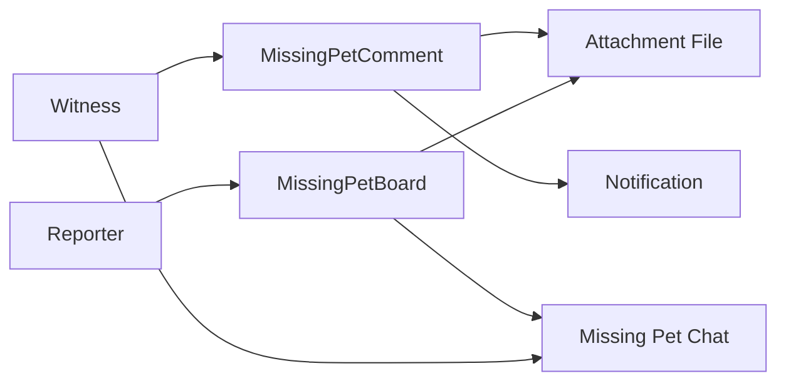

# Missing Pet 도메인 포트폴리오 페이지 초안

## 1. 페이지 목적

이 페이지는 Missing Pet 도메인을 단순 실종 게시판이 아니라, **긴급한 사용자 상황을 빠르게 공유하고 후속 소통까지 연결하는 구조**로 설명하기 위한 초안입니다.

이 도메인에서 보여줘야 할 핵심은 아래 3가지입니다.

1. 실종 제보는 일반 게시글보다 정보 구조와 긴급성이 다르다.
2. 목록과 상세 조회는 빠르게 보여야 하지만, 댓글과 파일 때문에 조인 폭발을 피해야 한다.
3. 제보자와 목격자를 바로 채팅으로 연결하는 흐름이 이 도메인의 실제 가치를 만든다.

---

## 2. 한 줄 소개

> Missing Pet 도메인은 실종 반려동물 제보와 목격 정보 공유를 담당하며, 저는 이 도메인에서 **긴급 정보 구조화, 댓글/파일 조회 최적화, 제보자-목격자 채팅 연결**을 핵심 포인트로 다뤘습니다.

---

## 3. 이 도메인을 포트폴리오에서 보여줘야 하는 이유

실종 제보 기능은 일반 커뮤니티 글과 달리, "읽는 재미"보다 **빠른 전달과 정확한 후속 연결**이 더 중요합니다.

- 실종 위치와 시점, 동물 특징이 구조화되어야 한다.
- 목격 댓글은 일반 댓글보다 더 실질적인 제보 데이터여야 한다.
- 제보자와 목격자는 바로 대화를 시작할 수 있어야 한다.

또한 이 도메인은 코드 구조상 `board` 패키지 안에 있지만, 실제 사용자 목적은 완전히 별도입니다. 그래서 포트폴리오 페이지에서도 **Board의 하위 기능**이 아니라 **독립 도메인성**을 드러내는 설명이 필요합니다.

---

## 4. 사용자 관점 기능 설명

### 4.1 실종 제보 게시글

사용자는 제목과 설명뿐 아니라, 반려동물 이름, 종, 품종, 성별, 색상, 실종일, 실종 위치, 좌표 등을 포함해 제보를 등록할 수 있습니다. 작성과 수정, 삭제에는 이메일 인증이 필요합니다.

핵심 포인트:

- 실종 상황에 필요한 구조화된 필드 제공
- `MISSING`, `FOUND`, `RESOLVED` 상태 관리
- 일반 커뮤니티 글과 다른 목적 중심 UI/데이터 모델

근거 코드:

- `backend/main/java/com/linkup/Petory/domain/board/service/MissingPetBoardService.java`
- `createBoard(...)`
- `updateStatus(...)`

### 4.2 목격 댓글

목격자는 댓글로 단순 텍스트가 아니라, 목격 주소와 좌표, 이미지까지 남길 수 있습니다. 이 댓글은 사실상 "추가 제보"에 가까운 역할을 합니다.

핵심 포인트:

- 위치 정보가 포함된 댓글
- 이미지 첨부 지원
- 댓글 작성 시 제보자 알림 발송
- 댓글 삭제는 Soft Delete

근거 코드:

- `backend/main/java/com/linkup/Petory/domain/board/service/MissingPetCommentService.java`
- `addComment(...)`
- `deleteComment(...)`

### 4.3 제보자-목격자 채팅 연결

이 도메인의 가장 큰 차별점은 "목격했어요" 이후의 행동이 끊기지 않는다는 점입니다.

- 목격자는 버튼 클릭으로 바로 채팅 시작
- 목격자 ID는 별도 파라미터가 아니라 JWT principal에서 확인
- 제보자 ID는 게시글 전체를 읽지 않고 `getUserIdByBoardIdx(...)`로 경량 조회
- 같은 제보에 대해 여러 목격자와 각각 개별 채팅방 생성 가능

이 흐름 덕분에 Missing Pet 도메인은 단순 게시판이 아니라 **긴급 제보 중개 도구**로 설명할 수 있습니다.

근거 코드:

- `backend/main/java/com/linkup/Petory/domain/board/controller/MissingPetBoardController.java`
- `backend/main/java/com/linkup/Petory/domain/board/service/MissingPetBoardService.java`
- `backend/main/java/com/linkup/Petory/domain/chat/service/ConversationService.java`

---

## 5. 포트폴리오에서 강조할 기술 포인트

### 5.1 목록과 상세를 분리한 이유

실종 제보 목록은 빠르게 스캔되어야 하지만, 댓글까지 한 번에 붙이면 조인 비용이 급격히 커집니다. 그래서 현재 구조는 아래처럼 역할을 나눕니다.

- 목록 조회: 댓글 제외
- 상세 조회: 필요 시 댓글 페이징
- 댓글 API: 별도 조회

이 설계는 단순 분리가 아니라, **조인 폭발을 피하고 긴급 화면을 빠르게 유지하기 위한 결정**으로 설명할 수 있습니다.

### 5.2 배치 조회와 경량 COUNT 적용

이 도메인에서 반복적으로 다룬 문제는 "게시글 수만큼 댓글 수와 파일을 다시 읽는 구조"였습니다.

주요 개선 포인트:

- 파일 배치 조회
- 댓글 수 배치 조회
- 상세 댓글 수는 `countByBoardAndIsDeletedFalse`로 COUNT 쿼리 처리

문서 기준으로 특히 보여주기 좋은 수치:

- 게시글 삭제 시 댓글 1000개 처리: `1001 쿼리 -> 1 쿼리`

근거 문서:

- `docs/refactoring/missing-pet/missing-pet-backend-performance-optimization.md`

### 5.3 관리자 조회를 DB 필터링으로 전환

이전에는 관리자 영역이 전체 데이터를 메모리로 올린 뒤 상태와 검색어를 필터링하는 구조였고, 이는 데이터가 많아질수록 바로 병목이 됩니다. 이를 `Specification + DB 페이징` 구조로 바꾼 점도 포트폴리오에서 보여주기 좋습니다.

이 포인트는 "기능 추가"보다 **운영 화면도 데이터 증가를 견디게 만들었다**는 메시지에 가깝습니다.

### 5.4 채팅 시작 경량화

`start-chat`에서 전체 게시글을 읽는 대신, 작성자 ID만 프로젝션으로 가져오도록 바꾼 개선도 좋습니다.

- 필요한 데이터만 읽기
- 긴급 액션 경로에서 불필요한 DTO 조립 제거

작지만 설계 감각이 드러나는 포인트입니다.

### 5.5 서비스 레이어 권한 검증

기존 구현에서 `createBoard`·`addComment`는 요청 바디의 `userId`를 그대로 신뢰했고, `updateBoard`·`updateStatus`·`deleteBoard`·`deleteComment`는 작성자 본인 여부를 검증하지 않았습니다. 특히 `deleteBoard`는 현재 사용자가 아닌 게시글 소유자의 이메일 인증을 확인하는 버그도 있었습니다.

이를 아래처럼 일관된 패턴으로 수정했습니다.

- **생성 시**: `SecurityContextHolder`에서 JWT principal(loginId)을 꺼내 `usersRepository.findActiveByIdString(loginId)`로 사용자 조회 — 바디 `userId` 신뢰 제거
- **수정/삭제 시**: `assertOwner(board.getUser())` / `assertCommentOwner(comment.getUser())` 공통 메서드로 소유권 검증 — 어드민은 우회, 본인 아니면 403
- **예외 응답**: `MissingPetForbiddenException` (HTTP 403, `MISSING_PET_FORBIDDEN`) — `GlobalExceptionHandler`의 `ApiException` 핸들러로 일관 처리

이 패턴은 Board 도메인(`assertBoardOwner`)과 Care 도메인(`isAdmin()` 기반 검증)과 동일한 구조로 통일됩니다.

근거 코드:

- `domain/board/service/MissingPetBoardService.java` — `assertOwner`, `createBoard`, `updateBoard`, `updateStatus`, `deleteBoard`
- `domain/board/service/MissingPetCommentService.java` — `assertCommentOwner`, `addComment`, `deleteComment`
- `domain/board/exception/MissingPetForbiddenException.java`

---

## 6. 페이지에 그대로 쓸 수 있는 서술형 초안

### 6.1 소개 문단

Missing Pet 도메인은 실종 반려동물 제보와 목격 정보 공유를 위한 기능입니다. 저는 이 도메인을 일반 커뮤니티 게시글과 같은 방식으로 다루지 않고, 빠른 정보 전달과 후속 연락이 중요한 긴급 상황 도메인으로 설계했습니다. 그래서 제보글에는 반려동물 특징, 실종 위치, 시점 같은 구조화된 정보를 담고, 목격 댓글은 위치 정보와 이미지까지 포함할 수 있게 구성했습니다.

### 6.2 기술 포인트 문단

기술적으로는 목록 조회 성능과 후속 액션의 가벼운 흐름에 집중했습니다. 목록에서는 댓글을 함께 읽지 않도록 분리해 조인 폭발을 피했고, 파일과 댓글 수는 배치 조회 또는 COUNT 쿼리로 처리했습니다. 또한 제보자와 목격자를 연결하는 채팅 시작 흐름에서는 게시글 전체를 읽지 않고 작성자 ID만 경량 조회하도록 구성해, 긴급 액션 경로를 더 가볍게 만들었습니다.

### 6.3 결과 문단

이 과정에서 댓글 일괄 삭제는 1000개 기준 1001번의 쿼리에서 1번 배치 업데이트로 줄었고, 관리자 목록도 메모리 필터링 대신 DB 페이징 구조로 전환했습니다. Missing Pet 도메인은 단순한 실종 게시판이 아니라, 긴급 상황에서 정보 전달과 사용자 연결을 빠르고 안정적으로 수행하는 기능으로 완성했습니다.

---

## 7. 시각 자료 추천

- 실종 제보 목록 화면
- 실종 상세와 상태 변경 UI
- 목격 댓글 입력 화면
- "목격했어요" 버튼 이후 채팅 연결 흐름
- 목록/상세/댓글 API 분리 구조 다이어그램
- 댓글 삭제 1001 -> 1 쿼리 개선 표

간단 다이어그램 초안:

---

## 8. 코드 근거 링크 묶음

### 8.1 핵심 코드

- `backend/main/java/com/linkup/Petory/domain/board/controller/MissingPetBoardController.java`
- `backend/main/java/com/linkup/Petory/domain/board/service/MissingPetBoardService.java`
- `backend/main/java/com/linkup/Petory/domain/board/service/MissingPetCommentService.java`
- `backend/main/java/com/linkup/Petory/domain/chat/service/ConversationService.java`

### 8.2 참고 문서

- `docs/domains/missingpet.md`
- `docs/refactoring/missing-pet/missing-pet-backend-performance-optimization.md`
- `docs/troubleshooting/missing-pet/performance-measurement-results.md`
- `docs/troubleshooting/missing-pet/n-plus-one-query-issue.md`
- `docs/troubleshooting/missing-pet/orphanRemoval-soft-delete-analysis.md`

---

## 9. 문서 작성 방향 한 줄 정리

Missing Pet 페이지는 "실종 게시판 구현"이 아니라, **긴급 정보 구조화와 제보자-목격자 연결 흐름을 빠르게 만든 도메인**으로 설명하는 편이 가장 좋습니다.
