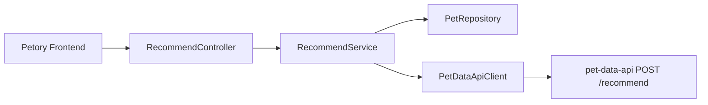

# Recommendation 도메인 포트폴리오 페이지 초안

Petory의 **Recommendation 도메인**과 독립 레포 **pet-data-api**(Python/FastAPI)가 어떻게 한 사용자 플로우로 묶이는지 설명하기 위한 초안입니다. 실제 포트폴리오 페이지는 `makkong1-github.io`의 [`RecommendationDomain.jsx`](https://github.com/makkong1/makkong1-github.io/blob/main/src/pages/projects/petory/domains/RecommendationDomain.jsx)와 함께 보면 됩니다.

---

## 1. 페이지 목적

이 페이지는 Recommendation을 **“추천 알고리즘을 구현한 도메인”**이 아니라, **사용자 맥락을 안전하게 조립해 외부 데이터 서비스로 넘기고, 계약에 맞춰 응답을 받아 프론트에 전달하는 BFF 레이어**로 보여주기 위한 문서입니다.

핵심 메시지는 아래 3가지입니다.

1. Petory는 반경·트렌드·랭킹 로직을 갖지 않고, **위치·맥락·반려 프로필만 조립**한다.
2. pet-data-api는 **PostgreSQL 공공 시설·Redis 트렌드·(선택) LLM**으로 실제 추천 묶음을 만든다.
3. 두 서비스 사이에는 **`POST /recommend` 계약**, **타임아웃 분리**, **`request_id` 추적**, **이벤트 환류** 같은 운영 디테일이 있다.

---

## 2. 한 줄 소개

> Recommendation은 Petory에서 **로그인 사용자 기준으로 반려 정보를 붙여 Pet Data API에 넘기고**, 시설·트렌드·추천 문구를 **그대로 반환하는 BFF**이며, 저는 이 영역에서 **외부 API 계약 정렬·타임아웃 분리·이벤트/트렌드 부가 경로**를 함께 다뤘습니다.

---

## 3. 이 도메인을 포트폴리오에서 보여줘야 하는 이유

“추천 기능 붙였다”는 설명만으로는 **경계가 안 보입니다.**

- 어디까지가 메인 앱 책임이고, 어디부터가 데이터 서버 책임인가
- 한 번의 추천을 **두 번의 HTTP**(본 응답 + 카피)로 나눈 이유는 무엇인가
- 추천 결과를 메인 DB에 저장하지 않을 때 **품질 피드백 루프**를 어떻게 남기는가
- Location 도메인의 “주변 시설 추천”과 **목적이 겹칠 때** 로드맵을 어떻게 적어 두었는가

이 도메인은 **마이크로서비스 경계와 계약 중심 설계**를 보여주기 좋은 사례입니다.

---

## 4. 사용자·시스템 관점 설명

### 4.1 사용자 관점 — 한 번의 “맞춤 추천”

사용자는 앱에서 위치와 맥락(예: 그루밍·병원 등 화면 컨텍스트)을 두고 추천 카드를 봅니다. 카드에는 **근처 시설 후보**, **트렌드 키워드**, **한 줄 추천 문구**가 함께 올 수 있습니다. 로그인이 필요하고, 등록된 반려동물이 있으면 그 정보가 추천 요청에 반영됩니다.

### 4.2 Petory 백엔드 — BFF

Petory는 다음을 담당합니다.

- 인증된 `userId` 확보 (`Authentication#getName()`)
- `PetRepository.findByUserIdAndNotDeleted`로 반려 목록 조회 후 **첫 번째 펫만** `PetInfo`로 매핑 (없으면 `pet` 생략)
- `RecommendRequest` 조립: `lat`, `lng`, `context`, 고정값 **`radius_km=10.0`**, **`top_n=5`**
- `PetDataApiClient`로 **`POST {baseUrl}/recommend`**, 헤더 **`X-API-Key`** (+ 로깅용 **`X-Request-Id`**)

추가 경로:

- **`POST /api/recommend/copy`** — 본 추천과 동일한 펫 컨텍스트를 서버에서 다시 채워 `POST /recommend/copy` 전달 (프론트는 `requestId`·시설·트렌드 위주로 넘김)
- **`POST /api/recommend/events`** — 노출·클릭 등 이벤트를 pet-data-api의 **`POST /events/recommendation`**으로 환류; `user_ref`는 Petory `userId`의 **SHA-256 일부 접두 해시**로 익명화
- **`GET /api/recommend/trends/{category}/timeseries`** — 트렌드 시계열을 **`GET .../trends/{category}/timeseries`**로 프록시

근거 코드:

- `backend/main/java/com/linkup/Petory/domain/recommendation/controller/RecommendController.java`
- `backend/main/java/com/linkup/Petory/domain/recommendation/service/RecommendService.java`
- `backend/main/java/com/linkup/Petory/domain/recommendation/client/PetDataApiClient.java`

### 4.3 pet-data-api — 추천 서빙

pet-data-api의 **`app/serving/`** 레이어가 요청을 받아 **DB·Redis 읽기와 조합**만 합니다 (수집 파이프라인과 분리 — [`docs/INGESTION-VS-SERVING.md`](https://github.com/makkong1/pet-data-api/blob/main/docs/INGESTION-VS-SERVING.md)).

대표 흐름 (`POST /recommend`):

- 맥락 정규화 (`VALID_CONTEXTS` 등)
- 컨텍스트별 분기 — 예: 그루밍 MVP 시 **`grooming_ranker`** 등 규칙 기반 파이프
- 레거시 경로에서는 근처 시설·트렌드 조합 후 **`include_copy`** 등에 따라 LLM 카피 선택
- 응답에 **`request_id`**, **`recommend_version`** 등을 포함할 수 있음 (Petory 통합 가이드 및 v3 호환 패치 문서 참고)

보조 엔드포인트:

- **`POST /recommend/copy`** — 프롬프트 기반 카피 (타임아웃 길게)
- **`POST /events/recommendation`** — 추천 세션별 상호작용 로깅 (202 등)

근거 코드:

- [`app/serving/api/recommend.py`](https://github.com/makkong1/pet-data-api/blob/main/app/serving/api/recommend.py)
- [`app/serving/recommender/`](https://github.com/makkong1/pet-data-api/tree/main/app/serving/recommender) — 시설 쿼리, 랭커, LLM, 로그 적재 등

---

## 5. 포트폴리오에서 강조할 기술 포인트

### 5.1 책임 분리 — Petory vs pet-data-api

| 책임 | Petory | pet-data-api |
|------|--------|----------------|
| 인증·사용자 식별 | ✅ JWT 기반 `userId` | API Key (`X-API-Key`) |
| 반려 프로필 출처 | ✅ MySQL `Pet` | 요청 JSON의 `pet` |
| 공공 시설·반경 검색 | ❌ | ✅ PostgreSQL 등 |
| 트렌드 | ❌ | ✅ Redis 등 |
| 추천 문구·랭킹 조합 | ❌ | ✅ serving 레이어 |
| 추천 결과 영속 | ❌ (프록시만) | 로그·분석 테이블 등 (구현별) |

### 5.2 운영 디테일 — 이중 타임아웃

`PetDataApiClient`는 **본 추천**과 **카피**에 서로 다른 `RestClient`를 씁니다.

- 본 추천: 기본 **`app.pet-data-api.timeout-ms`** (예: 3초) — v3에서 빠른 응답 전제
- 카피: **`app.pet-data-api.copy-timeout-ms`** (예: 35초) — LLM 동기 대기

즉 “한 번에 무거운 호출”이 아니라 **UX와 장애 반경을 나눈 계약**입니다.

### 5.3 관측 가능성 — `request_id`와 이벤트

본 추천 응답의 `request_id`를 카피·이벤트에 재사용하면, pet-data-api 쪽에서 **한 세션으로 로그를 묶기** 쉽습니다. Petory의 이벤트 API는 **`202 Accepted`** 패턴과 fire-and-forget에 가깝게 설계된 통합 가이드와 맞춥니다.

### 5.4 개인정보 최소화 — `user_ref`

`RecommendService.recordEvents`에서 클라이언트가 넘기지 않은 경우 **`petory-` + SHA-256(hex 12자)** 형태로 `user_ref`를 채워, 원본 `userId`를 외부 로그에 그대로 남기지 않도록 했습니다.

### 5.5 Location 도메인과의 관계 (로드맵)

문서상 **“주변 서비스 추천”** 목적이 Recommendation과 겹치므로, Pet Data API 안정화 후 Location 쪽 추천 경로를 **통합하거나 제거**할 예정이라고 명시되어 있습니다. 포트폴리오에서는 **중복을 인지하고 계약 단일화 방향을 적어 둔 점**을 강조할 수 있습니다.

근거:

- `docs/domains/recommendation.md` §1.4
- `docs/domains/location.md` (교차 참조)

### 5.6 현재 한계와 다음 개선

- **단일 펫만 매핑**: 다반려 가구에서는 첫 번째 펫만 반영 — 선택 UI·백엔드 계약 확장 여지
- **외부 장애 = 사용자 5xx**: 본 추천·카피 실패 시 복원력(Resilience4j, 폴백 카피)은 선택 과제
- **context 문자열**: 프론트·pet-data-api·기획 간 **합의된 계약** 관리 필요
- **Location 통합**: 로드맵대로 진행 시 문서·엔드포인트 정리 작업이 따름

---

## 6. 페이지에 그대로 쓸 수 있는 서술형 초안

### 6.1 소개 문단

Recommendation 도메인은 Petory 안에서 추천 점수를 계산하지 않습니다. 로그인 사용자의 위치와 화면 맥락, 그리고 필요하면 반려동물 프로필만 조립해 별도의 Pet Data API로 넘기고, 그 JSON 응답을 클라이언트에 그대로 전달합니다. 저는 이 경계에서 계약 정렬과 타임아웃 분리, 그리고 추천 세션 추적을 위한 부가 API까지 묶어 두었습니다.

### 6.2 기술 포인트 문단

Petory 쪽에서는 `PetDataApiClient`가 본 추천과 카피 생성에 서로 다른 타임아웃을 사용하고, 트렌드 시계열과 상호작용 이벤트도 같은 외부 서비스로 프록시합니다. pet-data-api 쪽에서는 수집과 분리된 serving 레이어에서 반경 시설·트렌드·맥락별 파이프를 조합해 응답을 만들며, 이벤트와 로그로 품질 피드백을 남길 수 있게 되어 있습니다.

### 6.3 결과 문단

그 결과 Petory는 추천 엔진 없이도 **멀티스택 포트폴리오**(Spring BFF + Python 데이터 서버)에서 역할이 명확히 나뉜 통합 플로우를 보여 줄 수 있습니다. Recommendation 페이지는 “알고리즘 구현”보다 **서비스 경계·계약·운영**을 설명하는 편이 더 정확합니다.

---

## 7. 시각 자료 추천

- 추천 카드 UI (시설 목록 + 트렌드 + 문구)
- 네트워크 탭: `GET /api/recommend` → (내부) `POST .../recommend` → (선택) `POST .../copy`
- 트렌드 시계열 화면 (`/trends/.../timeseries` 프록시)
- 두 레포 디렉터리 구조 한 장 (Petory `domain/recommendation` vs pet-data-api `app/serving`)

간단 다이어그램 초안:

---

## 8. 코드·문서 근거 묶음

### 8.1 Petory

- `backend/main/java/com/linkup/Petory/domain/recommendation/controller/RecommendController.java`
- `backend/main/java/com/linkup/Petory/domain/recommendation/service/RecommendService.java`
- `backend/main/java/com/linkup/Petory/domain/recommendation/client/PetDataApiClient.java`
- `docs/domains/recommendation.md`
- `docs/architecture/pet-data-server/pet-data-api architecture.md` (통합 아키텍처 — 경로는 저장소 기준)
- `docs/PETORY-INTEGRATION.md` (pet-data-api 레포 — Petory 연동 계약)

### 8.2 pet-data-api

- `app/serving/api/recommend.py`
- `app/serving/recommender/` (facilities, ranker, llm, persistence 등)
- `docs/PETORY-INTEGRATION.md`
- `docs/ARCHITECTURE.md` (추천 파이프 요약)
- `docs/INGESTION-VS-SERVING.md`

### 8.3 포트폴리오 사이트

- [`RecommendationDomain.jsx`](https://github.com/makkong1/makkong1-github.io/blob/main/src/pages/projects/petory/domains/RecommendationDomain.jsx)

---

## 9. 문서 작성 방향 한 줄 정리

Recommendation 페이지는 **“추천 알고리즘 구현”**보다, **Petory BFF와 pet-data-api serving 계약으로 맞춤 추천을 만드는 멀티스택 통합 사례**로 쓰는 편이 가장 설득력 있습니다.
