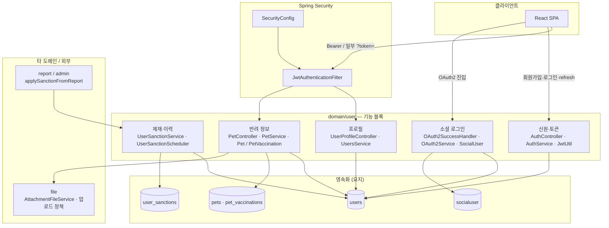
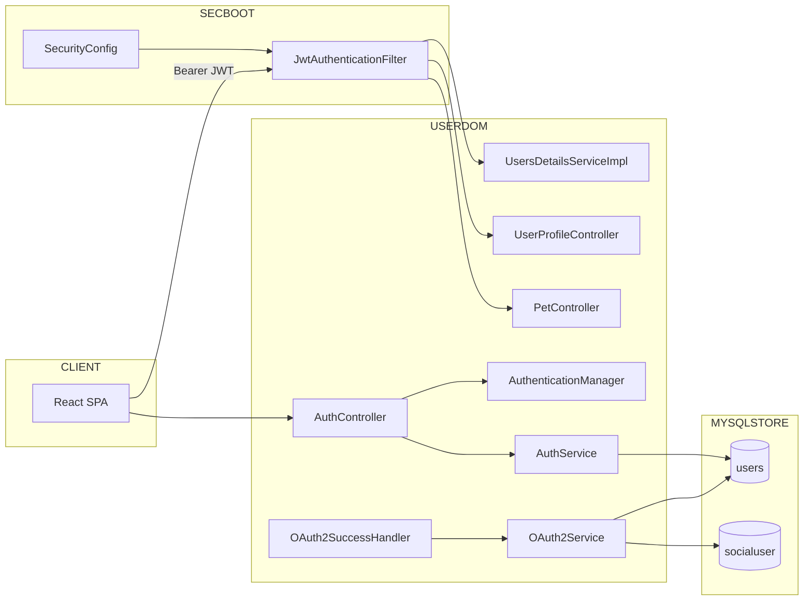
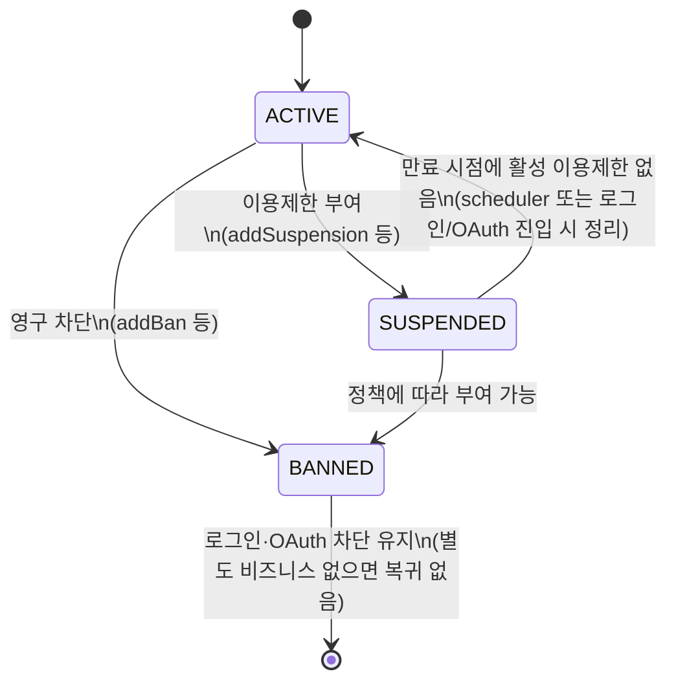

# User 도메인 아키텍처

본 문서는 **`domain/user` 패키지가 시스템 안에서 차지하는 위치를 먼저 한 장으로 잡고**, 그다음 **인증·인가, 반려(Pet) 정보, 제재**처럼 안에서 다시 나뉘는 축을 순서대로 설명합니다.  
기능 시나리오·화면 단위 설명은 **`docs/domains/user.md`** , 이메일 인증 토큰·purpose·Redis 상세는 **`docs/architecture/user/이메일 인증 시스템 아키텍처.md`** , JWT·토큰 경로 **리팩토링 백로그**는 **`docs/architecture/user/JWT-토큰-리팩토링-백로그.md`** 를 참고합니다.

---

## 1. User 도메인 전체 구조 (한 장)

Petory **시스템 전체 구조도**(`docs/architecture/시스템_아키텍처_다이어그램.md`)처럼, User 도메인만 발췌한 **경로·데이터·타 도메인** 관계입니다. 아래 세부 절(인증, Pet, 제재)은 이 그림의 블록을 펼친 것이다.

**읽는 법 (요지).**

- **세로로**: `CLIENT` → `Security`(가능한 요청만) → `domain/user`의 **신원 / 소셜 / 프로필 / 반려 / 제재** 블록 → `DATA`.
- **가로 연계**: 신고·관리 결과는 **`applySanctionFromReport`** 로 제재 블록에만 닿고, 반려 프로필 이미지·첨부는 **file** 도메인과 맞물린다.
- **동일 패키지 안에서도** HTTP 축은 `§4`처럼 **필터 → `/api/auth` → (OAuth 병렬) → `/api/users` → `/api/pets`** 순으로 읽는 것이 코드와 맞다.

| 블록 | 담당하는 것 (한 줄) | 주요 저장 |
|------|---------------------|-----------|
| 신원·토큰 | 로컬 가입·로그인·Refresh·로그아웃, Access JWT 발급 | `users` Refresh 컬럼 등 |
| 소셜 | Provider별 콜백 후 사용자 연결·생성, 동일 토큰 정책 | `users` + `socialuser` |
| 프로필 | 내 정보, 이메일 검증 트리거와 `emailVerified` | `users` |
| 반려 정보 (`Pet`) | 반려 CRUD·접종, 프로필 이미지 ↔ file 동기화 | `pets`(+FK `user`) · `pet_vaccinations` |
| 제재·이력 | 상태·경고·이용정지·스케줄러 정리 | `users` · `user_sanctions` |

---

## 2. 도메인 경계 (책임)

**도메인 경계**는 한 영역이 **무엇까지 책임지는지**(데이터·규칙의 진짜 주인, 보통 말하는 source of truth)와 **무엇부터는 다른 패키지·전역 설정·인프라가 맡는지**를 나누는 선입니다. 아래 표는 그 선을 **`domain/user` 기준**으로만 적어 둔 것입니다.

처음 읽을 때는 열 이름보다 이렇게 매핑하면 됩니다. **가운데 열**은 “User 코드·테이블 안에서 끝내는 게 맞는 일”, **오른쪽 열**은 “여기서 시작하면 `global`·`report` 같은 다른 축과 합의·연동이 필요한 일”입니다. 예를 들어 비밀번호 해시와 Refresh 저장은 User 소유가 자연스럽고, “게시판 한 건 안에서 이 사용자를 어떻게 쓸지” 같은 규칙은 해당 기능 도메인 쪽 책임에 가깝습니다.

| 영역 | User 도메인이 소유하는 것 | User 바깥에 두는 것 |
|------|--------------------------|---------------------|
| **신원·자격증명** | 로그인 ID(`Users.id`), 비밀번호 해시, Refresh Token 저장·폐기, JWT **subject로 쓰이는 문자열**(로그인 ID) | HTTP 보안 헤더·CORS 운영 값·전역 예외 포맷 → `global` |
| **OAuth 연계** | `SocialUser`(provider + providerId) ↔ `Users` 연결, OAuth 성공 후 토큰 발급·리다이렉트 | Provider 앱 등록 정보 → 설정·인프라 |
| **프로필** | 사용자 공개 정보 등 **계정 단위** 메타데이터(`Users`) | 게시판/케어/모임 등 **비즈니스 컨텍스트** 안에서의 사용자 참조 FK |
| **반려 정보 (`Pet`)** | `Pet`·`PetVaccination` 등 반려 CRUD, `Users` FK로 귀속하는 저장; 프로필 이미지·첨부 연동은 **file** 도메인과 결합 | 케어·실종 제보 등이 `pet_idx` 등으로 반려를 참조할 때의 비즈니스 규칙 → **각 기능 도메인** |
| **제재 상태** | `Users.status`, `suspendedUntil`, `warning_count`, `UserSanction` 이력, 로그인·OAuth 진입 시 제재 검사 일부 | 신고 접수·관리자 UI·`ReportActionType` 선택 → **`report` / `admin`** (적용 시 `UserSanctionService.applySanctionFromReport` 호출) |

신뢰·고위험 액션(펫케어·모임 등)에서의 **`emailVerified` 게이트**는 기능별 서비스에 흩어져 있으며, “이메일 인증이라는 하나의 상태를 여러 도메인이 참조한다”는 점만 User 아키텍처 관점에서 기억하면 됩니다(상세는 이메일 인증 문서).

---

## 3. 식별자 체계

실제 코드·스키마에서 혼동이 생기기 쉬운 축입니다.

| 구분 | 필드·값 | 용도 |
|------|---------|------|
| **Surrogate PK** | `Users.idx` (Long) | JPA FK, 다른 도메인 엔티티가 사용자를 참조할 때 주로 사용 |
| **로그인 ID** | `Users.id` (String, unique) | 로컬 로그인·**Access/Refresh JWT subject**·`UserDetailsService.loadUserByUsername` 인자명은 `username`이지만 실질값은 로그인 ID |
| **username 컬럼** | `Users.username` (String, unique) | 회원 레코드의 별칭 성격 필드로 존재(로그인 subject와 혼동 주의) |
| **OAuth 식별** | `(Provider, SocialUser.providerId)` | 신규/기존 판별; 기존 `Users`는 **동일 이메일이면 소셜 연결** (`OAuth2Service.createOrLinkUser`) |
| **Refresh 세션** | `Users.refreshToken` + `refreshExpiration` | 현재 설계에서는 **사용자당 최근 1개의 Refresh 문자열**(새 로그인·OAuth마다 행 업데이트로 덮임) |
| **반려 PK** | `Pet.idx` 등 | `Pet` → `Users` FK로 귀속; 타 도메인의 “사용자 반려” 저장 루트 |

**문서화 시 주의:** API 응답 DTO에서는 로그인 ID와 idx를 명확히 구분하는 것이 크로스 도메인 추적 비용을 줄입니다.

---

## 4. 인증·인가

### 4.1 컴포넌트 레이아웃 (인증 레일)

- **Stateful 한 지점**: Refresh는 **DB 컬럼**에 저장(주석 상 Redis 이전 가능성 언급). Access는 **무상태 JWT**(짧은 TTL).
- **OAuth**: Naver 등은 **커스텀 `accessTokenResponseClient`**, 사용자 정보 로딩은 **`OAuth2UserProviderRouter`** 경유(`SecurityConfig`).

### 4.2 인증 흐름 (요지)

#### 로컬 로그인

1. `AuthController.login` → `AuthenticationManager.authenticate`(principal = **로그인 ID 문자열**, credential = 비밀번호).
2. `AuthService.login` → `UsersRepository.findActiveByIdString` 로 조회 후 **제재 상태** 검사 및 만료된 SUSPENDED 정리 → Access·Refresh 생성·저장.

#### API 요청 시(JWT)

1. `JwtAuthenticationFilter`: `Authorization: Bearer` 또는 **쿼리 파라미터 `token`**(SSE 등).
2. `JwtUtil.validateToken` + `UserDetailsService.loadUserByUsername(id)` → `SecurityContext`에 `ROLE_*` 부여.

#### Refresh

- `AuthService.refreshAccessToken`: JWT 서명 검증 → DB의 문자열 일치 및 `refreshExpiration` 확인 → **Access만 재발급**, Refresh 문자열은 **회전하지 않음**.

**Refresh 정책(설계 노트):** `/api/auth/refresh` 는 Access만 새로 만들고 저장된 Refresh 문자열은 그대로 돌려준다(회전 미적용). 로그아웃 시에는 DB에서 Refresh·만료 시각을 비운다. 탈취·무단 재사용에 대한 추가 방어(Refresh 회전, 재사용 탐지, 클라이언트 보관 방식 등)는 위협 모델·운영 단계에서 별도로 정하지 않았고, 필요 시 후속 과제로 둔다.

#### OAuth2 성공

- `OAuth2SuccessHandler` → `OAuth2Service.processOAuth2Login` → 로컬 로그인과 동일하게 **Refresh 덮어쓰기** 후 프론트로 **쿼리 스트링에 토큰 실어 리다이렉트**(닉네임 미설정 시 `needsNickname` 플래그).

### 4.3 인가(역할·경로)

- Access JWT와 `UsersDetailsServiceImpl` 로 **`ROLE_*`** 가 `SecurityContext`에 올라간 뒤, 메서드 보안(`@PreAuthorize`)과 HTTP 레이어(`SecurityConfig` 의 `requestMatchers`)가 함께 동작한다.
- **주의:** 컨트롤러에 `@PreAuthorize("permitAll()")` 가 있어도 **`SecurityConfig`에서 `authenticated()` 로 막히면 요청이 먼저 거절**될 수 있다(게시판 목록 등, `CLAUDE.md` GOTCHA). 메서드 보안 허용과 HTTP 보안 허용을 동일 의미로 읽으면 안 된다.

---

## 5. 반려 정보 (`Pet` / `PetVaccination`)

- **HTTP**: `/api/pets` → `PetController` → `PetService`. 보호 API는 `JwtAuthenticationFilter` 이후 동일 레일로 진입한다.
- **모델**: `Pet`은 `Users`에 `ManyToOne`으로 매달리고, 예방접종은 `PetVaccination` 자식 엔티티로 관리된다.
- **파일**: 펫 프로필 이미지 등은 `AttachmentFileService` 등 **file 도메인**과 URL·첨부 레코드를 동기화하는 경로가 있다(`FileTargetType.PET` 등).
- **소유 검증**: `getPet` / `updatePet` / `deletePet` / `restorePet` 에서 JWT subject(로그인 ID)와 `Pet.user`(Users)의 로그인 ID를 대조하고, 불일치 시 `UserForbiddenException`(403). 타 도메인에서 `petIdx`만으로 펫을 노출하는 API가 따로 있으면 그쪽은 별도 검증이 필요하다.

---

## 6. 제재·계정 상태

### 6.1 `UserStatus` (코드 레벨)

### 6.2 런타임에서의 정리 책임(중복)

- **배치**: `UserSanctionScheduler`(매일 0시) → `UserSanctionService.releaseExpiredSuspensions` — `UserSanction` 이력을 기준으로 `Users.status` 동기화.
- **요청 시**: `AuthService.login`, `OAuth2Service.processOAuth2Login` 에서 만료된 SUSPENDED 를 ACTIVE 로 정리하는 경로 존재(스케줄러 실패 지연 완충 역할 가능).

### 6.3 신고 액션과의 매핑 (사실 기록)

`UserSanctionService.applySanctionFromReport` 에서 **`ReportActionType.SUSPEND_USER` → 실제 코드상 `addBan`(영구 차단)** 로 연결됩니다. 이름과 동작 불일치는 운영·문서 간 혼선 요인이므로 “도메인 사전” 차원에서 유지해야 합니다.

---

## 7. 타 도메인 조합·동시성·성능

### 7.1 타 도메인

- **신고/관리**: 관리자 조치 결과가 `applySanctionFromReport` 로 들어옴 → `UserSanction` 누적 + `Users` 상태 변경. 상위 플로우는 **`docs/architecture/user/신고 및 제재 시스템 아키텍처.md`** 쪽과 맞춰 읽습니다.
- **파일 업로드**: 펫 등 이미지 URL은 저장되나, 저장소 접근 규칙은 **file 업로드 / 정적 제공** 전역 설정과 결합됩니다(`SecurityConfig` 의 `/api/uploads/**` 등).
- **펫코인 등 금전**: `SpringDataJpaUsersRepository.findByIdForUpdate` 로 **유저 행 단위 비관적 락**(동시 차감·경고 카운터는 별 처리 — 아래 표).

### 7.2 성능·동시성 포인트

| 지점 | 구현 패턴 | 비고 |
|------|-----------|------|
| 경고 카운터 | `incrementWarningCount` 단일 JPQL 업데이트 | 동시 경고 레이스에 유리 |
| 이용제한 + 경고 재조회 | `addWarning` 내 save 후 재조회 | 경계 부근에서 발생할 수 있는 이중 처리는 상위 플로우 설계로 완화 |
| 펫코인 등 | `findByIdForUpdate` | 동시 차감 시 필수 패턴 유지 전제 |
| 소셜 가입 레이스 | `createNewUserWithRetry`(Unique 위반 재시도) | 동일 이메일 동시 소셜 가입 시 장애 완충 경로 존재 |
| Many 쪽 로딩 | `Users.socialUsers` 등 `@BatchSize` | 다른 도메인에서 참조 시 N+1 완충 패턴 명시 참고 가능 |
| Refresh 저장 | 사용자당 단일 컬럼 | 다중 디바이스 동시 세션은 “후발 로그인이 이전 세션 Refresh 무효화” 형태 |

---

## 8. 현재 보안·정책 갭 (코드 팩트 중심, 우선순위만 정리)

JWT·Access·Refresh·URL 토큰 전달 등을 **문제 → 영향 → 검토 방향**으로 정리한 문서는 **`JWT-토큰-리팩토링-백로그.md`** (동일 디렉터리). 아래는 같은 내용을 한 줄로만 스캔할 때 쓴다.

1. **`UserStatus` ↔ Access JWT**  
   `UsersDetailsServiceImpl` 과 `JwtAuthenticationFilter` 경로에서는 **JWT가 유효한 한 BANNED/SUSPENDED 여부가 재평가되지 않음**(로그인·OAuth 순간 검사에는 걸림). 제재 즉시 효력을 위해선 Access TTL에 의존도↑ 또는 매 요청·주기 검증 같은 정책 보강 검토 필요.

2. **`@PreAuthorize("permitAll()")` vs HTTP 보안 레이어**  
   컨트롤러 메서드에 `@PreAuthorize("permitAll()")` 가 있어도, **`SecurityConfig.authorizeHttpRequests`에서 해당 경로가 `authenticated()` 로 막히면 요청 자체가 먼저 거절**됩니다(CLAUDE.md에 게시판 목록 사례로 기록된 불일치). 메서드 보안 허용과 HTTP 보안 허용을 같은 의미로 읽으면 안 됩니다.

3. **토큰이 URL을 타는 플로우**  
   OAuth 성공 후 `accessToken`, `refreshToken` 을 **쿼리**로 넘김 → 브라우저 기록·Referer 등으로 유출 표면 증가. 운영 수준에서는 **Authorization Code 흐름 + 백엔드 교환 또는 POST body/fragment 전략** 등으로 축소하는 편이 일반적.

4. **`JwtAuthenticationFilter` 의 `token` 쿼리 파라미터**  
   Bearer 헤더가 없으면 `request.getParameter("token")` 으로 JWT를 읽는다(`filter/JwtAuthenticationFilter.java`, 주석에 SSE 등 명시). 실사용 예: 알림 **`GET /api/notifications/stream?token=...`** — 브라우저 `EventSource`는 커스텀 헤더를 붙이기 어려워 쿼리로 넘김(`frontend/src/components/Layout/Navigation.js`). 이 패턴은 **브라우저 기록·Referer·중간 프록시 로그** 등으로 토큰이 새어 나갈 표면이 생긴다.

5. **CORS 설정**  
   `allowedOriginPatterns("*")` + `allowCredentials(true)` 조합은 운영에서 제한해야 할 수 있으며, 파일 내 TODO 주석이 그 전제를 담음.

6. **공개·모니터링 엔드포인트**  
   `/actuator/**`, `/admin-ui/**` 가 `permitAll` 로 노출되어 있음. 로컬 전용이라는 전제가 깨지면 위험.

7. **OAuth 처리 로그**  
   `OAuth2Service` 초기 처리에서 속성 로그 출력이 과할 수 있어, 운영 환경 PII 노출 검토 필요.

8. **Access JWT TTL 설정**  
   ~~과거 `jwt.expiration` / 미사용 `generateToken` 이중 체계~~ → 제거됨. Access TTL은 **`jwt.access-token-expiration-ms`**(밀리초, 기본 15분). 마이그레이션·남은 과제는 **`JWT-토큰-리팩토링-백로그.md` §2** 참고.

---

## 9. 이 문서와 `docs/domains/user.md`의 역할 분담

| 문서 | 읽는 이유 |
|------|-----------|
| **`user-domain-architecture.md`(본 문서)** | 전체 구조 한 장·경계·식별자·인증·반려(Pet)·제재·보안 현실 면을 빠르게 잡음 |
| **`JWT-토큰-리팩토링-백로그.md`** | JWT·토큰 경로 리팩토링 백로그(항목별 코드 팩트·리스크·검토 방향) |
| **`domains/user.md`** | 기능·시나리오·구체 API·예외 메시지 흐름을 참조 |

변경 발생 시 우선 순서: 코드 진실 변경 → 본 문서의 **전체 구조·식별자·전이·갭** 업데이트 → JWT 백로그(`JWT-토큰-리팩토링-백로그.md`) 필요 시 동기화 → 도메인 상세 예시 블록(`domains/user.md`) 순을 권장합니다.
