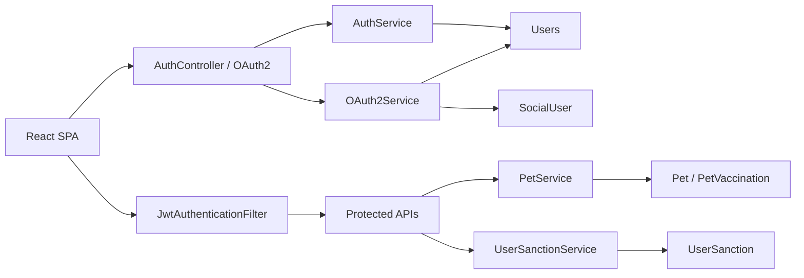

# User 도메인 포트폴리오 페이지 초안

## 1. 페이지 목적

이 페이지는 User 도메인을 단순한 "회원가입/로그인 기능"이 아니라, **시스템의 신원·인증·반려 정보·제재 상태를 함께 관리하는 기반 도메인**으로 보여주기 위한 초안입니다.

이 도메인에서 보여줘야 할 핵심은 아래 3가지입니다.

1. User 도메인은 로그인 한 번으로 끝나는 기능이 아니라, JWT 인증, OAuth 연동, 반려 정보 소유권, 제재 상태를 함께 묶는 시스템 입구다.
2. 토큰 발급·Refresh 저장·OAuth 연결·제재 상태 갱신처럼, 보안과 정책이 코드 구조에 직접 반영된다.
3. 단순 CRUD보다 **도메인 경계, 식별자 체계, 보안 트레이드오프를 어떻게 정리했는지**가 더 중요한 페이지다.

---

## 2. 한 줄 소개

> User 도메인은 Petory의 신원·인증 기반을 담당하는 영역이며, 저는 이 도메인에서 **JWT Access/Refresh 구조, OAuth 계정 연결, Pet 소유 검증, 제재 상태 동기화**를 핵심 기술 포인트로 다뤘습니다.

---

## 3. 이 도메인을 포트폴리오에서 보여줘야 하는 이유

User 도메인은 겉으로 보면 흔한 회원 시스템처럼 보이지만, 실제로는 거의 모든 기능 도메인의 입구 역할을 합니다.

- 로그인과 토큰 발급은 모든 보호 API의 전제다.
- OAuth 연동은 기존 계정과의 연결 정책까지 함께 다뤄야 한다.
- Pet 정보는 단순 프로필이 아니라 케어·실종 제보 같은 타 도메인의 참조 루트다.
- 제재 상태는 로그인/OAuth 진입 시점과 운영 배치가 함께 맞물려야 한다.

즉, 이 도메인은 "회원가입을 만들었다"가 아니라 **시스템이 누구를 어떤 상태로 신뢰할지 관리하는 구조를 만들었다**는 점에서 포트폴리오 가치가 있습니다.

---

## 4. 사용자 관점 기능 설명 (작성자용)

### 4.1 로컬 로그인과 Refresh

사용자는 로컬 계정으로 로그인하고 Access Token과 Refresh Token을 발급받습니다. Access는 짧은 TTL의 JWT로 사용하고, Refresh는 DB의 `users` 컬럼에 저장해 재발급 시 검증합니다.

핵심 포인트:

- 로그인 시 제재 상태(`BANNED`, `SUSPENDED`) 확인
- Refresh Token은 사용자당 최근 1개 문자열 저장
- 로그아웃 시 Refresh Token 제거

근거 코드:

- `backend/main/java/com/linkup/Petory/domain/user/service/AuthService.java`
- `login(...)`
- `refreshAccessToken(...)`
- `logout(...)`

### 4.2 OAuth 계정 연결

소셜 로그인은 별도 사용자로 중복 생성하는 방식이 아니라, **기존 이메일이 있으면 계정을 연결하고 없으면 신규 생성**하는 구조입니다. 로그인 성공 후에는 로컬 로그인과 동일하게 Access/Refresh를 발급합니다.

핵심 포인트:

- `SocialUser(provider, providerId)`로 소셜 식별
- 동일 이메일이면 기존 `Users`와 연결
- 신규 생성 시 Unique 충돌에 대비한 재시도 경로 존재

근거 코드:

- `backend/main/java/com/linkup/Petory/domain/user/service/OAuth2Service.java`
- `processOAuth2Login(...)`
- `createOrLinkUser(...)`
- `createNewUserWithRetry(...)`

### 4.3 반려 정보(`Pet`) 소유권 검증

User 도메인 안의 Pet 정보는 단순 부가 데이터가 아니라, 타 도메인이 참조하는 사용자 자산입니다. 그래서 조회·수정·삭제 시 JWT subject와 펫 소유자의 로그인 ID를 대조하는 소유권 검증이 핵심입니다.

핵심 포인트:

- `Pet`은 `Users`에 귀속
- `getPet`, `updatePet`, `deletePet`, `restorePet` 모두 소유권 검증
- 프로필 이미지 파일은 file 도메인과 동기화

근거 코드:

- `backend/main/java/com/linkup/Petory/domain/user/service/PetService.java`
- `assertPetOwnedBy(...)`

### 4.4 제재 상태와 운영 배치

경고, 이용정지, 영구 차단은 `Users.status`와 `UserSanction` 이력으로 관리합니다. 로그인/OAuth 시에도 만료된 정지를 자동 해제하고, 배치 스케줄러도 별도로 상태 정리를 수행합니다.

핵심 포인트:

- 경고 3회 시 자동 이용제한
- 로그인/OAuth 진입 시 만료된 정지 자동 해제
- 배치 스케줄러와 요청 시 정리가 함께 존재

근거 코드:

- `backend/main/java/com/linkup/Petory/domain/user/service/UserSanctionService.java`
- `addWarning(...)`
- `addSuspension(...)`
- `releaseExpiredSuspensions(...)`

---

## 5. github.io 페이지 구성 (확정안)

> 이 절만 메인 페이지 구현 기준으로 본다. 기존 `user-domain-architecture.md`는 설계 레퍼런스로 유지하고, 메인 페이지는 여기 구조로 압축한다.

### 5.1 설계 원칙

| 구분 | 원칙 |
|------|------|
| **독자** | github.io 방문자 — 30초 안에 "User 도메인에서 무엇을 왜 신경 썼는지" 파악 |
| **베이스 카피** | 3문단 요약 + 카드형 기술 결정 |
| **역할 분리** | `user-domain-architecture.md`는 레퍼런스, 이 문서는 메인 페이지 카피 |
| **핵심 초점** | 성능 수치보다 인증 구조, 도메인 경계, 보안 트레이드오프 |
| **톤** | Board/Care와 동일 — pillars → 개요 → design 카드 → 한계 → docs |

### 5.2 페이지 맵 (`UserDomain.jsx`)

```
사용자 도메인
├── [Hero] 제목 + 소개 문단
├── [pillars] 핵심 축 5개
├── [intro] 도메인 개요 + 사실 표
├── [design] 기술 결정 카드 5개
├── [limits] 한계 & 다음 개선
└── [docs] 관련 문서 링크
```

### 5.3 섹션별 상세

#### Hero

> User 도메인은 Petory에서 로그인만 담당하는 얇은 계층이 아니라, 인증, 소셜 계정 연결, 반려 정보 소유권, 제재 상태를 함께 관리하는 신원 도메인입니다. 저는 이 영역에서 단순 회원 CRUD보다, 시스템이 어떤 사용자를 어떤 상태로 신뢰할지 코드 구조로 분리하는 데 집중했습니다.

#### `pillars` — 핵심 기능

```
JWT 인증 | OAuth 계정 연결 | Pet 소유 검증 | 제재 상태 동기화 | 보안 트레이드오프 인식
```

#### `intro` — 도메인 개요

**카드 1:** User 도메인은 `Auth`, `OAuth`, `Pet`, `Sanction` 네 블록으로 나뉘며, 모든 보호 API의 진입점 역할을 한다.

**카드 2:** 사실 표

| 항목 | 현재 구조 |
|------|-----------|
| Access 인증 | JWT Bearer |
| Refresh 저장 | `users.refreshToken` + `users.refreshExpiration` 두 컬럼 |
| OAuth 연결 | `(provider, providerId)` + 동일 이메일 연결 |
| 반려 소유 검증 | JWT subject ↔ `Pet.user.id` 대조 |
| 제재 상태 | 로그인/OAuth + 배치 스케줄러 이중 정리 |

#### `design` — 기술 결정 (카드 5개)

| 카드 | 제목 | bullet 요지 | 코드 (택 1) |
|------|------|-------------|-------------|
| A | JWT + Refresh | Access는 짧은 JWT / Refresh는 DB 저장 / 사용자당 최근 1개 유지 | `refreshAccessToken` 분기 4~6줄 |
| B | OAuth Linking | 기존 이메일이면 연결 / 없으면 신규 생성 / 충돌 시 재시도 | `createOrLinkUser` 분기 4~6줄 |
| C | Pet Ownership | 펫은 사용자 자산 / 수정·삭제 시 소유권 대조 / 파일 동기화 | `assertPetOwnedBy` 3~4줄 |
| D | Sanction Lifecycle | 경고 누적 → 정지 / 만료 시 자동 해제 / 로그인과 스케줄러 양쪽 정리 | `addWarning` 또는 `releaseExpiredSuspensions` 4~6줄 |
| E | Security Tradeoffs | 요청 시 제재 재평가 부재 / URL 토큰 전달 / Refresh 회전 미적용 등 현실적 갭 명시 | 코드 대신 limits 링크 |

#### `limits` — 한계 & 다음 개선

- Access JWT가 유효한 동안 `BANNED`/`SUSPENDED` 상태를 매 요청 재평가하지 않음
- Refresh Token은 회전하지 않고 사용자당 최근 1개 문자열만 저장
- OAuth 성공 후 토큰을 쿼리 스트링으로 리다이렉트하는 구간이 있어 브라우저 기록·Referer 노출 표면 존재
- `JwtAuthenticationFilter`가 SSE 등을 위해 `token` 쿼리 파라미터도 허용
- `ReportActionType.SUSPEND_USER`가 실제로는 `addBan`으로 연결돼 이름과 동작이 불일치

#### `docs` — 관련 페이지

- [User 아키텍처 레퍼런스](/domains/user/architecture) — 전체 구조, 식별자 체계, 보안 현실
- [이메일 인증 아키텍처](/domains/user/email-verification) — purpose, Redis, 토큰 흐름
- [JWT 리팩토링 백로그](/domains/user/jwt-backlog) — 보안/정책 후속 과제

### 5.4 구현 체크리스트

- [ ] `UserDomain.jsx`는 번호형 기술 문서가 아니라 `Hero → pillars → intro → design → limits → docs` 구조로 재편
- [ ] 긴 설명은 architecture 문서로 보내고, 메인 페이지는 1~2분 내 스캔 가능 길이로 제한
- [ ] design 카드에 코드 스니펫 2~3개 이상 배치
- [ ] limits 섹션을 반드시 포함해 자기 인식이 드러나게 구성

---

## 6. 페이지에 그대로 쓸 수 있는 서술형 초안

### 6.1 소개 문단

User 도메인은 Petory에서 로그인만 처리하는 모듈이 아니라, 시스템이 어떤 사용자를 어떤 상태로 신뢰할지 관리하는 기반 도메인입니다. 로컬 로그인과 OAuth2 소셜 로그인, 반려 정보 소유권, 제재 상태 동기화가 모두 이 영역에 연결되어 있어 다른 도메인의 입구 역할을 합니다.

### 6.2 기술 포인트 문단

이 도메인에서는 Access JWT와 DB 저장 Refresh Token을 조합해 인증 흐름을 구성했고, OAuth 로그인 시에는 `(provider, providerId)`와 이메일 기준으로 기존 계정을 연결하도록 설계했습니다. 또한 `Pet`은 단순 프로필 데이터가 아니라 사용자 자산으로 보고 JWT subject와 소유자를 대조하는 검증을 넣었고, 제재 상태는 로그인/OAuth 진입 시점과 배치 스케줄러 양쪽에서 정리하도록 구성했습니다.

### 6.3 결과 문단

User 도메인은 눈에 띄는 화면 기능보다, 인증 구조와 데이터 소유권, 운영 정책이 실제 코드에 어떻게 반영되는지를 보여주는 사례입니다. 동시에 Refresh 회전 미적용, URL 토큰 전달, 요청 시 제재 재평가 부재 같은 한계도 드러나 있어, 설계 결정과 보안 트레이드오프를 함께 설명할 수 있는 도메인입니다.

---

## 7. 시각 자료 추천

- 로그인 → JWT 필터 → 보호 API 진입 흐름도
- OAuth 로그인 → 계정 연결 → 토큰 발급 흐름도
- `Users` / `SocialUser` / `Pet` / `UserSanction` 관계 다이어그램
- 제재 상태 전이 다이어그램 (`ACTIVE -> SUSPENDED -> ACTIVE`, `ACTIVE -> BANNED`)

간단 다이어그램 초안:



---

## 8. 코드·문서 근거

### 8.1 핵심 코드

- `backend/main/java/com/linkup/Petory/domain/user/service/AuthService.java`
- `backend/main/java/com/linkup/Petory/domain/user/service/OAuth2Service.java`
- `backend/main/java/com/linkup/Petory/domain/user/service/PetService.java`
- `backend/main/java/com/linkup/Petory/domain/user/service/UserSanctionService.java`
- `backend/main/java/com/linkup/Petory/filter/JwtAuthenticationFilter.java`

### 8.2 참고 문서

- `docs/portfolio/user-domain-architecture.md`
- `docs/domains/user.md`
- `docs/architecture/user/이메일 인증 시스템 아키텍처.md`
- `docs/architecture/user/JWT-토큰-리팩토링-백로그.md`

---

## 9. 문서 작성 방향 한 줄 정리

User 페이지는 "회원가입/로그인 기능"보다, **인증 구조와 사용자 자산, 제재 정책을 함께 관리하는 기반 도메인**으로 설명하는 편이 가장 강합니다.
